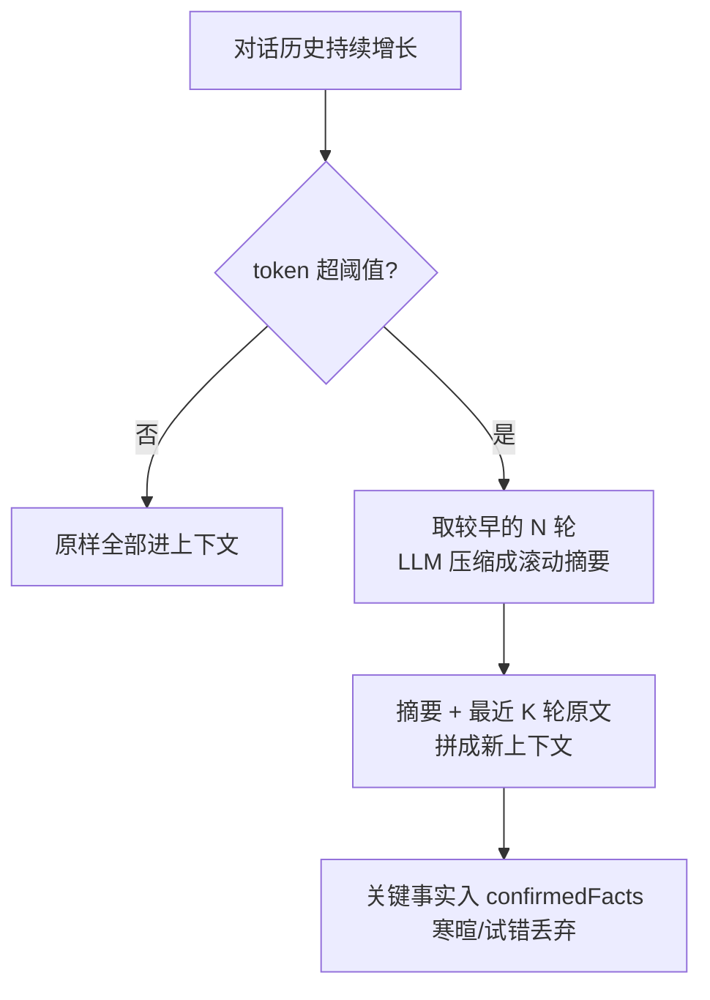
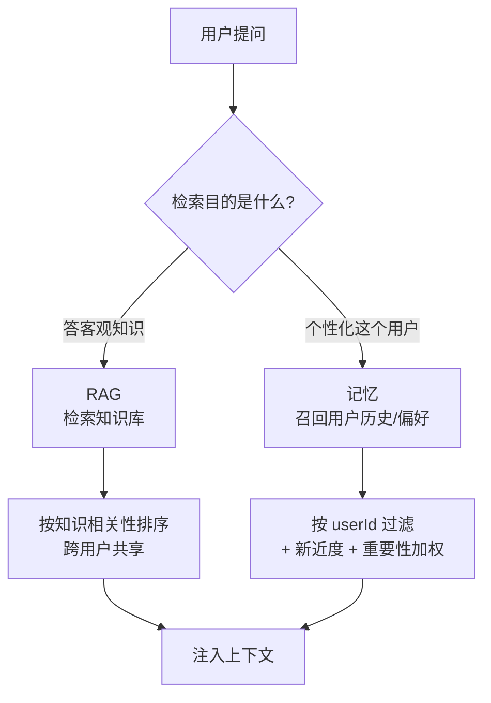
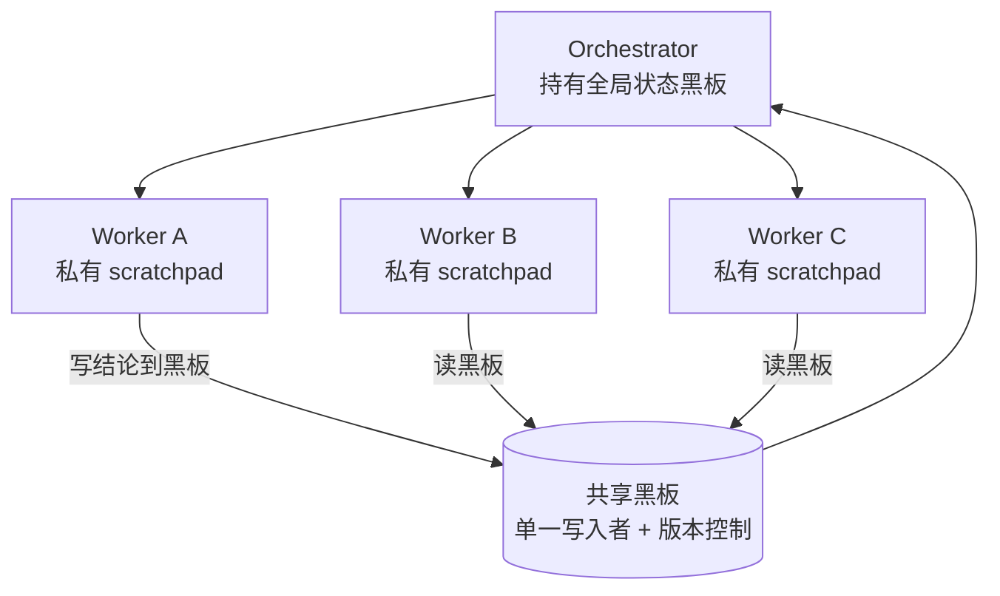

# Agent 记忆与状态管理

> 记忆是 Agent 的独立一维，不是"多塞点上下文"就能糊弄的：短期记忆受窗口硬顶，长期记忆要外部存储 + 显式的写入/召回策略。把它和 RAG 用同一套检索糊在一起，是生产 Agent 最常见的隐性事故源。

## 为什么记忆值得单列一页

没有记忆的 Agent 每次都是陌生人：用户说过"我用 pnpm 不用 npm"，下一会话它又给你 `npm install`；上次排了半天才定下的技术选型，新开窗口又要重来。**记忆 = 让 Agent 跨时间累积对"这个用户 / 这个任务"的了解**，它是把 demo 变成"越用越顺手"的工具的关键一跃。

但记忆不是"把对话历史全塞进 prompt"。它有三个正交难题，每个都得单独设计：

| 难题 | 核心矛盾                   | 对应机制            |
| ---- | -------------------------- | ------------------- |
| 容量 | 上下文窗口有限，长会话撑爆 | 短期裁剪 + 滚动摘要 |
| 持久 | 进程/会话结束就丢          | 长期记忆落外部存储  |
| 信号 | 啥都写 → 噪声淹没重点      | 写入时机 + 召回加权 |

> 核心结论：记忆设计的本质不是"存"，而是**取舍**——写什么、何时写、召回时谁排前面。存是便宜的部分，召回质量才是命门。

---

## 短期记忆：scratchpad 与对话历史

短期记忆就是**当前会话的上下文**，两种形态：

- **对话历史**：user/assistant/tool 消息流，天然累积，受窗口硬顶。
- **scratchpad（草稿板）**：Agent 中途的结构化中间态——已收集的字段、待办清单、已确认的子结论。它把"模型脑子里的进度"显式落成数据，便于断点恢复和裁剪。

二者都活在内存（或会话级 checkpointer），**会话结束即失效**。关键是把"过程性噪声"和"结论性事实"分开——前者随会话丢弃，后者才可能晋升长期记忆。

```ts
// 会话内状态:过程性中间态显式化,便于裁剪与恢复
interface SessionState {
  messages: Message[]; // 对话历史(会被摘要/裁剪)
  scratchpad: {
    goal: string; // 本次任务目标
    collected: Record<string, unknown>; // 已收集的结构化字段
    pending: string[]; // 待办
    confirmedFacts: string[]; // 用户显式确认过的事实 → 候选长期记忆
  };
}

// 关键:confirmedFacts 是"晋升长期记忆"的唯一入口
// 过程性的 collected / pending 随会话丢弃,绝不写入长期库
```

> scratchpad 的价值不在"给模型看"（它本来就在上下文里），而在**给宿主看**：你能据此判断哪些值得提炼进长期记忆、断点续跑时恢复到哪一步。LangGraph 里它就是 State 的一部分，由 checkpointer 落盘，见 [LangGraph](./langgraph)。

---

## 长期记忆：向量 / episodic / semantic

长期记忆跨会话持久化，存外部存储。三类，**存储与召回策略各不相同**，别用一种结构硬套：

| 类型                    | 存什么                                                       | 类比     | 典型存储              | 召回方式            |
| ----------------------- | ------------------------------------------------------------ | -------- | --------------------- | ------------------- |
| **Semantic** 语义记忆   | 事实、偏好、约束（"用户用 pnpm""偏好 TS 严格模式"）          | 知识卡片 | 向量库 + 元数据       | 语义相似 + 用户过滤 |
| **Episodic** 情景记忆   | 历史事件片段（"上周三我们把 DB 从 MySQL 迁到了 PG，因为……"） | 日记     | 向量库 + 时间戳       | 相似度 + 时间衰减   |
| **Procedural** 程序记忆 | 操作技能、可复用流程（"怎么发版""怎么排查 OOM"）             | 肌肉记忆 | Skill 文件 / 流程定义 | 按任务匹配触发      |

> Semantic 答"你是谁/你要什么"，Episodic 答"我们经历过什么"，Procedural 答"这事怎么办"。**Procedural 已接近 Skill 的领地**——可复用的操作流程该沉淀成 Skill 文件（渐进式披露），而不是塞向量库靠相似度碰运气。

```ts
// 长期记忆条目:三类共用外壳,用 kind 区分,元数据是召回加权的关键
interface MemoryEntry {
  id: string;
  userId: string; // 必须按用户隔离
  kind: 'semantic' | 'episodic' | 'procedural';
  content: string; // 提炼后的一句话事实/事件/流程,非原始对话
  embedding: number[];
  importance: number; // 0-1,写入时由 LLM 评估打分
  createdAt: number;
  lastAccessedAt: number; // 召回命中时更新 → 新近度信号
  accessCount: number; // 被召回次数 → 强化重要记忆
}
```

---

## 记忆写入时机与召回策略

### 写入：不是每轮都写

每轮对话都写长期库，噪声会淹没真正重要的偏好——"今天天气不错"和"我用 pnpm"被同等对待，召回时前者稀释后者。三种合理触发：

| 时机             | 说明                                       | 适用               |
| ---------------- | ------------------------------------------ | ------------------ |
| **显式标记**     | 用户/模型明确说"记住这个"                  | 最可靠，噪声最低   |
| **会话结束提炼** | 会话收尾时 LLM 通读，提炼 N 条关键事实落库 | 主流做法，成本可控 |
| **达阈值触发**   | 某类信息累积到量（如偏好被提及 3 次）才写  | 弱信号聚合成强信号 |

```ts
// 会话结束时的提炼式写入:LLM 当"记忆筛选器",只放行高价值事实
async function consolidateSession(state: SessionState) {
  const transcript = renderTranscript(state.messages);
  const facts = await llm.extract<{ content: string; importance: number }[]>(`
    从以下对话提炼值得跨会话记住的事实/偏好/决策。
    只保留:用户偏好、明确约束、关键技术决策及其原因。
    丢弃:寒暄、过程性试错、一次性上下文。给每条打 importance(0-1)。
    对话:${transcript}`);
  for (const f of facts) {
    if (f.importance < 0.6) continue; // 低价值直接丢,别污染库
    await memoryStore.upsert({ userId, kind: 'semantic', ...f });
  }
}
```

### 召回：相关性 + 新近度 + 重要性加权

纯向量相似度召回是新手坑——它会捞起"语义像但早已过时/无关紧要"的记忆。MemGPT 式做法是**多信号加权打分**，且**必须按 userId 过滤**（记忆是私人的）：

```ts
// 加权召回:score = α·相似度 + β·新近度 + γ·重要性,先按 user 过滤
function score(m: MemoryEntry, queryEmb: number[], now: number): number {
  const sim = cosine(m.embedding, queryEmb); // 相关性
  const recency = Math.exp(-(now - m.lastAccessedAt) / TAU); // 时间衰减
  const importance = m.importance * Math.log(1 + m.accessCount); // 重要性×频次
  return 0.5 * sim + 0.3 * recency + 0.2 * importance;
}

async function recall(userId: string, query: string, k = 5) {
  const q = await embed(query);
  // 关键:where userId 过滤 —— 记忆按人隔离,这是和 RAG 的本质区别
  const cands = await vectorDb.query({ embedding: q, topK: 50, where: { userId } });
  const now = Date.now();
  return cands
    .map((m) => ({ m, s: score(m, q, now) }))
    .sort((a, b) => b.s - a.s)
    .slice(0, k)
    .map(({ m }) => {
      touch(m);
      return m;
    }); // touch:更新 lastAccessedAt + accessCount
}
```

> 召回命中要**回写** `lastAccessedAt` / `accessCount`——被反复用到的记忆越排越前，长期不用的自然沉底，形成自调节的记忆强度，无需人工清理。

---

## 记忆压缩与摘要

对话历史无限增长，窗口有限。**超阈值就滚动摘要**：把较早的消息压成一段"迄今要点"，保留最近几轮原文，丢寒暄留事实。



> 核心结论：摘要不是无损压缩，是**有损取舍**——保留事实/决策/未决问题，丢弃客套与中间试错。摘要本身也是一次 LLM 调用，要控成本（用便宜模型、增量摘要而非每次全文重摘要）。

```ts
// 增量滚动摘要:新摘要 = LLM(旧摘要 + 新增对话),而非每次重读全部历史
async function rollingSummarize(state: SessionState, budget: number) {
  if (tokenCount(state.messages) < budget) return state;
  const cutoff = findCutoff(state.messages); // 切出"较早待压缩"段
  const old = state.messages.slice(0, cutoff);
  const recent = state.messages.slice(cutoff); // 最近原文保留

  const summary = await cheapLlm.summarize(
    `已有摘要:${state.summary ?? '(无)'}\n新增对话:${render(old)}\n请合并为更新后的要点摘要,保留事实/决策/未决问题。`,
  );
  return { ...state, summary, messages: recent }; // 历史被摘要替换,窗口让出来
}
```

> 历史裁剪是 [Prompt 工程](./prompt-engineering) 窗口预算的一部分——摘要、system、RAG、记忆共享同一份 token 预算，得统一规划，不能各抢各的。

---

## 跨会话记忆持久化

持久化分两层，别混：

| 层             | 存什么                           | 机制                                            | 生命周期        |
| -------------- | -------------------------------- | ----------------------------------------------- | --------------- |
| **会话内**     | 对话历史 + scratchpad + 当前进度 | LangGraph checkpointer（Postgres/Redis/SQLite） | 单次会话/thread |
| **跨会话长期** | 提炼后的 semantic/episodic 记忆  | 外部向量库 + 元数据                             | 永久（带衰减）  |

checkpointer 解决的是"**这一个 thread 断点续跑**"（HITL 暂停、崩溃恢复、多轮往返），它按 `thread_id` 存整个 State 快照；跨会话长期记忆解决的是"**换一个 thread 还记得这个用户**"。前者是状态持久化，后者才是真正的记忆。

```ts
// LangGraph:checkpointer 管会话内,外部库管跨会话,分层叠加
import { PostgresSaver } from '@langchain/langgraph-checkpoint-postgres';

// 会话内:thread_id 级别的状态快照,崩溃/暂停可恢复
const checkpointer = PostgresSaver.fromConnString(process.env.PG_URL);
const graph = builder.compile({ checkpointer });

await graph.invoke(input, { configurable: { thread_id: 'thread-42' } });

// 跨会话:新 thread 启动时,先从长期库召回该用户的记忆注入 system
const memories = await recall(userId, openingQuery);
const systemWithMemory = `${baseSystem}\n\n关于该用户你已知的:\n${memories.map((m) => `- ${m.content}`).join('\n')}`;
```

> checkpointer 的状态图、interrupt、HITL 细节见 [LangGraph](./langgraph)。记忆注入发生在**每个新 thread 的起点**——这是短期与长期交汇的唯一接缝。

---

## 记忆与 RAG 的边界（都是检索但目的不同）

两者都是"检索 + 注入上下文"，工程上容易共用一套向量库代码——**这是陷阱**。它们检索的东西、为什么检索、怎么排，根本不同：



| 维度     | RAG                              | 记忆                                   |
| -------- | -------------------------------- | -------------------------------------- |
| 数据来源 | 公共知识库（文档/手册/FAQ）      | 这个用户/这个 Agent 的交互历史         |
| 目的     | 回答客观问题，补模型不知道的知识 | 个性化，记住偏好与上下文               |
| 召回策略 | 知识相关性（相似度 + rerank）    | userId 过滤 + 相关性 + 新近度 + 重要性 |
| 生命周期 | 知识库更新才变，相对稳定         | 随交互持续写入，时间衰减               |
| 共享性   | 跨用户共享同一份                 | 严格按用户/会话隔离                    |

> ❌ 用同一套检索同时捞"知识"和"记忆"——记忆没按 userId 过滤会串号（A 用户看到 B 的偏好），知识没按相关性 rerank 会被记忆的高分挤掉。
> ✅ 两条独立管道，各自召回后**在上下文里分区注入**（system 里"已知用户偏好"一段，用户问题旁"相关知识"一段）。RAG 侧的分块/混合检索/rerank 见 [RAG](./rag)。

---

## 多 Agent 共享状态

Orchestrator-Worker 结构下，**每个 worker 各自 scratchpad，共享一块黑板/全局状态**交换结论——而不是让所有 worker 直接读写彼此的上下文。



> 核心结论：worker 的中间推理留在各自 scratchpad（互不污染）；只有**结论**经 Orchestrator 仲裁写进共享黑板。黑板要有**单一写入者**（或乐观锁/版本号），否则多 worker 并发覆盖，状态互相打架。

```ts
// 共享黑板:版本号 + 单一写入者,杜绝并发覆盖
interface Blackboard {
  version: number;
  facts: Record<string, { value: unknown; by: string; at: number }>;
}

// ✅ worker 提交结论,Orchestrator 串行落板(单一写入者)
async function commitResult(board: Blackboard, key: string, value: unknown, worker: string) {
  // 由 Orchestrator 单点调用,天然串行;若必须多写者,用 CAS:
  // await store.compareAndSwap(key, expectedVersion, { value, by: worker })
  board.facts[key] = { value, by: worker, at: Date.now() };
  board.version++;
}

// ❌ 让 worker 直接互改对方的 scratchpad / 共享对象 —— 无并发控制必乱
```

> 多 Agent 的拓扑、Orchestrator 职责、worker 编排见 [Agent 设计模式](./agent-patterns)；这里只强调**状态一致性**：共享可变状态必须有写入纪律。

---

## 常见陷阱 ❌/✅

| ❌ 反模式                  | ✅ 正确做法                                                           |
| -------------------------- | --------------------------------------------------------------------- |
| 记忆和 RAG 用同一套检索    | 记忆按 userId 过滤 + 时间衰减，RAG 按知识相关性，两条独立管道分区注入 |
| 每条对话都写长期记忆       | 显式标记 / 会话结束提炼 / 达阈值触发，低 importance 直接丢弃          |
| 召回只看向量相似度         | 相关性 + 新近度 + 重要性加权，命中回写 accessCount 自调节             |
| 对话历史不裁剪不摘要       | 超阈值滚动摘要，留事实丢寒暄，用便宜模型增量摘要控成本                |
| 记忆不按用户隔离           | 所有记忆查询强制 `where userId`，杜绝跨用户串号                       |
| 把原始对话原文塞长期库     | 只存提炼后的一句话事实/偏好，原文随会话丢弃                           |
| 可复用操作流程塞向量库     | procedural 沉淀成 Skill 文件按任务触发，不靠相似度碰运气              |
| 多 worker 直接互改共享状态 | 私有 scratchpad + 共享黑板，单一写入者 / 版本号乐观锁                 |

**混同记忆与 RAG 的连锁后果**：共用向量表、没按 userId 过滤 → A 的偏好泄给 B（安全事故）；记忆高分挤掉知识 → 客观问题被"你上次说过"带偏。隔离不只是工程洁癖，是正确性与隐私的双重底线。

**写入不加节制的代价**：噪声记忆进入召回候选 → 加权分数被"高频但无价值"的条目抬高 → 真正重要的偏好沉底 → Agent 越用越"记岔"。记忆的质远比量重要，宁缺毋滥。
