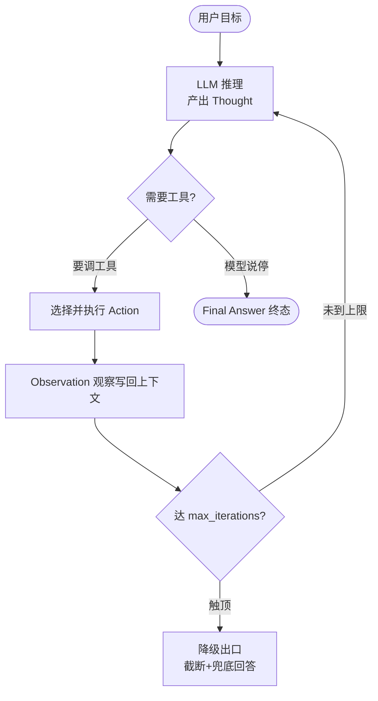
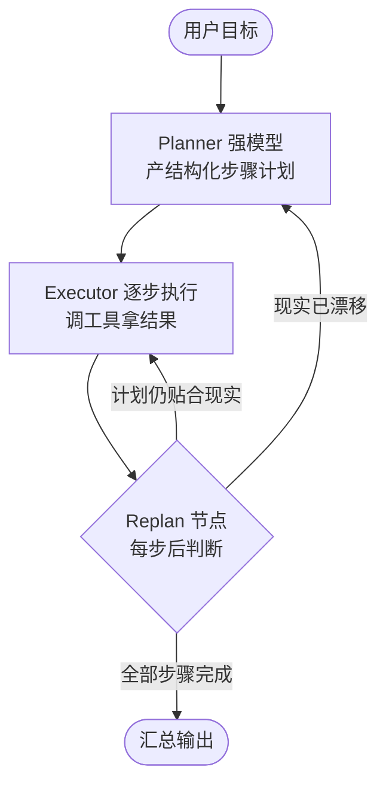
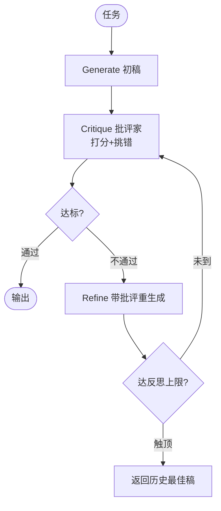
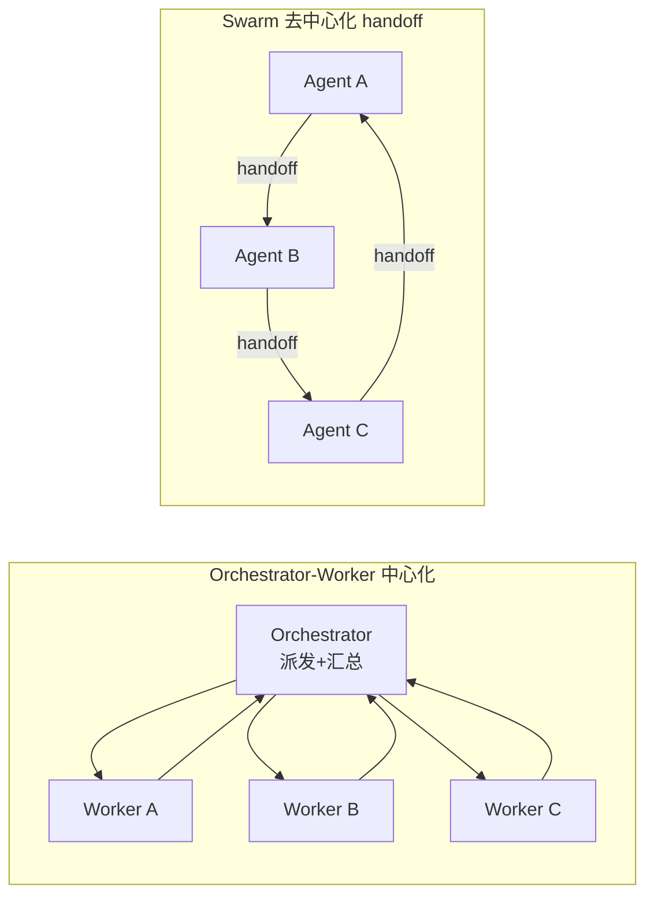
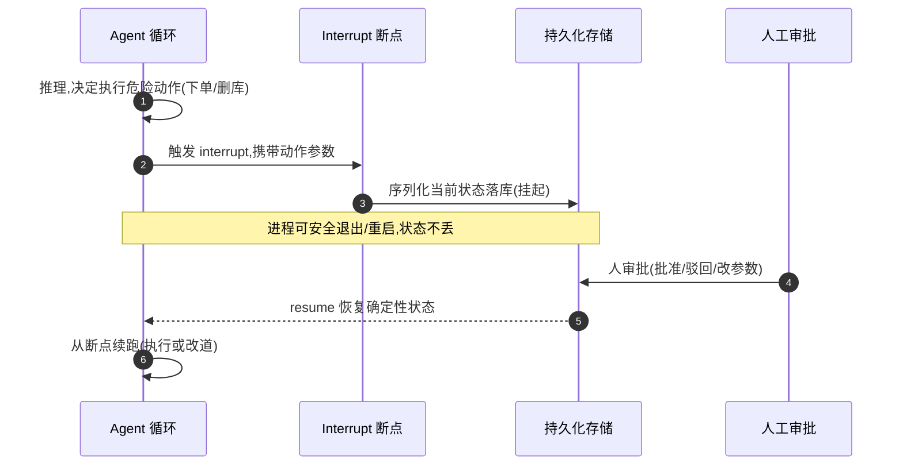
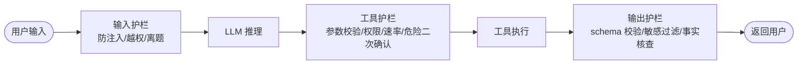

# Agent 设计模式

> 六种主流 Agent 模式（ReAct / Plan-Execute / Reflection / 多 Agent / 人机回环 / 护栏）不是六选一的菜单，而是可叠加的积木。速查的核心就一句:**单 Agent + 几个工具能跑通,就别上多 Agent——每加一个 Agent、每叠一层反思,都是在 token、延迟、调试难度上加杠杆。**

## 模式全景:一张表看懂六种模式

六种模式解决的是不同维度的问题,先建立坐标再逐个拆。

| 模式              | 一句话本质             | 解决什么                   | 失效模式                 | 适用信号                     |
| ----------------- | ---------------------- | -------------------------- | ------------------------ | ---------------------------- |
| ReAct             | while 循环边推理边行动 | 步骤不可预知、边探边定     | 原地转圈 + 上下文撑爆    | 输入开放、路径列不全         |
| Plan-and-Execute  | 规划与执行解耦         | 任务可分解、子任务较独立   | 计划与现实漂移           | 目标结构清晰、可列步骤       |
| Reflection        | 第二个 LLM 当批评家    | 有可验证信号的输出打磨     | 越改越浮夸、引幻觉       | 有客观验证(测试/执行)        |
| 多 Agent          | 分工协作               | 单一上下文装不下的复杂任务 | 消息雪崩、状态不一致     | 任务可拆成独立子域           |
| Human-in-the-Loop | 高风险动作前设断点     | 不可逆操作的安全闸         | 断点是内存态、重启丢审批 | 含下单/删库/发信等不可逆动作 |
| Guardrails        | 确定性代码三层拦截     | 注入/越权/危险动作/脏输出  | 用 LLM 当护栏被绕过      | 一切开放输入系统的标配       |

> 核心结论:ReAct 和 Plan-Execute 是**控制流骨架**(决定下一步谁定);Reflection 是**质量增强器**(叠加在生成环节);多 Agent 是**拓扑扩展**(横向分工);HITL 和 Guardrails 是**安全横切面**(任何骨架都要配)。前两者二选一当主干,后四者按需叠加。

---

## ReAct:边推理边行动

ReAct(Reason + Act)的本质就是一个 while 循环:**Thought → Action → Observation,把观察写回上下文,再迭代**,直到模型自己给出 Final Answer。它不是框架,是最小 Agent 骨架。



> 核心结论:循环有两个出口——模型主动 `end_turn` 给 Final Answer(正常),或 `max_iterations` 触顶走降级(兜底)。**没有第二个出口的 ReAct 等于裸奔。**

```ts
// 最小可跑骨架:硬上限 + 观察截断是两条命根子
const MAX_ITER = 15; // 硬编码步数上限,触顶必须降级
const OBS_LIMIT = 2_000; // 单次观察截断字符数,防上下文撑爆

async function react(goal: string, tools: Tool[]): Promise<string> {
  const messages: Msg[] = [{ role: 'user', content: goal }];

  for (let i = 0; i < MAX_ITER; i++) {
    const res = await llm.withTools(tools).call(messages);

    // 正常出口:模型自己说停
    if (res.stopReason === 'end_turn') return res.text;

    // 执行模型选的工具,观察截断后写回——不截断会把网页/日志原文灌爆上下文
    const raw = await runTool(res.toolCall);
    const obs = raw.slice(0, OBS_LIMIT) + (raw.length > OBS_LIMIT ? '…[已截断]' : '');
    messages.push(res.assistantMsg, { role: 'tool', content: obs });
  }

  // 兜底出口:超限不允许裸抛,给降级回答而非无限烧 token
  return degradeAnswer(messages);
}
```

失效模式有两个,都致命:

- **原地转圈**:模型反复重试同一个失败调用(参数略改、语义不变),step 一路烧到上限。解法靠外层 `max_iterations` 硬上限 + 检测"连续 N 次同名工具同参数"提前熔断。
- **上下文撑爆**:网页、日志、SQL 结果原文写回,几轮就顶到 context window,后续推理质量崩塌。解法靠观察截断 + 旧观察摘要压缩。

工具定义与 `stopReason` 协议详见 [Function Calling](./function-calling),落地编排载体见 [LangGraph](./langgraph)。

---

## Plan-and-Execute:先规划后执行

把"想清楚"和"动手做"解耦:**Planner(可用更强/更贵的模型)一次性产出结构化步骤计划,Executor(可用便宜模型)逐步调工具执行,每步后由 Replan 节点判断要不要修订计划。**



> 核心结论:回流回路是灵魂——`Executor` 每跑一步都回到 `Replan`,把"原计划假设"与"当前观察"对齐;**没有 Replan 的 Plan-Execute 会一头扎进与现实漂移的废计划里。**

```ts
// 计划是结构化数据,不是自由文本——可校验、可逐项执行、可审计
interface Plan {
  steps: Array<{ id: string; action: string; tool: string; done: boolean }>;
}

async function planAndExecute(goal: string, tools: Tool[]): Promise<string> {
  let plan: Plan = await planner.strongModel.makePlan(goal); // 强模型产计划

  while (plan.steps.some((s) => !s.done)) {
    const step = plan.steps.find((s) => !s.done)!;
    const result = await runTool({ tool: step.tool, input: step.action }); // 便宜模型执行
    step.done = true;

    // 关键:每步后 Replan,把现实观察喂回,决定是否修订剩余计划
    const verdict = await planner.replan(goal, plan, result);
    if (verdict.shouldReplan) plan = verdict.newPlan; // 漂移则整体修订
    if (verdict.isFinished) return verdict.finalAnswer;
  }
  return planner.summarize(plan);
}
```

失效模式是**计划与现实漂移**:第 3 步发现查无此数据,原计划第 4~8 步全作废,没有 Replan 回路就会对着不存在的中间产物空跑。这也是它比纯 ReAct 省 token 的原因——长程任务的"思考"集中在 Planner 一次做完,Executor 不再每步重想;代价是首计划做错时返工成本高。

---

## Reflection:自我批判与修正

用**第二个 LLM 当批评家**:生成 → 批评打分挑错 → 带着批评重写,直到通过或触反思上限。



> 核心结论:批评必须落到**可验证信号**上才划算;纯主观文本的反思,批评家会越改越"看起来对",反而引入幻觉。

```ts
// 划算的前提:critique 能调客观信号(跑测试/执行 SQL),而非凭语感
const MAX_REFLECT = 3;

async function reflect<T>(task: string, verify: (out: string) => Promise<VerifyResult>) {
  let draft = await generator.draft(task);
  let best = draft;

  for (let i = 0; i < MAX_REFLECT; i++) {
    const v = await verify(draft); // 客观信号:测试通过率/能否执行
    if (v.ok) return draft; // 验证通过即收
    const critique = await critic.critique(task, draft, v.errors); // 把真实报错喂给批评家
    draft = await generator.refine(task, draft, critique);
    if (v.score > (await verify(best)).score) best = draft; // 留历史最佳,防越改越差
  }
  return best;
}
```

**只在有可验证信号的场景划算**:代码能跑测试、SQL 能执行、schema 能校验——批评家有客观事实可依,反思确实提分。**纯主观文本(写文案、写总结)别乱叠**:批评家没有事实抓手,只会把文字改得更华丽更自信,事实错误原样保留甚至更隐蔽,且每轮反思 token 成本翻倍。

---

## 多 Agent:Orchestrator-Worker 与 Swarm

两种拓扑,生产绝大多数用前者。



> 核心结论:Orchestrator-Worker 有中心节点掌控全局视图、可控易追踪,适合任务可分解;Swarm 靠 Agent 间互相 handoff 涌现协作,灵活但缺全局视图、难调试、易消息雪崩。

| 维度          | Orchestrator-Worker                       | Swarm                    |
| ------------- | ----------------------------------------- | ------------------------ |
| 控制归属      | 中心编排器派发                            | 各 Agent 自主 handoff    |
| 全局视图      | ✅ 编排器持有                             | ❌ 各自只见局部          |
| 可追踪/可调试 | 强(调用链清晰)                            | 弱(消息路径涌现)         |
| 状态一致性    | 编排器收敛汇总                            | 易各说各话               |
| 风险点        | 编排者单点瓶颈、worker 上下文塞满无关历史 | 消息雪崩、A→B→A 死循环   |
| 适用          | 任务可分解、子任务独立                    | 角色少、协作路径高度开放 |

```ts
// Orchestrator-Worker:编排器只发"任务+必要上下文"给 worker,不灌全量历史
async function orchestrate(goal: string, workers: Worker[]): Promise<string> {
  const subtasks = await orchestrator.decompose(goal); // 拆成独立子任务

  const results = await Promise.all(
    subtasks.map((t) => {
      const w = pickWorker(workers, t.domain);
      // 关键:只给该子任务需要的最小上下文,别把无关历史塞爆 worker 窗口
      return w.run({ task: t, context: minimalContextFor(t) });
    }),
  );
  return orchestrator.aggregate(results); // 中心收敛汇总,保证状态一致
}
```

**多数生产系统用 Orchestrator-Worker**,而且编排器内每个 worker 自身往往就是一个 ReAct 循环——模式是嵌套的,不是平铺的。编排选型与边界见 [Orchestration](./orchestration)。

---

## Human-in-the-Loop:人机回环断点

HITL 是**架构组件,不是事后补救**。在下单、删库、发邮件这类**高风险不可逆动作**前,主动设 interrupt 断点:状态持久化挂起,等人审批后再 resume 续跑。



> 核心结论:断点必须是**可恢复的确定性状态**(落库、可重启、可审计),不是内存里的调用栈——`sleep`/轮询/进程内变量做的"暂停",进程一重启待审批状态全丢。

```ts
// 断点状态落库:可重启、可审计,resume 从存档精确恢复而非从头重跑
interface Checkpoint {
  runId: string;
  nodeId: string; // 断点所在节点
  state: unknown; // 序列化后的完整图状态
  pendingAction: { tool: string; args: unknown }; // 待审批的危险动作
  status: 'awaiting_approval' | 'approved' | 'rejected';
}

async function resumeIfApproved(runId: string): Promise<void> {
  const cp = await db.checkpoints.get(runId);
  if (!cp || cp.status === 'awaiting_approval') return; // 仍待人审,不动
  if (cp.status === 'rejected') return graph.resume(cp, { skip: cp.pendingAction });

  // 批准:从落库状态精确续跑,而不是从 goal 重跑一遍(重跑会重复已完成的副作用)
  await graph.resume(cp, { execute: cp.pendingAction });
}
```

HITL 与 Workflow 的人工任务、状态持久化一脉相承,落地见 [Workflow](./workflow);审批节点的留痕设计与 BPMN UserTask 同源。

---

## Guardrails:输入/工具/输出三层护栏

护栏是**确定性代码**,不是另一个 LLM——用模型当护栏会被同样的注入/越狱手段绕过。三层各守一道门。



> 核心结论:三层分别卡在**进 LLM 前、执行前、返回前**;每层都是确定性校验代码,任何一层失败就地拦截,绝不放行到下一环。

```ts
// 三层护栏骨架:每层都是确定性函数,失败即抛/降级,不进下一环
async function guardedPipeline(input: string): Promise<string> {
  // 1. 输入护栏:进 LLM 前拦注入/越权/离题
  if (detectInjection(input)) throw new GuardrailError('疑似注入');
  if (!isOnTopic(input)) return offTopicReply();

  const toolCall = await llm.withTools(tools).call(input);

  // 2. 工具护栏:执行前校验参数/权限/速率,危险动作二次确认
  validateArgs(toolCall.name, toolCall.args); // 参数白名单+schema
  await rateLimiter.check(toolCall.name); // 速率上限
  if (isDangerous(toolCall.name)) await requireHumanConfirm(toolCall); // 接 HITL

  const result = await runTool(toolCall);

  // 3. 输出护栏:返回前 schema 校验+敏感过滤+事实核查
  const parsed = OutputSchema.parse(result); // 结构不达标就地拦
  return redactSensitive(parsed); // 脱敏后返回
}
```

护栏与注入攻击、越权、数据泄漏的攻防细节超出本页骨架范围,展开见 [LLM 安全](./llm-security)。

---

## 模式组合:真实系统怎么搭

六种模式**可叠加**,真实生产系统几乎从不是单模式。常见组合:`ReAct + Reflection + HITL + Guardrails`——ReAct 当主干循环,Reflection 叠在有验证信号的生成环节,HITL 守在不可逆动作前,Guardrails 三层横切全程。

```ts
// 组合骨架:主干 ReAct,内嵌 Reflection,危险动作走 HITL,全程护栏
async function productionAgent(goal: string, tools: Tool[]): Promise<string> {
  guardInput(goal); // 护栏-输入层

  for (let i = 0; i < MAX_ITER; i++) {
    // ReAct 主干
    const res = await llm.withTools(tools).call(history);
    if (res.stopReason === 'end_turn') return guardOutput(res.text); // 护栏-输出层

    if (isGenerativeStep(res)) {
      // 有验证信号的生成环节
      res.toolCall.args = await reflect(res.toolCall.args, verify); // 叠 Reflection
    }
    await guardTool(res.toolCall); // 护栏-工具层(危险动作内部转 HITL 断点)

    const obs = truncate(await runTool(res.toolCall), OBS_LIMIT);
    history.push(res.assistantMsg, { role: 'tool', content: obs });
  }
  return degrade(history);
}
```

> 核心结论:组合不是堆砌——每一层都要有"当下存在的理由"。主干只能有一个(ReAct 或 Plan-Execute),Reflection 只在有验证信号处点状叠加,HITL 只在不可逆动作前设点,Guardrails 才是标配全程。

---

## 模式选型决策:按任务特征选

不看框架名,看任务特征。

| 任务特征                        | 选这个                              |
| ------------------------------- | ----------------------------------- |
| 步骤不可预知、边探边定          | ReAct                               |
| 任务可分解、子任务较独立        | Plan-Execute 或 Orchestrator-Worker |
| 有客观验证信号(测试/SQL 可执行) | 叠加 Reflection                     |
| 含不可逆动作(下单/删库/发信)    | 必须 HITL 断点                      |
| 开放输入、面向真实用户          | 三层 Guardrails 标配                |
| 单 Agent + 几工具能跑通         | 别上多 Agent(奥卡姆剃刀)            |

奥卡姆剃刀是压轴原则:**每加一个 Agent、每叠一层反思,都在 token、延迟、调试难度上加杠杆**。能单 Agent + 几个工具跑通的活,上多 Agent 只是把不确定性从一个上下文摊到多个上下文,再赔上消息一致性与调试成本。

---

## 常见陷阱

1. **ReAct 不设 max_iterations**:模型对着同一失败调用无限重试(参数微调、语义不变),token 费用瞬间打满。

   | ❌ 错误                             | ✅ 正确                                                                                |
   | ----------------------------------- | -------------------------------------------------------------------------------------- |
   | `while(true)` 裸循环,指望模型自己停 | 硬编码 `MAX_ITER` 步数上限,触顶走 `degrade` 降级回答;叠加"连续 N 次同名工具同参数"熔断 |

2. **把 Reflection 当万能质量提升器**:无客观验证信号的纯文本任务,批评家没有事实抓手,越改越"看起来对",反而引入幻觉,且每轮反思成本翻倍。

   | ❌ 错误                                    | ✅ 正确                                                                                                    |
   | ------------------------------------------ | ---------------------------------------------------------------------------------------------------------- |
   | 写文案/写总结也叠三层反思,指望"改得更漂亮" | 只在有可验证信号(测试能跑、SQL 能执行、schema 能校验)处叠加;设 `MAX_REFLECT` 上限 + 留历史最佳稿防越改越差 |

3. **多 Agent 消息雪崩与状态不一致**:Swarm 下互相 handoff 缺全局视图,A 移交 B 又移交回 A 死循环;Orchestrator-Worker 则防编排者单点瓶颈 + worker 上下文塞满无关历史。

   | ❌ 错误                                                               | ✅ 正确                                                                                           |
   | --------------------------------------------------------------------- | ------------------------------------------------------------------------------------------------- |
   | Swarm 无 handoff 计数,指望 Agent 自己收敛;或把全量历史灌给每个 worker | handoff 加跳数上限防 A→B→A 死循环;worker 只发"任务+最小必要上下文";编排器中心收敛汇总保证状态一致 |

4. **HITL 断点设计成内存态**:用 `sleep`/轮询/进程内变量做"暂停",进程一重启,待审批状态全丢,危险动作悬空。

   | ❌ 错误                                            | ✅ 正确                                                                                        |
   | -------------------------------------------------- | ---------------------------------------------------------------------------------------------- |
   | `await sleep(60000)` 等人来,或审批状态存进程内 Map | 断点状态序列化落库,可重启、可审计;resume 从存档精确续跑,不从 goal 重跑(避免重复已完成的副作用) |
