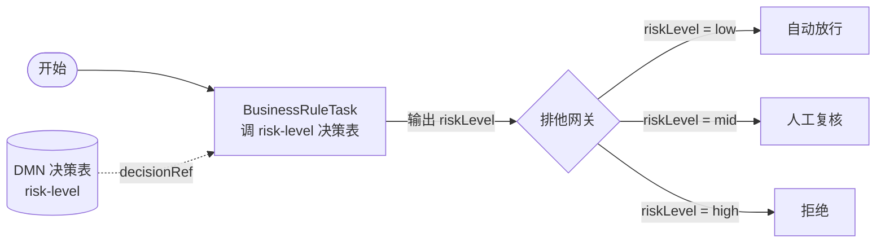
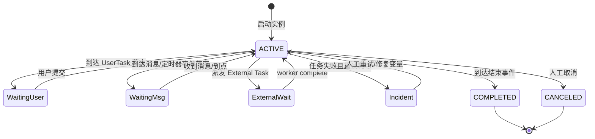
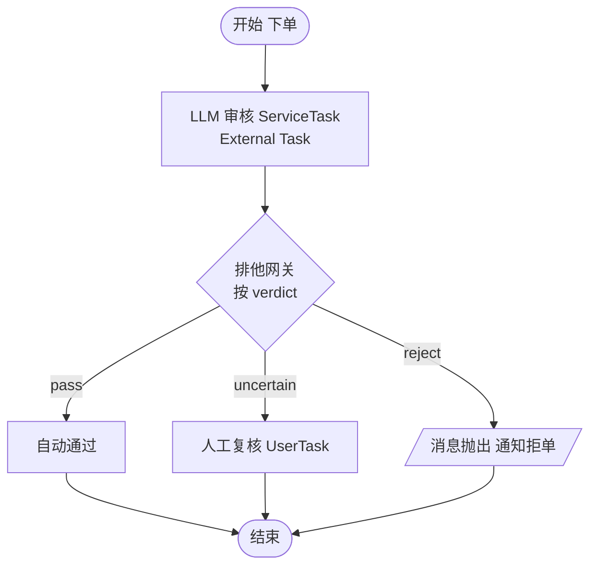

# BPMN 业务流程建模与执行

> BPMN 的价值从来不在"画图好看",而在**可视化即代码 + 引擎托管状态**:长流程里的等待、重试、补偿、超时,全部交给引擎持久化托管,而不是自己在业务代码里维护一堆状态字段和定时任务。短平快的同步流程用它就是过度设计。

---

## 什么时候用 BPMN,什么时候别用

判断标准只有一条:**流程里有没有"会停下来的等待点"**。有等待点(人工审批、等回调、定时触发、跨系统消息)就有状态要托管,BPMN 引擎是为此而生;全程无等待、毫秒级跑完的纯同步编排,引一个引擎纯属负担。

| 维度       | 自研 workflow / 状态机  | BPMN 引擎                            |
| ---------- | ----------------------- | ------------------------------------ |
| 适用流程   | 短期、纯同步、无等待    | 长流程、有等待/重试/补偿/超时        |
| 状态持久化 | 自己设计表 + 字段       | 引擎在等待点自动落库                 |
| 可视化     | 代码即真相,图另画易漂移 | 图即模型,模型即可执行                |
| 重试/超时  | 手写定时任务 + 补偿逻辑 | `asyncBefore`/`boundaryEvent` 声明式 |
| 改造成本   | 低(就是写代码)          | 高(建模 + 引擎运维 + 心智转换)       |
| 典型场景   | 请求内编排、规则管道    | 订单审批、理赔、开户、对账           |

- ✅ 用:跨天/跨人的审批流、要等待外部回调、SLA 超时升级、失败要补偿回滚。
- ❌ 别用:一次 HTTP 请求内几个 service 顺序调用——直接写代码或用 [workflow](./workflow) 里讲的轻量编排。

---

## 核心元素速查:事件/活动/网关/泳道/消息

BPMN 五类核心元素,记住"**谁触发、谁干活、谁分流、谁负责、谁传话**":

| 元素               | 图形     | 作用         | 关键子类型                       |
| ------------------ | -------- | ------------ | -------------------------------- |
| 事件 Event         | 圆       | 发生的事情   | 开始/中间/结束;捕获 vs 抛出      |
| 活动 Activity      | 圆角矩形 | 要干的活     | Task / SubProcess / CallActivity |
| 网关 Gateway       | 菱形     | 分流与汇合   | XOR / AND / OR / 事件网关        |
| 泳道 Pool/Lane     | 大框分隔 | 职责归属     | Pool=参与者,Lane=角色            |
| 消息流 MessageFlow | 虚线箭头 | 跨 Pool 通信 | 只能跨 Pool,不能跨 Lane          |

事件是 BPMN 最容易搞混的部分,按两个维度切:

- **位置**:开始事件(启动实例)、中间事件(流程中途)、结束事件(终结)。
- **方向**:**捕获(catching)**= 被动等待某个信号,**抛出(throwing)**= 主动发出信号。
- **类型**:消息(message)、定时器(timer)、信号(signal)、错误(error)、升级(escalation)。

```text
定时器中间捕获事件:流程挂起,到点自动继续 → SLA/超时提醒的标配
消息中间捕获事件:流程挂起,等外部系统发消息关联到本实例 → 异步解耦关键
边界事件(boundary event):挂在活动边缘,触发时打断/不打断该活动
```

**异步解耦的本质**:消息/定时器中间事件让流程"停在库里",外部世界推进它,而不是业务线程一直挂着等。

---

## 网关语义:排他/并行/包容/事件网关的执行差异

网关决定 token(执行令牌)怎么走,语义差异直接影响正确性:

| 网关     | 符号 | 语义                              | 易错点                              |
| -------- | ---- | --------------------------------- | ----------------------------------- |
| 排他 XOR | ✕    | 按条件**只走一条**出流            | 条件都不满足必须有 default,否则卡死 |
| 并行 AND | +    | **全部** fork,join 处**等齐**再走 | ≠ 多线程,见下                       |
| 包容 OR  | ◯    | **所有满足条件的**出流都走        | join 要算清还有几条活跃 token       |
| 事件网关 | ◎    | 谁的事件先到走谁                  | 配合消息/定时器中间事件用           |

**并行网关不是多线程**。Camunda/Zeebe 默认单线程串行推进 token,fork 出来的多个分支是**逻辑并行、物理串行**——引擎逐个推进,只是它们都"活着"。一个分支里的长任务会堵住同一事务里其他分支的推进;join 网关还要等最慢的那条分支到齐。

```text
AND fork 后:A、B、C 三个分支都被激活
join 处:等 A、B、C 全部完成才放行
若 B 是长耗时同步任务 → 整个事务被拖住,A、C 也得等
→ 长任务要拆成 External Task / 加 asyncBefore 切事务边界
```

---

## BPMN XML 长什么样(最小可执行流程)

BPMN 文件是 XML,`definitions` 下是 `process`(可执行逻辑)+ `BPMNDiagram`(纯图形坐标,执行不需要)。**能跑的关键在每个元素都配了 implementation**,否则部署后跑不动。

```xml
<?xml version="1.0" encoding="UTF-8"?>
<bpmn:definitions xmlns:bpmn="http://www.omg.org/spec/BPMN/20100524/MODEL"
                  xmlns:zeebe="http://camunda.org/schema/zeebe/1.0"
                  targetNamespace="order-approval">
  <bpmn:process id="order-approval" isExecutable="true">

    <bpmn:startEvent id="StartOrder" name="下单">
      <bpmn:outgoing>Flow_to_review</bpmn:outgoing>
    </bpmn:startEvent>

    <!-- ServiceTask:绑 job type,由 External Task worker 拉去执行 -->
    <bpmn:serviceTask id="LlmReview" name="LLM 审核">
      <bpmn:extensionElements>
        <zeebe:taskDefinition type="llm-review" retries="3"/>
      </bpmn:extensionElements>
      <bpmn:incoming>Flow_to_review</bpmn:incoming>
      <bpmn:outgoing>Flow_to_gate</bpmn:outgoing>
    </bpmn:serviceTask>

    <!-- 排他网关:按 LLM 输出的 verdict 分流 -->
    <bpmn:exclusiveGateway id="GateVerdict" name="审核结果">
      <bpmn:incoming>Flow_to_gate</bpmn:incoming>
      <bpmn:outgoing>Flow_auto_pass</bpmn:outgoing>
      <bpmn:outgoing>Flow_manual</bpmn:outgoing>
    </bpmn:exclusiveGateway>

    <!-- 人工任务:合规留痕,显式建任务等认领 -->
    <bpmn:userTask id="ManualAudit" name="人工复核">
      <bpmn:incoming>Flow_manual</bpmn:incoming>
      <bpmn:outgoing>Flow_to_end</bpmn:outgoing>
    </bpmn:userTask>

    <bpmn:endEvent id="EndDone" name="完成">
      <bpmn:incoming>Flow_auto_pass</bpmn:incoming>
      <bpmn:incoming>Flow_to_end</bpmn:incoming>
    </bpmn:endEvent>

    <!-- 顺序流:出流上挂条件表达式 -->
    <bpmn:sequenceFlow id="Flow_to_review" sourceRef="StartOrder" targetRef="LlmReview"/>
    <bpmn:sequenceFlow id="Flow_to_gate" sourceRef="LlmReview" targetRef="GateVerdict"/>
    <bpmn:sequenceFlow id="Flow_auto_pass" sourceRef="GateVerdict" targetRef="EndDone">
      <bpmn:conditionExpression xsi:type="bpmn:tFormalExpression">= verdict = "pass"</bpmn:conditionExpression>
    </bpmn:sequenceFlow>
    <bpmn:sequenceFlow id="Flow_manual" sourceRef="GateVerdict" targetRef="ManualAudit"/>
    <bpmn:sequenceFlow id="Flow_to_end" sourceRef="ManualAudit" targetRef="EndDone"/>
  </bpmn:process>
</bpmn:definitions>
```

注意 `serviceTask` 上的 `taskDefinition type="llm-review"`——这就是 implementation,worker 按这个 topic 拉活。**没绑 delegate/topic/decisionRef 的元素,部署能过、跑起来必卡**。

---

## DMN 决策表:把业务规则从流程里拆出来

多变量、易变的业务规则(定价、风控分级、路由)不要硬编码进网关的条件表达式——改成独立 DMN 决策表,流程里用 `BusinessRuleTask` 引用,规则改了只发决策表不动流程。

```text
流程视角:BusinessRuleTask(decisionRef=risk-level) → 输出 result → 排他网关按 result 分流
规则视角:DMN 决策表输入(amount, vipLevel, region) → 命中规则 → 输出 riskLevel
```

本图核心:BusinessRuleTask 调 DMN,决策结果回流给排他网关做分流——流程管"怎么走",DMN 管"按什么规则判"。



DMN 决策表本体(`risk-level.dmn` 语义示意,实际用 Camunda Modeler 编辑):

| 命中策略 | 输入 amount     | 输入 vipLevel | 输出 riskLevel |
| -------- | --------------- | ------------- | -------------- |
| FIRST    | `< 1000`        | -             | `low`          |
| FIRST    | `[1000..50000]` | `>= 3`        | `mid`          |
| FIRST    | `> 50000`       | -             | `high`         |

✅ 好处:运营/风控可直接在 Modeler 改表发布,不动代码、不动流程定义版本;❌ 反例:把 `amount > 50000 && vip < 3` 这种表达式糊在网关上,改一次规则要发一版流程。

---

## 执行引擎:Camunda vs Flowable 选型与落地

同源不同代。Camunda 7、Flowable 都从 Activiti 演化而来(嵌入式 JVM 库);Camunda 8 是重写的云原生引擎(Zeebe,broker + gRPC)。TS/全栈栈几乎只考虑 Camunda 8 的 External Task client。

| 维度     | Camunda 7            | Camunda 8 (Zeebe)             | Flowable              |
| -------- | -------------------- | ----------------------------- | --------------------- |
| 架构     | 嵌入式 JVM 库        | 独立 broker,gRPC 流           | 嵌入式 JVM 库         |
| 集成方式 | 内嵌进 Spring 应用   | 独立部署,client 远程连        | 内嵌进 Spring 应用    |
| 任务执行 | Java Delegate 内调用 | External Task worker 拉取     | Java Delegate         |
| 横向扩展 | 共享 DB,扩展有限     | 分区 broker,天然水平扩展      | 共享 DB               |
| 适合谁   | 存量 Java 单体       | 云原生、多语言 worker、高吞吐 | 存量 Java,要 CMMN/DMN |
| TS/全栈  | 不友好               | ✅ zeebe-node client          | 不友好                |

全栈落地 Camunda 8 的标准姿势——JS worker 拉 External Task:

```ts
import { ZBClient } from 'zeebe-node';

const zbc = new ZBClient(); // 连 Zeebe broker 的 gRPC gateway

// 按 topic 'llm-review' 拉活,拉到才执行,引擎不管你怎么实现
zbc.createWorker({
  taskType: 'llm-review',
  taskHandler: async (job) => {
    try {
      const { orderText } = job.variables;
      // 调 LLM 拿结构化结果(见 function-calling 的结构化输出)
      const verdict = await llmReview(orderText);
      // 结果写回流程变量,网关按它分流
      return job.complete({ verdict: verdict.label, score: verdict.score });
    } catch (err) {
      // fail:剩余重试次数 -1,耗尽产生 incident,不静默吞
      return job.fail({ errorMessage: String(err), retries: job.retries - 1 });
    }
  },
});
```

---

## 流程实例生命周期与状态

引擎在**等待状态**(UserTask、消息捕获事件、定时器、External Task)处提交事务、把状态落库。理解事务边界是排查"为什么卡在这"的前提。

本图核心:实例不是"一直在跑",而是在 ACTIVE 与各种等待/挂起态之间跳,失败走 incident,可被人工恢复或取消。



事务边界由 `asyncBefore` / `asyncAfter` 控制,决定**重试粒度**和**失败回滚点**:

```xml
<!-- 在这个 ServiceTask 前先提交事务、落库,失败重试从这里重来 -->
<bpmn:serviceTask id="Charge" zeebe:taskDefinition type="charge"
                  camunda:asyncBefore="true" camunda:exclusive="false"/>
```

- `asyncBefore=true`:进活动前切一个事务边界,失败只重跑这个活动,不回滚前面已落库的部分。
- 长流程每个可能失败的 External Task 都应考虑加,避免一个失败把整段已完成的活儿回滚。

---

## 与 AI 的结合点:LLM 作为 ServiceTask/决策节点

原则一句话:**不确定性留在任务里,确定性路由留给网关**。LLM 负责产出结构化判断,网关/DMN 负责按它分流——绝不让 LLM 直接"决定流程怎么走"。

本图核心:订单审批流,LLM 审核是普通 ServiceTask,产出 verdict 给排他网关,拿不准就转人工 UserTask 留痕。



LLM 必须封装成 **External Task / ServiceTask**,而不是塞进同步脚本任务——因为 LLM 调用慢、会超时、要重试,External Task 的超时/重试由 worker 控制,不拖住引擎事务。结构化输出怎么拿,见 [function-calling](./function-calling)。

```ts
// worker 内:LLM 只产出结构化判断,不碰流程走向
async function llmReview(orderText: string) {
  const res = await llm.chat({
    // 用 tool/function calling 强制结构化,拿到可路由的枚举值
    tools: [
      {
        name: 'verdict',
        schema: {
          label: { enum: ['pass', 'uncertain', 'reject'] },
          score: { type: 'number' },
        },
      },
    ],
    messages: [{ role: 'user', content: orderText }],
  });
  return res.toolCall.args; // 喂给 complete 的 variables,网关按 label 分流
}
```

多步 LLM 任务如何编排、与 deterministic 步骤混排,见 [orchestration](./orchestration);BPMN 与其他编排范式的取舍见 [comparison](./comparison)。

---

## 与自研状态机的迁移路径与互操作

从存量自研状态机迁到 BPMN,不要一次性推翻,分阶段切:

| 阶段    | 动作                               | 收益               |
| ------- | ---------------------------------- | ------------------ |
| 1. 盘点 | 列出现有状态、迁移、补偿、定时任务 | 明确哪些是"等待点" |
| 2. 外围 | 新流程直接上 BPMN,存量不动         | 控制爆炸半径       |
| 3. 切流 | 高频/高价值长流程建模迁移          | 状态托管交给引擎   |
| 4. 退役 | 旧状态机只读存档,新实例不再进      | 删表删定时任务     |

互操作要点:

- 旧系统通过**消息事件**与 BPMN 实例通信(`message correlate`),而不是直接改库——保住事务边界。
- 存量同步逻辑保留为 ServiceTask/External Task,引擎只管编排不管实现,逐步替换。
- 双跑期用同一业务键(business key)在两边对齐,便于对账和回切。

---

## 常见陷阱 ❌/✅

- ❌ 把 BPMN 当画图工具,元素不配 implementation(没绑 delegate / topic / decisionRef)
  ✅ 每个 ServiceTask 绑 job type、每个 BusinessRuleTask 绑 decisionRef,部署前在 Modeler 里跑 lint
- ❌ 把并行网关当多线程,在分支里写长任务堵住同一引擎线程;join 还等最慢分支
  ✅ 知道引擎单线程串行推进 token,长任务拆 External Task 并加 `asyncBefore` 切事务
- ❌ ServiceTask 里写长耗时同步调用(含 LLM/HTTP),超时导致整个事务回滚、流程卡死
  ✅ 长耗时一律 External Task,worker 侧控制超时重试,`complete`/`fail` 显式回报
- ❌ 易变业务规则硬编码进网关条件表达式,改规则要发新版流程
  ✅ 抽成 DMN 决策表,流程用 BusinessRuleTask 引用,规则与流程解耦发布
- ❌ 跨 Pool 用顺序流连接,或审批节点不画成 UserTask 导致无留痕
  ✅ 跨 Pool 只用消息流;审批/合规节点显式建 UserTask,认领与完成都留痕
- ❌ 排他网关条件都不满足且没设 default 出流,实例卡死在网关
  ✅ 每条 XOR 都设 default 出流兜底,拿不准的转人工
