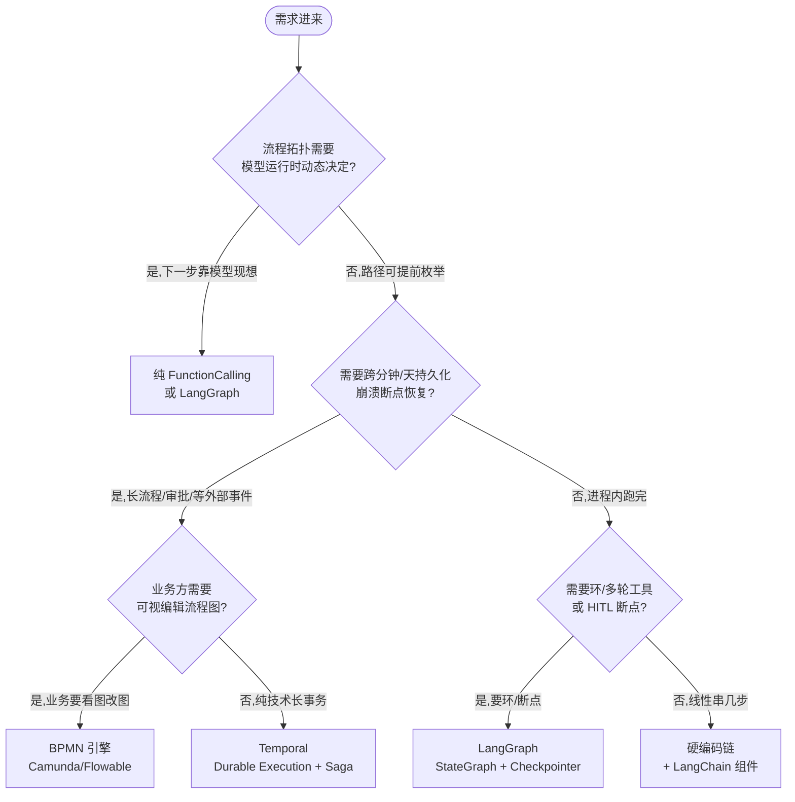
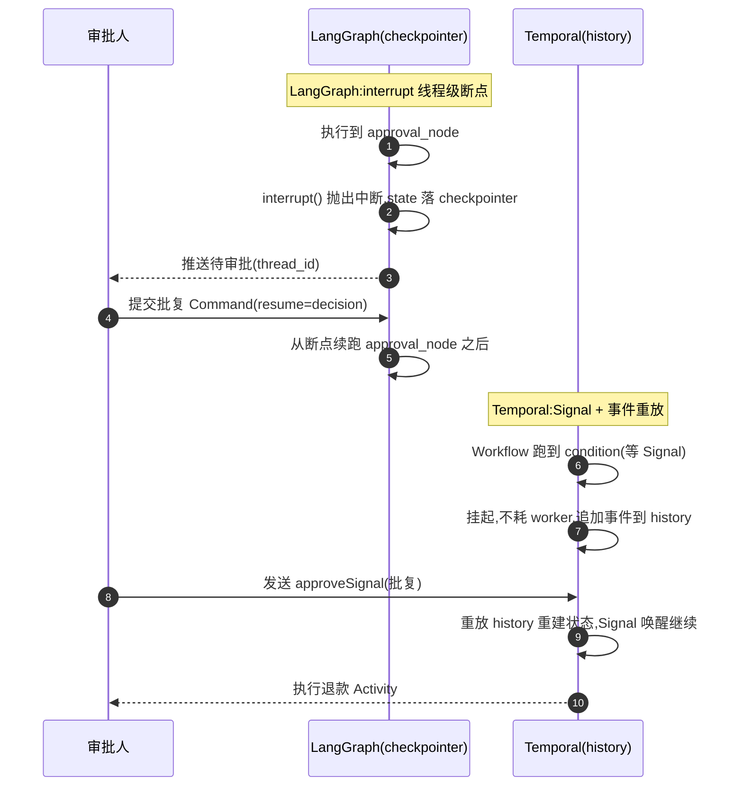
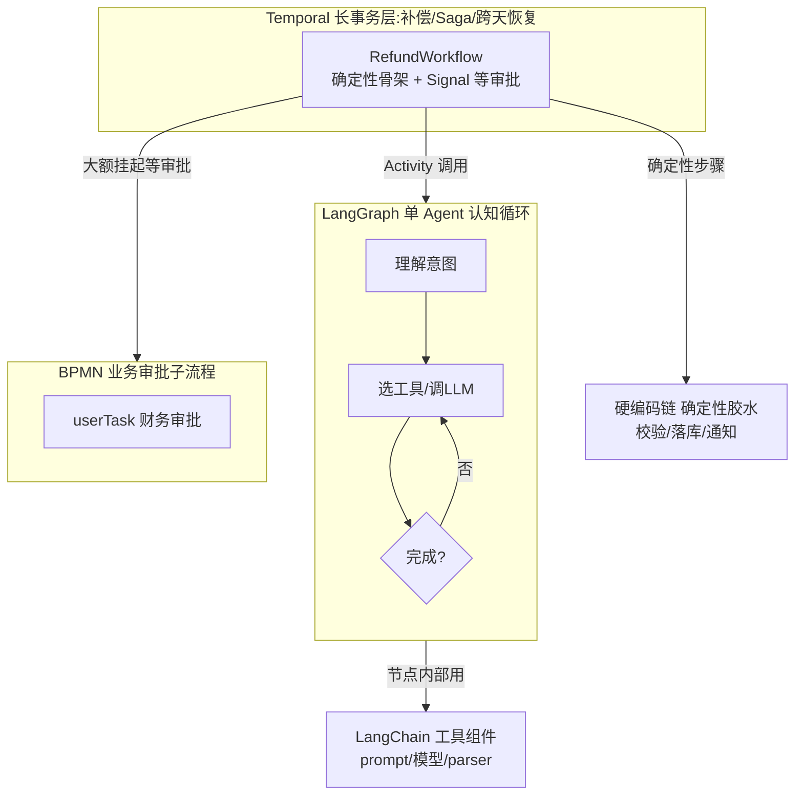

# 编排方案选型 决策表与决策树

> 编排选型没有银弹,真正的难点不是"哪个最强",而是"我的流程拓扑、状态寿命、HITL 诉求落在光谱哪一格"。把六种方案压到确定性 / 状态持久化 / HITL / 学习成本 / 运维成本五张表上,大多数纠结会消失——剩下的是组合,不是二选一。

> 本页是 [Orchestration 编排全景](./orchestration) 的落地选型篇:全景页讲"控制流归属"这条分界,本页直接给可照抄的决策表与决策树。

## 六种方案一句话画像

先记住每个方案的**本质定位**,后面所有对比都是这六句话的展开。

| 方案                                              | 一句话定位                                               | 控制流归属                |
| ------------------------------------------------- | -------------------------------------------------------- | ------------------------- |
| 硬编码链                                          | 确定性代码编排,中间嵌几个 LLM 节点                       | 代码                      |
| [LangChain](./langchain)                          | LLM **组件抽象库**(prompt/模型/parser/工具),不是编排引擎 | 代码(组件由你串)          |
| [LangGraph](./langgraph)                          | 带全局状态的**图状态机**:环/分支/持久化/HITL             | 结构代码定,节点内可模型定 |
| [BPMN 引擎](./bpmn)                               | **可视化声明式流程**,业务能看图读流程                    | BPMN 模型定义             |
| [Temporal](./workflow)                            | **持久化执行**(Durable Execution)的分布式任务编排        | Workflow 代码(确定性)     |
| [纯 prompt + FunctionCalling](./function-calling) | 控制权交模型,代码只做工具执行循环                        | **模型**                  |

> 关键分水岭:**LangChain 是组件库不是编排引擎**,纯 FunctionCalling 是唯一把下一步交给模型的方案。这两个最常被错配。

---

## 先选后看:选型决策树

别一上来就比功能矩阵,先回答四个问题,逐层收敛到方案。**本图核心结论:先看拓扑是否模型动态决定,再看状态要不要跨时间存活,再看业务要不要看图,最后看轻量场景直接硬编码。**



读图方式:

- **第一个分叉最重要**——拓扑由代码定还是模型定,把六方案劈成两半,详见「确定性与可控性」。
- **第二个分叉是最大分水岭**——状态要不要活得比进程久,这一步常一票否决,详见「状态持久化」。
- 走到 FC/LG 后还要再看步数:纯 FunctionCalling 超过 3-5 步就该收回代码编排,见「反模式」。

---

## 核心维度对比总表(速查)

五张表压成一张速查,后面分节逐个深挖。**"流程拓扑可静态穷举"一列是确定性的核心判据。**

| 维度               | 硬编码链       | LangChain        | LangGraph             | BPMN                 | Temporal         | 纯 FunctionCalling |
| ------------------ | -------------- | ---------------- | --------------------- | -------------------- | ---------------- | ------------------ |
| 本质               | 代码编排       | 组件库           | 图状态机              | 可视化流程           | 持久化执行       | 模型自主循环       |
| **拓扑可静态穷举** | ✅             | ✅               | 结构✅节点内❌        | ✅                   | ✅               | ❌ 完全不可枚举    |
| 状态持久化         | ❌ 进程内存    | ❌ 自己管        | 线程级 Checkpointer   | ✅ 引擎库            | ✅ 事件溯源      | ❌ 默认无状态      |
| 崩溃断点恢复       | ❌ 从头再来    | ❌               | ✅ thread 续跑        | ✅                   | ✅ 重放恢复      | ❌                 |
| HITL 介入成本      | 高(手写状态机) | 高               | ✅ 原生 interrupt     | ✅ userTask 天然审批 | ✅ Signal 等输入 | 高(手写暂停/恢复)  |
| 学习成本           | 极低           | 中高(抽象泄漏)   | 中高(图/状态/Command) | 高(符号+引擎)        | 高(确定性/重放)  | 极低(while 循环)   |
| 运维成本           | 极低           | 低(库)+LangSmith | 低(库)+LangSmith      | 高(重型中间件)       | 高(集群/Cloud)   | 极低               |
| 可观测性           | 自建           | LangSmith        | LangSmith             | 引擎级审计历史       | 自带事件历史     | 自建               |

---

## 维度深挖:确定性与可控性

**确定性是光谱不是开关。** 关键判据是:**流程拓扑能否在定义阶段静态穷举**。能穷举就能静态审查、能离线测试、能回放审计;不能穷举就只能在运行时看 Trace 事后补。

| 方案                       | 拓扑可静态穷举 | 说明                                                                       |
| -------------------------- | -------------- | -------------------------------------------------------------------------- |
| 硬编码链 / Temporal / BPMN | ✅ 100%        | 路径写死在代码/模型定义里,可静态审查、画图、枚举测试                       |
| LangGraph                  | 半             | **图结构代码定**(可穷举节点与边),但**节点内部可走模型**,单节点输出不可预测 |
| 纯 FunctionCalling         | ❌             | **下一步完全由模型推理**,无法提前枚举会调哪个工具、调几次、何时停          |

实践含义:

- 合规/审计/金融场景,优先拓扑可穷举的方案(Temporal/BPMN/硬编码链),把模型的不确定性**收敛进单个节点内部**,节点间的流转保持确定。
- LangGraph 是折中:骨架确定、节点内灵活。把"必须可控的分支"画成显式条件边,把"可以交给模型的判断"塞进节点内部。
- 纯 FunctionCalling 的不可枚举性,决定了它只适合**短、可控、可人工兜底**的场景,见「反模式」。

---

## 维度深挖:状态持久化与断点恢复

**这是六个维度里最大的分水岭,常一票否决。** 业务流程的寿命一旦超过进程寿命(跨分钟/天/周、等异步外部事件、等人工审批),状态就必须活在存储里而不是调用栈里。

| 方案               | 持久化机制                    | 能跨多久     | 崩溃恢复                            |
| ------------------ | ----------------------------- | ------------ | ----------------------------------- |
| Temporal           | 事件溯源(append-only history) | 天/周/月     | ✅ 重放 history 重建状态,从断点续跑 |
| BPMN               | 引擎持久化流程实例到 DB       | 天/周/月     | ✅ 实例可挂起/恢复                  |
| LangGraph          | Checkpointer(线程级快照)      | 线程生命周期 | ✅ thread_id 续跑                   |
| 硬编码链           | ❌ 进程内存                   | 单次进程     | ❌ 崩了从头再来                     |
| 纯 FunctionCalling | ❌ 默认无状态                 | 单次循环     | ❌ 崩了从头再来                     |

判据一句话:**只要流程会"等"——等人、等外部回调、等定时——就别用内存态方案**,直接上 Temporal/BPMN,或至少 LangGraph Checkpointer。长流程/审批/异步等待这三类场景,这一维度直接淘汰硬编码链和纯 FunctionCalling。

---

## 维度深挖:Human-in-the-Loop 介入

HITL 的实现成本天差地别,而且**最常被低估**。难点不是"暂停",而是"暂停-持久化-等待-恢复"这一整套状态机:状态存哪、怎么标识等谁、恢复时怎么从断点续跑不重复副作用。

| 方案                          | HITL 机制                                  | 你要写多少                                                  |
| ----------------------------- | ------------------------------------------ | ----------------------------------------------------------- |
| LangGraph                     | 原生 `interrupt`,checkpointer 自动存断点   | 几乎零,框架包了                                             |
| BPMN                          | `userTask` 天然就是审批节点,引擎挂起等回调 | 只画流程图                                                  |
| Temporal                      | `Signal` 等人工输入,workflow 挂起不耗资源  | 少,定义 Signal handler                                      |
| 硬编码链 / 纯 FunctionCalling | ❌ 无原生支持                              | **手写整套状态机**:暂停点落库 + 等待轮询/Webhook + 幂等恢复 |

❌ 在硬编码链/纯 FunctionCalling 里做审批,手写 sleep + 轮询 DB 等人工点按钮——无法精确从断点续跑、无法留痕、崩溃即丢。
✅ 有 HITL 诉求直接选带原生机制的方案:要图状态选 LangGraph `interrupt`,要业务审批选 BPMN `userTask`,要长事务选 Temporal `Signal`。

同一个"大额退款需人工审批",两种主流方案的断点/恢复差异一目了然。**本图核心结论:LangGraph 在节点内 `interrupt` 挂起、checkpointer 存线程断点;Temporal 把审批外化成 `Signal`,Workflow 挂起不耗资源、靠事件历史重放恢复。**



读图方式:LangGraph 的断点是**图内某个节点的中断**,恢复粒度是"节点之后";Temporal 的断点是**Workflow 的一次等待**,恢复粒度是"重放整段历史后从 Signal 点继续"。两者都能跨崩溃,但 Temporal 靠事件溯源天然抗进程重启,LangGraph 靠 checkpointer 落盘。

---

## 学习成本与团队上手曲线

| 方案               | 核心概念                             | 上手曲线            | 坑                                       |
| ------------------ | ------------------------------------ | ------------------- | ---------------------------------------- |
| 纯 FunctionCalling | while 循环 + 工具分发                | 极低,几乎零框架概念 | 容易裸奔,缺持久化/HITL                   |
| 硬编码链           | 无,就是写代码                        | 极低,零依赖         | 复杂度全在自己代码里                     |
| LangChain          | Runnable/LCEL/记忆/流式              | 中高                | **抽象泄漏 + 版本 API 漂移**,LCEL 概念多 |
| LangGraph          | State/Node/Edge/Command/Checkpointer | 中高                | 图建模思维要转,Command 控制流要练        |
| Temporal           | Workflow/Activity/确定性/重放        | 高                  | **确定性约束反直觉**,见下                |
| BPMN               | BPMN 2.0 建模符号 + 引擎 API         | 高                  | 符号体系重,引擎概念多                    |

> 团队没有工作流引擎经验时,Temporal 和 BPMN 的概念成本是真实开销,别低估。反之纯 FunctionCalling 和硬编码链是"今天就能写"的级别。

---

## 运维成本与可观测性

| 方案               | 部署形态                          | 额外设施                      | 可观测性                  |
| ------------------ | --------------------------------- | ----------------------------- | ------------------------- |
| 硬编码链           | 随应用                            | 无                            | 自建(日志/Trace 全自己拼) |
| 纯 FunctionCalling | 随应用                            | 无                            | 自建                      |
| LangChain          | 库,随应用部署                     | LangSmith(SaaS 或自托管)      | LangSmith Trace           |
| LangGraph          | 库,随应用部署                     | LangSmith + Checkpointer 存储 | LangSmith + 图状态快照    |
| Temporal           | **服务端集群**(或 Temporal Cloud) | 集群 + 持久化存储             | ✅ 自带事件历史,天然审计  |
| BPMN               | **重型中间件**(Camunda/Flowable)  | 引擎服务 + DB                 | ✅ 引擎级实例历史/审计    |

权衡很直白:**Temporal/BPMN 把可观测性和审计"买"回来了,但要养一套服务端;硬编码链/纯 FunctionCalling 零设施,但可观测全自建**。LangChain/LangGraph 居中:是库随应用走,但想要好 Trace 得接 LangSmith。

---

## 同一个需求六种写法(代码对比)

需求:**"退款审批 Agent"——校验金额 → 大额需人工审批 → 执行退款 → 通知**。同一个需求,六种方案的控制流形态一眼可见。

### 1. 硬编码链:纯代码,LLM 只是节点

```ts
// 控制流 100% 写死,LLM 只是其中一步纯函数
async function refundChain(req: RefundReq) {
  const check = await validateAmount(req); // 确定性校验
  if (!check.ok) return { status: 'rejected' };
  // ❌ 大额审批在这里没法优雅"暂停等人",只能拆成两个接口轮询
  const draft = await llmDraftReason(req); // LLM 节点:起草退款说明
  const result = await executeRefund(req, draft); // 确定性执行
  await notify(req.userId, result);
  return { status: 'done' };
}
```

### 2. LangChain:提供组件,不管编排

```ts
// LangChain 只给你可复用的"零件",串成链是 DAG 无环、无状态
import { ChatPromptTemplate } from '@langchain/core/prompts';
import { ChatOpenAI } from '@langchain/openai';
import { StringOutputParser } from '@langchain/core/output_parsers';

// 一个 LCEL 链 = 一个 LLM 节点,本身表达不了循环/审批断点
const draftChain = ChatPromptTemplate.fromTemplate('为退款单起草说明:{detail}')
  .pipe(new ChatOpenAI({ model: 'gpt-4o-mini' }))
  .pipe(new StringOutputParser());
// 编排仍靠你在外层写 if/else——LangChain 不是编排引擎
```

### 3. LangGraph:图状态机,原生审批断点

```python
# 状态在节点间流转,interrupt 让审批成为一等公民,checkpointer 自动存断点
from langgraph.graph import StateGraph, START, END
from langgraph.types import interrupt

def approval_node(state: RefundState):
    if state["amount"] > THRESHOLD:
        decision = interrupt({"question": "批准大额退款?", "amount": state["amount"]})
        # 人工批复后从这里续跑,断点已由 checkpointer 落盘
        return {"approved": decision["approve"]}
    return {"approved": True}  # 小额自动通过

g = StateGraph(RefundState)
g.add_node("validate", validate); g.add_node("approve", approval_node)
g.add_node("execute", execute_refund)
g.add_edge(START, "validate"); g.add_edge("validate", "approve")
g.add_edge("approve", "execute"); g.add_edge("execute", END)
app = g.compile(checkpointer=checkpointer)  # 配上 checkpointer 才有断点恢复
```

### 4. BPMN:审批画成 userTask,引擎挂起

```xml
<!-- 控制流搬进 BPMN 定义,业务能看图;审批=userTask 天然挂起等回调 -->
<bpmn:process id="refund" isExecutable="true">
  <bpmn:startEvent id="start"/>
  <bpmn:serviceTask id="validate" name="校验金额" camunda:expression="${validate}"/>
  <bpmn:exclusiveGateway id="isLarge" name="大额?"/>
  <bpmn:userTask id="approve" name="人工审批" camunda:assignee="finance"/>
  <bpmn:serviceTask id="refundTask" name="执行退款" camunda:expression="${refund}"/>
  <!-- LLM 起草只是其中一个 serviceTask 节点,不当主角 -->
</bpmn:process>
```

### 5. Temporal:审批=Signal,workflow 挂起不耗资源

```ts
// Workflow 函数必须确定性:副作用(调 LLM/退款)全包进 Activity
import { defineSignal, setHandler, condition } from '@temporalio/workflow';

export const approveSignal = defineSignal<[boolean]>('approve');

export async function refundWorkflow(req: RefundReq) {
  let approved: boolean | null = null;
  setHandler(approveSignal, (ok) => {
    approved = ok;
  }); // 人工批复经 Signal 注入

  await activities.validate(req); // Activity:副作用
  if (req.amount > THRESHOLD) {
    await condition(() => approved !== null, '7d'); // 挂起等审批,最多 7 天,不耗 worker
  }
  if (approved === false) return { status: 'rejected' };
  const draft = await activities.llmDraft(req); // LLM 也必须在 Activity 里
  await activities.refund(req, draft);
  return { status: 'done' };
}
```

### 6. 纯 FunctionCalling:控制权交模型

```ts
// 下一步由模型现想,代码只做"执行工具 + 回灌结果"的循环
// ❌ 跑这个多步审批流程:模型可能上下文漂移、选错工具,且无持久化无法断点恢复
const tools = [validateAmount, requestApproval, executeRefund, notifyUser];
let messages = [{ role: 'user', content: `处理退款单 ${req.id}` }];

while (true) {
  const resp = await llm.chat({ messages, tools });
  if (!resp.tool_calls) break; // 模型说停就停
  for (const call of resp.tool_calls) {
    const out = await dispatch(call); // 执行模型选的工具
    messages.push(toToolResult(call, out)); // 结果回灌,让模型再想下一步
  }
}
// ⚠️ 步数一多就失控,见「反模式」
```

---

## 混合架构:真实项目里的组合搭配

**真实架构几乎没有单一方案,而是按职责组合。** 各方案在系统里只占它最擅长的一层。**本图核心结论:Temporal 包住长事务与补偿,LangGraph 在内部跑单个 Agent 的认知循环,BPMN 承载业务审批子流程,LangChain 只出工具组件,硬编码链做确定性胶水。**



分工一句话:

- **Temporal 管长事务与补偿(Saga)**:跨天、等审批、失败回滚。
- **LangGraph 管单 Agent 认知循环**:思考→工具→反思的环,被包成一个 Temporal Activity。
- **LangChain 只提供工具组件**:LangGraph 节点内部用 LCEL 链。
- **BPMN 暴露业务审批子流程**:财务/运营要看图改图的部分。
- **硬编码链串确定性胶水**:校验、落库、通知这些不需要任何框架的步骤。

---

## 选型反模式与常见误判

### ❌ 把 LangChain 当编排方案本身

LangChain 是**组件库不是编排引擎**。很多人用 Chain/LCEL 拼多步,做到一半发现 **DAG 表达不了循环、没有状态、没有断点**,被迫整体迁移到 LangGraph。
✅ 要状态化编排(环/断点/HITL)直接上 [LangGraph](./langgraph);LangChain 只用来提供节点内部的 prompt/模型/parser 组件。

### ❌ 误用纯 FunctionCalling 跑长流程

模型自主循环多步会**上下文漂移、幻觉、选错工具,越走越偏**;且默认无持久化,崩了无法断点恢复。
✅ **超过 3-5 步的确定性流程就该把控制权收回代码编排**——把模型的不确定性收敛进单个节点,节点间流转用代码/LangGraph 固定。

### ❌ 低估 Temporal 的确定性约束

Workflow 函数**必须确定性**:不能直接调 LLM、不能用随机数、不能读当前时间——否则重放时结果分叉,状态直接错乱。
✅ 所有副作用(网络/LLM/随机/时间)一律包进 **Activity**,Workflow 里只做编排;先吃透**重放语义**再写复杂流程。详见 [Temporal / Workflow](./workflow)。

### ❌ 为上 BPMN 引擎而上 BPMN

没有流程建模诉求、业务根本不看流程图时,引 Camunda 纯属**自增运维负担**(引擎服务 + DB + 符号体系)。
✅ **"业务要可视编辑流程"才是 BPMN 的硬约束**——只有这条成立才上 BPMN,否则 Temporal/LangGraph 更轻。详见 [BPMN](./bpmn)。

---

## 选型结论速记

- **拓扑要模型动态决定 + 短流程** → 纯 [FunctionCalling](./function-calling);要环/HITL → [LangGraph](./langgraph)。
- **拓扑可枚举 + 跨天持久化/崩溃恢复** → 纯技术长事务选 [Temporal](./workflow);业务要看图改图选 [BPMN](./bpmn)。
- **轻量线性几步** → 硬编码链 + [LangChain](./langchain) 组件,别引框架。
- **真实系统几乎总是组合**:Temporal 管长事务,LangGraph 管认知循环,BPMN 管业务审批,硬编码链做胶水。
