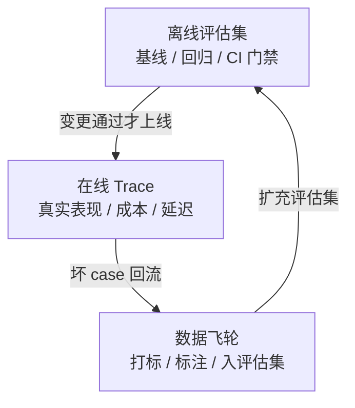
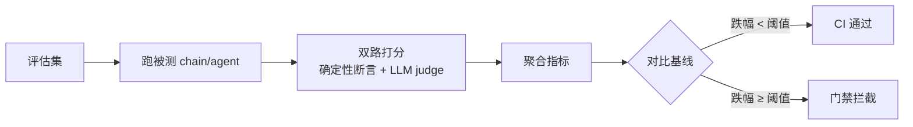
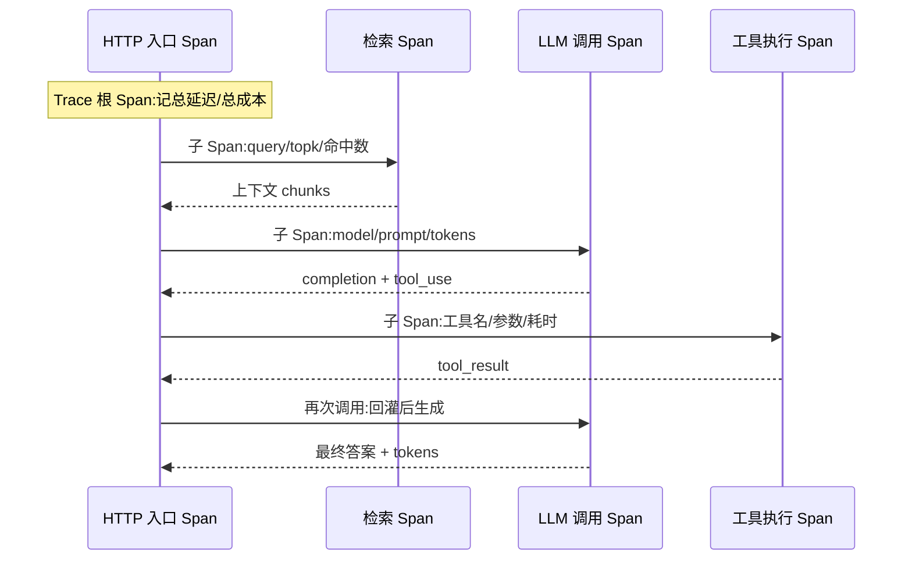
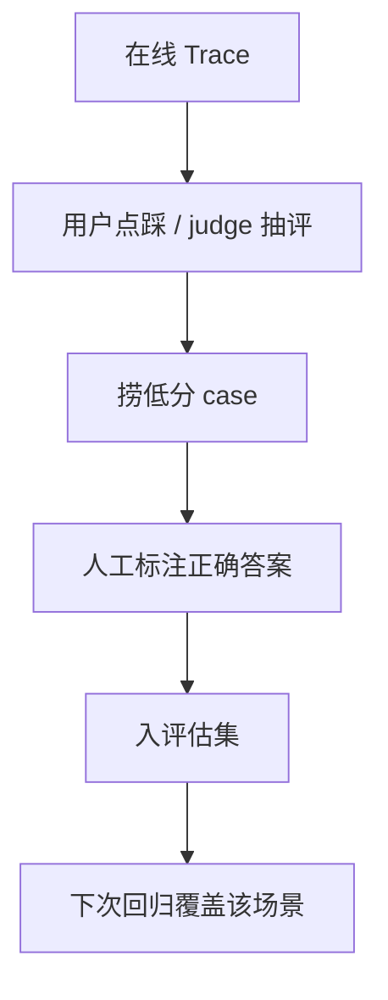

# 评估与可观测 Eval & Observability

> LLM 应用的分水岭不在"demo 跑通"，而在"可迭代"：离线评估集定基线、在线 trace 看真相、成本延迟管预算。三层缺一，你就在凭感觉改 prompt——每次"优化"都不知道是变好了还是变坏了。

## 为什么 LLM 应用必须单独做评估

传统单测断言"输出 === 期望值"，LLM 输出是**分布**——同一条 prompt 两次跑结果不同，且"对错"往往是程度问题而非布尔。这决定了 LLM 评估的三个本质差异：

| 维度     | 传统单测           | LLM 评估                       |
| -------- | ------------------ | ------------------------------ |
| 输出     | 确定性，可精确断言 | 随机性，只能统计判定           |
| 对错     | 布尔（对/错）      | 连续（相关性 0.8、忠实度 0.6） |
| 判定者   | 代码 assert        | 代码断言 + LLM judge 混合      |
| 回归含义 | 过了就是过了       | 分数跌了要查是噪声还是真退化   |

所以 LLM 评估的核心是**把"感觉变好了"变成可重复的分数**：固定输入集 → 固定打分口径 → 跑分 → 对比基线。没有这个，"调 prompt"就是玄学。

> ❌ 改完 prompt 手动试三条觉得"不错"就上线 —— 三条样本没有统计意义，手感会被锚定效应带偏。
> ✅ 至少几十条评估集跑分，关键指标有显著变化才下结论。

---

## 评估体系全景：离线 / 在线 / 闭环三层

三层各司其职，**缺一层迭代就失明**：

- **离线 Eval**：管"这次变更有没有变好"——金标准评估集 + 跑分 + 对比基线，进 CI。
- **在线 Observability**：管"线上真实发生了什么"——trace / span / token / 成本 / 延迟，看离线覆盖不到的真实分布。
- **闭环迭代**：管"线上失败怎么变成下次的评估数据"——把坏 case 回流进评估集，数据飞轮产生复利。



> 核心结论：离线 90 分不代表线上不死循环刷 token；在线 trace 漂亮也不代表变更方向对。三层互相校准，单层都是盲人摸象。

---

## 离线评估：构建金标准评估集

评估集是**资产**，不是一次性脚本。三路来源滚动扩充，持续与真实分布对齐：

| 来源                          | 价值                         | 占比建议 |
| ----------------------------- | ---------------------------- | -------- |
| 真实 query（线上日志采样）    | 对齐真实分布，最有代表性     | ~60%     |
| 边界 case（人工脑补对抗样本） | 覆盖长尾、注入、空输入、多轮 | ~25%     |
| 历史 bug 回归（线上事故沉淀） | 防止同一个坑踩两次           | ~15%     |

**防污染**：公开 benchmark（MMLU、HumanEval 等）可能已被模型"背过"——分数虚高但不代表你业务的真实表现。**自建私有集才可信**，且不要混进任何训练/微调语料。

每条样本至少带 `input` + `expected`（或 `reference`）+ 标签（来源/难度/功能），标注用"什么算对"的判据，不只是参考答案：

```json
{
  "id": "eval-0142",
  "input": "我上个月买的耳机坏了能退吗",
  "reference": "30 天内质量问题可退,引导走售后流程",
  "tags": ["refund", "edge:time-boundary"],
  "source": "online_log",
  "assert": { "must_contain": ["30 天", "售后"], "must_not_call": ["delete_user"] }
}
```

> ❌ 评估集上线前脑补建一批就再不动 —— 三个月后与真实分布脱节，分数自欺。
> ✅ 每周从线上低分 case 回流补充（见文末数据飞轮），评估集是活文档。

---

## 确定性断言：能写代码判的绝不丢给 LLM

**能用代码判的，用 LLM 判是又贵又有方差还不可复现。** 格式、字段、关键词、数值区间、禁调工具，全部零成本零方差的代码断言：

```ts
type Assertion = (output: string, ctx: { toolCalls: string[] }) => boolean;

// 一组确定性断言:零 token 成本、可复现、可进 CI
const deterministicChecks: Record<string, Assertion> = {
  // 格式:必须返回合法 JSON
  is_valid_json: (out) => {
    try {
      JSON.parse(out);
      return true;
    } catch {
      return false;
    }
  },
  // 字段:必须包含指定键
  has_refund_field: (out) => 'refundPolicy' in JSON.parse(out),
  // 关键词:必须提到时效
  mentions_deadline: (out) => /\d+\s*天/.test(out),
  // 数值区间:金额必须在合理范围
  amount_in_range: (out) => {
    const a = JSON.parse(out).amount;
    return a >= 0 && a <= 100000;
  },
  // 行为:不允许调用危险工具
  no_dangerous_tool: (_out, ctx) => !ctx.toolCalls.some((t) => ['delete_user', 'transfer'].includes(t)),
};
```

只有**开放性质量**——相关性、忠实度、语气、可读性——代码判不了，才交给 LLM judge。划分原则一句话：**判据能否写成布尔表达式，能就代码断言。**

| 判据类型                        | 判定者    | 原因                   |
| ------------------------------- | --------- | ---------------------- |
| JSON 合法 / 字段在 / 关键词命中 | 代码断言  | 零成本零方差，可复现   |
| 数值区间 / 禁调工具 / 正则匹配  | 代码断言  | 确定性，judge 反而会漏 |
| 相关性 / 忠实度 / 语气 / 完整性 | LLM judge | 语义判断，代码写不出   |

---

## LLM-as-Judge：rubric 设计与偏差控制

judge 不可信的主要来源是**裸分数 + 三大偏差**。对策：结构化 rubric + 显式对冲。

**强制结构化输出，reason 在前 score 在后**——先给依据再给分，逼模型"想清楚再打分"，两次跑分才对得上、可定位：

```ts
const JUDGE_PROMPT = `你是严格的评审。按以下 rubric 逐维打分(1-5),先写依据再给分。
维度:
- relevance: 答案是否回应了问题
- faithfulness: 答案是否被给定上下文支撑,有无编造
- completeness: 关键信息是否遗漏
先输出每维 reason(引用答案/上下文原文作证据),再输出每维 score。`;

// judge 必须输出结构化 JSON:reason 逼模型先给依据,可复现可定位
interface JudgeResult {
  relevance: { reason: string; score: number };
  faithfulness: { reason: string; score: number };
  completeness: { reason: string; score: number };
}
```

**三大偏差显式对冲**：

| 偏差     | 现象                          | 对冲                        |
| -------- | ----------------------------- | --------------------------- |
| 位置偏差 | 对比两个答案时偏向先出现的    | swap 顺序各评一次取均值     |
| 冗长偏差 | 倾向给更长答案更高分          | rubric 显式"不以长度论优劣" |
| 自我偏好 | 同源模型当 judge 给自己系偏高 | judge 用不同厂商/更强模型   |

```ts
// 位置偏差对冲:A/B 两种顺序各评一次,取均值
async function scorePair(q: string, a: string, b: string) {
  const s1 = await judge(q, a, b); // a 在前
  const s2 = await judge(q, b, a); // swap 后 b 在前
  return { a: (s1.a + s2.b) / 2, b: (s1.b + s2.a) / 2 }; // 对齐回原序
}
```

**G-Eval / RAGAS** 是这套方法的工程化封装。RAG 场景四个核心指标——faithfulness（答案是否被上下文支撑，防幻觉）、answer relevancy、context precision、context recall，详见 [RAG](./rag)。judge 一律要求输出 JSON `{score, reason}`，few-shot 锚点（给 1-2 个打分范例）能显著降低方差。

> ❌ judge 只输出裸分数没 rubric 没 reason —— 两次跑分对不上，无法定位是噪声还是真问题。
> ✅ 强制 `{score, reason}` 结构化输出，reason 在前逼模型先给依据；swap 顺序对冲位置偏差。

---

## 回归测试：把评估集接进 CI

改 prompt / 换模型 / 调检索，都必须跑评估集对比基线，**关键指标跌幅超阈值就 fail**。这就是 [Prompt 工程](./prompt-engineering) 里说的"prompt 回归"——prompt 也是代码，改动要走同样的回归门禁。



两层跑法平衡速度与覆盖：**小而精核心集（几十条）做提交门禁秒级跑完，大全量集（几百上千条）夜间回归**。

```ts
// CI 门禁:核心指标跌幅超阈值即 fail
function gate(current: Metrics, baseline: Metrics) {
  const THRESHOLD = 0.03; // 关键指标允许的最大跌幅
  const drops = {
    faithfulness: baseline.faithfulness - current.faithfulness,
    relevance: baseline.relevance - current.relevance,
    pass_rate: baseline.pass_rate - current.pass_rate, // 确定性断言通过率
  };
  for (const [k, drop] of Object.entries(drops)) {
    if (drop > THRESHOLD) {
      throw new Error(`回归失败:${k} 跌 ${(drop * 100).toFixed(1)}% 超阈值`);
    }
  }
}
```

> ❌ 只看总分过门禁 —— 总分涨了可能掩盖某个关键维度（如 faithfulness）的崩塌。
> ✅ 关键维度单独设阈值，逐维对比，任一跌破都拦截。

---

## 在线可观测：Trace 与 Span 的数据模型

一次请求 = 一个 **Trace**；每个 LLM 调用 / 检索 / 工具执行 = 一个 **Span**，树形挂在 Trace 下。Span 记录 model / prompt / completion / tokens / latency / cost，让你逐层定位"检索对但生成错"。



每个 Span 该记的字段（成本与延迟归因全靠它）：

| 字段                        | 说明                         |
| --------------------------- | ---------------------------- |
| `model`                     | 用的哪个模型，定价据此核算   |
| `prompt` / `completion`     | 输入输出原文（注意脱敏）     |
| `usage.input/output_tokens` | 分开记，单价不同             |
| `latency_ms`                | 本 Span 耗时                 |
| `cost`                      | 按 model 单价 + tokens 算出  |
| `status` / `error`          | 失败 Span 标红，定位链路断点 |

---

## OpenTelemetry GenAI 语义约定

OTel 的 GenAI 语义约定（`gen_ai.*` 属性族）给 Span 字段定了**厂商中立的标准名**，Langfuse / LangSmith 等都在向它对齐。用标准属性名埋点，换观测平台不用改埋点代码：

```ts
import { trace } from '@opentelemetry/api';

const tracer = trace.getTracer('llm-app');

async function callLlm(prompt: string) {
  return tracer.startActiveSpan('chat claude', async (span) => {
    // OTel GenAI 语义约定属性:厂商中立,跨平台通用
    span.setAttribute('gen_ai.system', 'anthropic');
    span.setAttribute('gen_ai.request.model', 'claude-opus-4-8');
    span.setAttribute('gen_ai.request.max_tokens', 16000);
    try {
      const resp = await client.messages.create(/* ... */);
      span.setAttribute('gen_ai.usage.input_tokens', resp.usage.input_tokens);
      span.setAttribute('gen_ai.usage.output_tokens', resp.usage.output_tokens);
      return resp;
    } finally {
      span.end();
    }
  });
}
```

LangSmith 与 Langfuse 本质都是这套 trace 数据的采集 + 可视化后台；LangSmith 对 LangChain/LangGraph 是环境变量即开的零成本接入（见 [LangChain](./langchain) 与 [LangGraph](./langgraph)），Langfuse 则开源可自托管。**选谁不重要，重要的是埋点用标准属性名，数据不被某家锁定。**

---

## Token 成本核算：按 trace / 用户 / 功能归因

把月度总账单当成本监控等于没监控——发现超支时某 agent 循环已烧掉大半预算。**按 trace → 用户 → 功能逐层分摊**，才能定位"是谁在烧钱"。

```ts
// 每个 Span 落 cost,按维度聚合归因
interface CostRecord {
  traceId: string;
  userId: string;
  feature: string; // 哪个功能:refund-qa / summary / codegen
  model: string;
  inputTokens: number;
  outputTokens: number;
  cachedTokens: number; // 命中缓存的 token,单价低很多
  cost: number;
}

// 按功能聚合:立刻看出哪个功能是成本大头
function costByFeature(records: CostRecord[]) {
  return records.reduce<Record<string, number>>((acc, r) => {
    acc[r.feature] = (acc[r.feature] ?? 0) + r.cost;
    return acc;
  }, {});
}
```

**cached 与 input/output 单价不同，必须分开统计**——缓存命中率是省钱关键。某 agent 陷入死循环时，按 trace 归因能在第一个 span 暴涨时告警，而不是月底看账单才发现。

> ❌ 把月度总账单当成本监控 —— 无法归因到功能/用户，发现时预算已烧穿。
> ✅ 按 trace→用户→功能分摊，cached 与 input/output 分开统计，异常 span 实时告警。

---

## 延迟监控：TTFT / TPOT / 端到端分位

延迟要拆开看，**均值会掩盖长尾**：

| 指标                  | 含义                       | 影响                             |
| --------------------- | -------------------------- | -------------------------------- |
| TTFT（首 token 时间） | 发出请求到收到第一个 token | 直接决定体感快慢                 |
| TPOT（每 token 时间） | 流式逐 token 的间隔        | 决定"打字速度"                   |
| 端到端 p50/p95/p99    | 整请求完成时间的分位       | 长尾来自重试/长上下文/agent 多轮 |

```ts
// 流式下分别记 TTFT 与端到端,进分位统计
async function streamWithLatency(prompt: string) {
  const t0 = performance.now();
  let ttft: number | null = null;
  const stream = await client.messages.stream({
    /* ... */
  });
  for await (const chunk of stream) {
    if (ttft === null && chunk.type === 'content_block_delta') {
      ttft = performance.now() - t0; // 首 token 时间
    }
  }
  const total = performance.now() - t0; // 端到端
  latencySink.record({ ttft, total }); // 落 p50/p95/p99
}
```

**p95/p99 长尾常来自：重试放大、超长上下文、agent 多轮循环**。只看均值会觉得"挺快"，但 5% 的用户在等 30 秒。给 TTFT 和端到端分别设 p95 预算，超预算的 trace 单独捞出来看是哪个 span 拖的。

---

## 把线上坏 case 回流成评估样本（数据飞轮）

这是复利所在：线上打标 → 捞低分 trace → 人工标注 → 进评估集 → 下次回归覆盖。评估集因此持续对齐真实分布，越用越准。



三路打标信号：**用户显式反馈（点踩/点赞）、judge 对线上样本抽评、人工巡检**。低分 case 进评估集前必须人工标注"正确答案是什么"，否则 judge 的低分可能是 judge 自己的误判。

> ❌ 线上坏 case 看完就扔 —— 同类问题反复出现，每次都靠人肉救火。
> ✅ 坏 case 回流进评估集，标注正确答案，下次回归自动覆盖，一次踩坑终身免疫。

---

## 工具选型速查

| 工具       | 定位                     | 优势                          | 适合                 |
| ---------- | ------------------------ | ----------------------------- | -------------------- |
| LangSmith  | LangChain/LangGraph 原生 | 环境变量即开、与框架零缝隙    | 已用 Lang 系，要快   |
| Langfuse   | 开源可自托管             | 数据自控、框架无关、OTel 对齐 | 数据敏感 / 多云      |
| Braintrust | 评估优先                 | eval 工作流强、对比实验好用   | 重评估迭代           |
| 自建       | OTel + 自有存储          | 完全可控                      | 有平台团队、特殊合规 |

选型一句话：**埋点用 OTel GenAI 标准属性名，后台选谁都不被锁定。** 已用 Lang 系就 LangSmith 起步最快；数据要自留就 Langfuse 自托管。LangSmith 接入细节见 [LangChain](./langchain)。

---

## 常见陷阱与反模式

| ❌ 反模式                                        | ✅ 正确做法                                             |
| ------------------------------------------------ | ------------------------------------------------------- |
| 用 LLM judge 评一切，含能代码断言的格式/字段检查 | 格式/字段/关键词/数值用代码断言，只有开放质量交 judge   |
| judge 只输出裸分数没 rubric 没 reason            | 强制结构化 `{score, reason}`，reason 在前先给依据       |
| 评估集一次建好不再动                             | 从线上坏 case 持续回流，评估集滚动扩充                  |
| 只看离线分数上线，不看在线 trace/成本/延迟       | 离线 + 在线 + 闭环三层齐备，单层都是盲人摸象            |
| 把月度总账单当成本监控                           | 按 trace→用户→功能分摊，cached 与 input/output 分开统计 |
| 只看延迟均值                                     | TTFT / 端到端分开，看 p95/p99 长尾                      |
| 拿公开 benchmark 当业务评估                      | 公开集可能被背过，自建私有集才可信                      |
| judge 用同源模型评自己                           | judge 用不同厂商/更强模型，swap 顺序对冲位置偏差        |

**核心记忆点**：离线管"变好了吗"，在线管"真实发生了什么"，闭环管"失败怎么变成下次的评估数据"。三层是同一个迭代飞轮的三个齿轮，拆掉任何一个，你都在凭感觉改 prompt。
