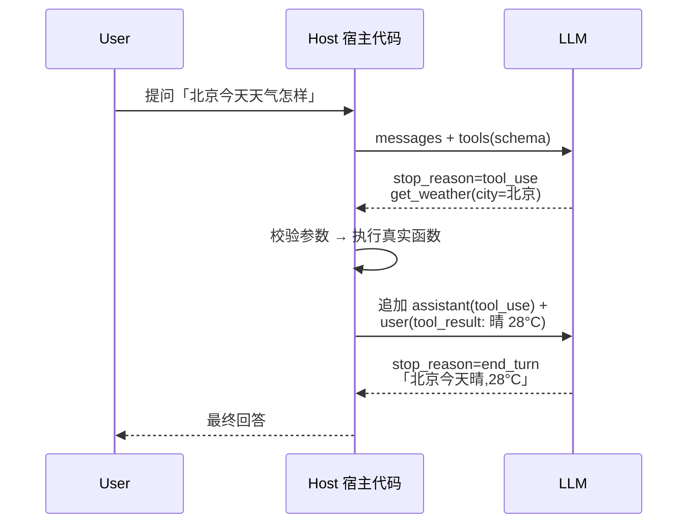
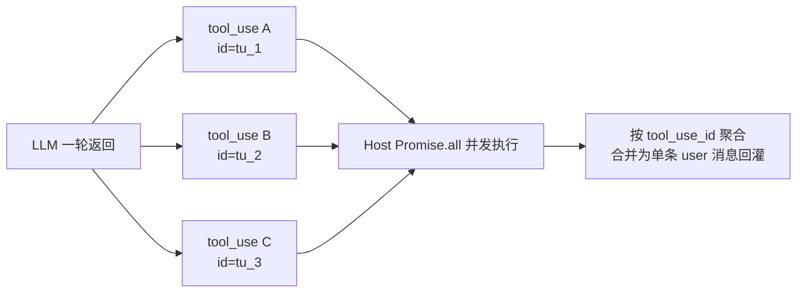
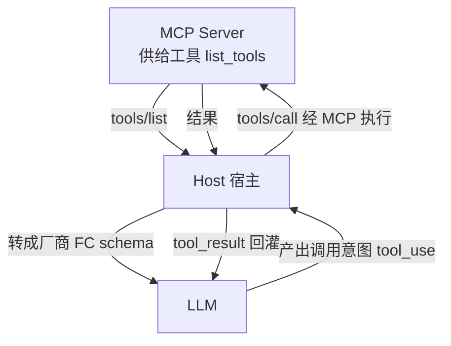

# Function Calling 工具调用机制与实战

> 模型本身从不"调函数"——它只输出一段结构化 JSON（`tool_calls` / `tool_use`），真正的解析、校验、执行、回灌、幂等全在你的宿主代码里。把这层想错，后面所有 Agent 都建立在流沙上。

## 核心机制：schema → 结构化输出 → 执行 → 回灌

Function Calling 的本质是**一份契约 + 一个循环**。你先用 JSON Schema 声明"模型可以叫我什么函数、参数长什么样"；模型在某个 turn 决定不调文字而是吐出一个 `tool_use` 块（名字 + arguments）；你的代码解析、执行这个函数；再把结果作为 `tool` role 消息塞回对话，再次请求模型；如此往复，直到模型不再返回 `tool_call` 为止。

关键点：**模型只做"决策"和"格式化"，从不触碰真实世界**。它输出的是"调用意图"，不是一个 RPC 调用。中间那道网络请求、那次数据库写入、那笔转账，全部由你的代码执行——这正是你能做权限、校验、幂等的唯一位置。



> 核心结论：一次"调用"就是一轮完整的 HTTP 往返；循环的终止条件是模型某一轮**不再返回** tool_use，而不是"工具执行成功"。

---

## Tool Schema 设计（JSON Schema + 字段说明）

**Schema 就是 prompt。** 模型选不选你的工具、参数填得对不对，几乎全部取决于 `name` / `description` / 字段约束写得好不好。schema 写得含糊，模型就会幻觉参数、漏必填、编造枚举。

一条好 description 要回答三件事：**何时用、何时不用、参数从哪来**。能用 `enum` 锁死就不要让它自由填字符串。

```json
{
  "name": "query_orders",
  "description": "查询订单列表。当用户问「我的订单/物流到哪了/买了什么」时调用。不要用它查商品详情（用 query_product）。user_id 必须从当前登录态取,禁止让模型猜。",
  "input_schema": {
    "type": "object",
    "properties": {
      "user_id": {
        "type": "string",
        "description": "当前登录用户 ID,由宿主注入,模型不得编造"
      },
      "status": {
        "type": "string",
        "enum": ["pending", "paid", "shipped", "done", "refund"],
        "description": "订单状态过滤;不传则查全部"
      },
      "limit": {
        "type": "integer",
        "description": "返回条数,默认 10,最大 50"
      }
    },
    "required": ["user_id"],
    "additionalProperties": false
  }
}
```

| 字段                   | 类型     | 必填 | 枚举值/范围 | 说明                                                      |
| ---------------------- | -------- | ---- | ----------- | --------------------------------------------------------- |
| `name`                 | string   | ✅   | snake_case  | 模型路由用的标识,名表意（`query_orders` 优于 `do_query`） |
| `description`          | string   | ✅   | —           | 决定选对工具的关键;写清「何时用/何时不用」                |
| `input_schema`         | object   | ✅   | JSON Schema | 参数契约,建议 `additionalProperties:false` 收紧           |
| `properties.<k>.enum`  | array    | ❌   | 穷举        | 有固定取值集就枚举,杜绝模型编字符串                       |
| `required`             | string[] | ✅   | —           | 只放真正必填;过多必填会让模型硬凑参数                     |
| `additionalProperties` | boolean  | ❌   | `false`     | 拒绝模型塞 schema 外的幻觉字段                            |

> ❌ `description: "查询订单"` —— 模型不知道何时用、user_id 从哪来，开始瞎编。
> ✅ 把"何时用/何时不用/参数来源"写进 description,把取值集写进 `enum`。

---

## 最小完整调用循环（TypeScript)

最小可跑的 agentic loop:校验参数 → 执行 → 回灌 → 循环直到 `stop_reason !== "tool_use"`。这层循环是 Function Calling 的全部骨架，框架（LangChain/LangGraph）只是把它包得更厚。

```ts
import Anthropic from '@anthropic-ai/sdk';

const client = new Anthropic();

// 1) 工具的真实实现:注意做参数校验与副作用控制
async function getWeather(city: string): Promise<string> {
  // 真实场景:zod 校验 + 调真实天气 API
  return JSON.stringify({ city, text: '晴,28°C' });
}

const tools: Anthropic.Tool[] = [
  {
    name: 'get_weather',
    description: '查询指定城市的实时天气。用户问天气时调用。',
    input_schema: {
      type: 'object',
      properties: { city: { type: 'string', description: '城市名' } },
      required: ['city'],
      additionalProperties: false,
    },
  },
];

async function run(userQuery: string) {
  const messages: Anthropic.MessageParam[] = [{ role: 'user', content: userQuery }];

  // 2) 循环直到模型不再要调工具
  for (let i = 0; i < MAX_ITER; i++) {
    const resp = await client.messages.create({
      model: 'claude-opus-4-8',
      max_tokens: 16000,
      tools,
      messages,
    });

    // 终止条件:不再返回 tool_use
    if (resp.stop_reason !== 'tool_use') {
      return resp.content
        .filter((b) => b.type === 'text')
        .map((b) => (b as Anthropic.TextBlock).text)
        .join('');
    }

    // 3) 把整个 assistant 回合(含 tool_use 块)原样回灌
    messages.push({ role: 'assistant', content: resp.content });

    // 4) 逐个执行,产出 tool_result
    const results: Anthropic.ToolResultBlockParam[] = [];
    for (const block of resp.content) {
      if (block.type !== 'tool_use') continue;
      let out: string;
      let isError = false;
      try {
        // 关键:永远先校验模型给的 arguments
        if (typeof (block.input as any).city !== 'string') {
          throw new Error('city 必须是字符串');
        }
        out = await getWeather((block.input as any).city);
      } catch (e) {
        // 失败也作为 tool_result 回灌,让模型自纠
        out = `Error: ${(e as Error).message}`;
        isError = true;
      }
      // tool_use_id 必须对应,否则模型对不上号
      results.push({
        type: 'tool_result',
        tool_use_id: block.id,
        content: out,
        is_error: isError,
      });
    }
    // 5) 所有结果合并成一条 user 消息回灌
    messages.push({ role: 'user', content: results });
  }
  throw new Error('超过最大迭代次数,疑似死循环');
}
```

要点回顾：**整个 `resp.content`（含 tool_use 块）原样进 assistant 回合**;tool_result 用 `tool_use_id` 对齐;失败置 `is_error:true` 而不是吞掉。

---

## 并行工具调用（parallel tool calls)

模型一个 turn 可以返回**多个** tool_use 块（"顺便查下北京和上海天气"）。宿主应该 `Promise.all` 并发执行，然后把**所有结果一次性**合并回灌——逐个 await 串行既慢，又会破坏模型学到的并行习惯。

```ts
const toolUses = resp.content.filter((b) => b.type === 'tool_use');

// ❌ 串行:慢且违背并行本意
// for (const t of toolUses) { await exec(t) }

// ✅ 并发执行,保持与 tool_use_id 一一对应
const settled = await Promise.all(
  toolUses.map(async (t) => {
    try {
      const out = await dispatch(t.name, t.input);
      return { type: 'tool_result', tool_use_id: t.id, content: out } as const;
    } catch (e) {
      return {
        type: 'tool_result',
        tool_use_id: t.id,
        content: `Error: ${(e as Error).message}`,
        is_error: true,
      } as const;
    }
  }),
);
// 全部结果合并为一条 user 消息回灌
messages.push({ role: 'user', content: settled });
```



> 核心结论：结果顺序无所谓，关键是每个 `tool_result.tool_use_id` 都对得上它对应的 `tool_use.id`；拆成多条 user 消息回灌会"训练"模型放弃并行。

---

## 工具结果回灌与多轮循环终止条件

循环只有三种出口，缺一个兜底都可能烧穿 token:

| 出口         | 判定                           | 含义                                   |
| ------------ | ------------------------------ | -------------------------------------- |
| 正常结束     | `stop_reason === 'end_turn'`   | 模型拿到结果生成了最终文字回答 ✅      |
| 输出截断     | `stop_reason === 'max_tokens'` | 输出被截断,需调大 max_tokens 或流式 ⚠️ |
| 达到迭代上限 | 计数 `>= MAX_ITER`             | 模型反复调工具不止,强制熔断 ❌ 兜底    |

```ts
const MAX_ITER = 10; // 永远设上限,别让模型死循环烧 token

for (let i = 0; i < MAX_ITER; i++) {
  const resp = await client.messages.create(/* ... */);

  if (resp.stop_reason === 'end_turn') return extractText(resp);
  if (resp.stop_reason === 'max_tokens') {
    /* 处理截断 */
  }
  if (resp.stop_reason !== 'tool_use') return extractText(resp);

  // ...执行 + 回灌
}
throw new Error(`tool loop exceeded ${MAX_ITER} iterations`);
```

> ❌ 循环不写 `MAX_ITER` —— 模型在「调工具→结果不对→再调」里打转，单次请求变几百刀。
> ✅ 硬性 `MAX_ITER` 兜底，超限抛错并落日志，让人工介入。

---

## OpenAI vs Anthropic 差异速查

两家 schema 与回灌格式不同，**封装一个适配层**把厂商差异隔离在一处，业务代码只面向统一中间表示。

| 维度          | OpenAI                                         | Anthropic                                    |
| ------------- | ---------------------------------------------- | -------------------------------------------- |
| 工具定义字段  | `tools[].function.parameters`                  | `tools[].input_schema`                       |
| 调用意图位置  | `message.tool_calls[].function`                | `content[].type === 'tool_use'`              |
| 参数载体      | `function.arguments`(JSON **字符串**,需 parse) | `tool_use.input`(**已解析**的对象)           |
| 结果回灌 role | `role:'tool'` + `tool_call_id`                 | `role:'user'` + `tool_result` 块             |
| 结果 id 对齐  | `tool_call_id` 对应 `tool_calls[].id`          | `tool_result.tool_use_id` 对应 `tool_use.id` |
| 并行调用      | `tool_calls` 数组                              | 一个 assistant 消息多个 `tool_use` 块        |

```ts
// 统一中间表示:业务层只认这个
interface ToolCall {
  id: string;
  name: string;
  args: unknown;
}

// OpenAI 适配:arguments 是字符串,要 JSON.parse 后再校验
function fromOpenAI(msg: any): ToolCall[] {
  return (msg.tool_calls ?? []).map((c: any) => ({
    id: c.id,
    name: c.function.name,
    args: safeParse(c.function.arguments), // parse 失败要给 tool 错误
  }));
}

// Anthropic 适配:input 已是对象,直接用
function fromAnthropic(content: any[]): ToolCall[] {
  return content.filter((b) => b.type === 'tool_use').map((b) => ({ id: b.id, name: b.name, args: b.input }));
}
```

> 注意 OpenAI 的 `arguments` 是**字符串**——`JSON.parse` 可能抛错（模型可能吐半截 JSON)，这个异常本身就该作为 `tool` 错误消息回灌，而不是让进程崩掉。

---

## Function Calling 与 MCP 的关系

FC 是**模型能力 / 输出格式**,MCP 是**工具的发现与供给协议**，二者正交，不冲突也不替代。典型组合:MCP server 暴露工具，host 把 MCP 工具列表转成目标厂商的 FC schema 喂给模型；模型产出调用意图后，host 再经 MCP 协议去执行。



> 核心结论：MCP 解决"工具从哪来、怎么标准化供给",FC 解决"模型怎么表达要调它"。MCP 喂给模型的，最终还是要落成各厂商的 FC schema。MCP 机制详见 [协议三件套](./protocols)。

---

## 错误处理与重试策略

分两类：**模型参数错**（可让模型自纠）和**基础设施错**（需宿主重试）。

**模型给的 arguments 错（类型错/漏必填/编枚举）→ 别自己硬扛，作为 `is_error` 的 tool_result 回灌，让模型下一轮自我修正。**

```ts
try {
  const args = MySchema.parse(block.input); // zod 校验
  out = await realExec(args);
} catch (e) {
  // 把校验失败原因喂回去,模型会读懂并重试正确参数
  results.push({
    type: 'tool_result',
    tool_use_id: block.id,
    content: `参数校验失败:${(e as Error).message},请修正后重试`,
    is_error: true,
  });
}
```

**API / 网络层错（429/5xx/超时）→ 宿主侧指数退避重试，这类错不该回灌给模型（它不是模型能修的）。** SDK 默认已对 408/409/429/5xx 做有限重试；要自定义就 `with_options` 或包一层退避。

| 错误类型           | 谁处理 | 策略                                      |
| ------------------ | ------ | ----------------------------------------- |
| 参数幻觉/类型错    | 模型   | 作 `is_error` tool_result 回灌,让模型自纠 |
| 工具内部业务错     | 模型   | 回灌错误文本,模型决定换参数或放弃         |
| 429 / 5xx / 网络断 | 宿主   | 指数退避重试,SDK `maxRetries`             |
| 死循环             | 宿主   | `MAX_ITER` 熔断,落日志人工介入            |

---

## 幂等性与副作用安全

**模型可能重试、可能重复发起同一个写操作**（尤其并行调用或回灌后重放）。所有**有副作用**的工具（写库、发消息、转账）必须幂等：同一个逻辑操作执行 N 次，效果等同执行一次。

两种落地方式：

```ts
// 方式一:幂等键。模型/宿主生成 operationId,下游唯一约束去重
async function createOrder(args: { operationId: string; sku: string; qty: number }) {
  // DB 唯一索引:相同 operationId 直接返回已有单,不重复扣库存
  return db.orders.upsert({ operationId: args.operationId }, args);
}

// 方式二:先查后写。写前判断是否已达成终态
async function markPaid(orderId: string) {
  const o = await db.orders.find(orderId);
  if (o.status === 'paid') return { ok: true, already: true }; // 幂等短路
  return db.orders.pay(orderId);
}
```

```ts
// 危险工具的额外护栏:拆分读/写,写操作走确认或 dry-run
const dangerous = new Set(['refund_order', 'delete_user', 'transfer']);

async function dispatch(name: string, args: any) {
  if (dangerous.has(name) && !args.confirmed) {
    // 不真正执行,回灌"需用户确认",把决策权交回上层
    return '该操作有副作用,请先向用户确认后再带 confirmed=true 调用';
  }
  return realExec(name, args);
}
```

> 副作用安全与不可信输入的隔离是 [安全与注入防护](./llm-security) 的核心；工具面设计（哪些该提为独立工具、哪些该走审批）见 [Agent 设计模式](./agent-patterns)。

---

## 常见陷阱与反模式

| ❌ 反模式                                  | ✅ 正确做法                                                     |
| ------------------------------------------ | --------------------------------------------------------------- |
| `JSON.parse(arguments)` 后直接执行，不校验 | 执行前 zod / JSON Schema 校验，失败作 `is_error` 回灌让模型自纠 |
| 调用循环不设 `MAX_ITER` 兜底               | 硬性上限，超限熔断抛错 + 日志，防死循环烧 token                 |
| 并行调用逐个 `await` 串行                  | `Promise.all` 并发，结果合并成一条 user 消息回灌                |
| tool_result 顺序乱 / `tool_use_id` 对不上  | 每个 `tool_result.tool_use_id` 严格对应其 `tool_use.id`         |
| `try/catch` 吞掉错误返回空字符串           | 错误作 `is_error:true` 的 tool_result 回灌，给模型失败信号      |
| 把 429/网络错回灌给模型                    | 基础设施错宿主侧退避重试，别污染模型上下文                      |
| 写操作裸奔，模型重试导致重复下单           | 副作用工具幂等：幂等键 / 先查后写                               |
| 危险操作无确认直接执行                     | 读写拆分，写操作走确认 / dry-run / 审批门                       |

**错误吞掉的连锁后果**：模型拿不到失败信号 → 以为成功 → 基于"假成功"继续推理 → 幻觉编造出根本不存在的结果。回灌错误不是兜底，是给模型**纠错的输入**。

**schema 与输出的关系**：tool schema 本质是一份强约束的输出契约，与 [Prompt 工程](./prompt-engineering) 中的结构化输出契约一脉相承——schema 越精确，模型的输出越可控。
