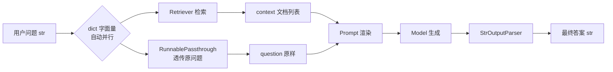
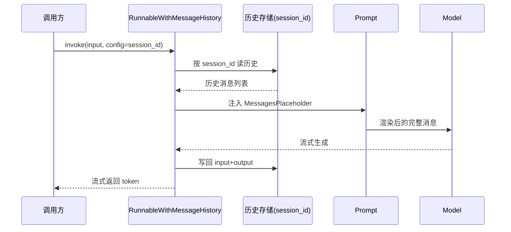
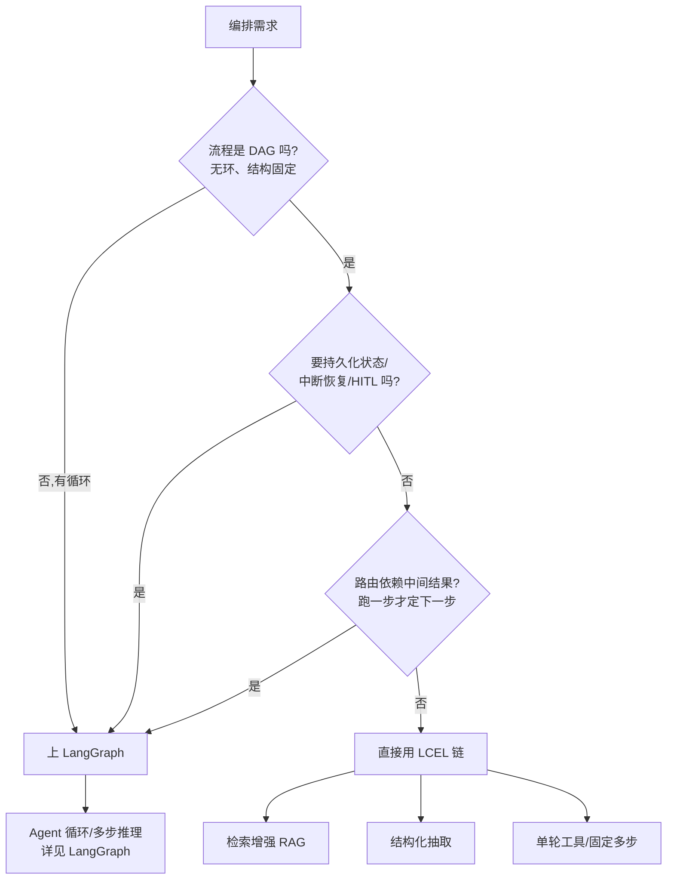

# LangChain 组件与 LCEL

> LangChain 的真正地基不是"链"这个概念，而是 Runnable 协议——任何能被 `|` 拼起来的组件都实现同一套接口（invoke/batch/stream/ainvoke），组件即 Runnable、链即组合。看懂 LCEL 的三个自动化（类型适配 / dict 自动并行 / Passthrough 透传）才算会用；它的边界是 DAG，一旦出现循环或要持久化中断恢复，控制流就该交给 [LangGraph](./langgraph)。

## 核心组件全景:Model / Prompt / OutputParser / Retriever / Tool

LangChain 把 LLM 应用拆成五类可拼接组件。每一类都是一个 Runnable，因此它们都能用 `|` 串进同一条链。

| 组件         | 抽象       | 输入 → 输出                 | 典型实现                               |
| ------------ | ---------- | --------------------------- | -------------------------------------- |
| Model        | 调模型     | `PromptValue → ChatMessage` | `ChatOpenAI` / `ChatAnthropic`         |
| Prompt       | 模板渲染   | `dict → PromptValue`        | `ChatPromptTemplate`                   |
| OutputParser | 结果解析   | `ChatMessage → 任意类型`    | `StrOutputParser` / `JsonOutputParser` |
| Retriever    | 检索文档   | `str → list[Document]`      | `vectorstore.as_retriever()`           |
| Tool         | 调外部能力 | `str/dict → str`            | `@tool` 装饰器                         |

```python
from langchain_openai import ChatOpenAI
from langchain_core.prompts import ChatPromptTemplate
from langchain_core.output_parsers import StrOutputParser

# 三个组件各是一个 Runnable,`| 串成一条链
prompt = ChatPromptTemplate.from_messages([
    ("system", "你是简洁的全栈工程师助手"),
    ("human", "{question}"),
])
model = ChatOpenAI(model="gpt-4o-mini", temperature=0)
parser = StrOutputParser()  # ChatMessage -> str,剥掉消息壳只留文本

chain = prompt | model | parser

print(chain.invoke({"question": "LCEL 是什么"}))
```

> 关键直觉：`Prompt` 的输出类型正好是 `Model` 的输入类型，`Model` 的输出正好是 `Parser` 的输入——LCEL 靠类型对齐串链，对不上会在组合期就报错，而不是跑到一半才崩。

---

## LCEL 表达式语言:用 `|` 把组件拼成链

`|`（`Runnable.__or__`）不是普通的函数组合，它在拼接时做了三件自动化的事，这也是 LCEL 区别于"自己写几个函数调用"的全部价值：

1. **自动类型适配**：上一个的输出塞进下一个的输入，类型不匹配立刻报错。
2. **自动并行**：链里出现 dict 字面量时，dict 的每个 value 被并发执行，结果按 key 收集——这是 RAG 链分叉汇合的核心。
3. **自动透传**：`RunnablePassthrough` 把输入原样转发，`RunnablePassthrough.assign()` 在保留原字段的同时追加新字段。

本图核心结论：RAG 链先用 dict 字面量触发「检索 + 透传问题」并行，再把两份结果一起喂给 prompt。



```python
from langchain_core.runnables import RunnablePassthrough

retriever = vectorstore.as_retriever(search_kwargs={"k": 4})

def format_docs(docs):
    return "\n\n".join(d.page_content for d in docs)

# dict 字面量 => 两个分支并发执行,结果收成一个 dict 交给 prompt
rag_chain = (
    {"context": retriever | format_docs, "question": RunnablePassthrough()}
    | prompt
    | model
    | StrOutputParser()
)

rag_chain.invoke("这个库怎么处理流式?")  # 详见 [RAG](./rag)
```

`RunnablePassthrough.assign()` 适合"既要保留原始输入、又要追加派生字段"的场景，避免中途把输入弄丢：

```python
from langchain_core.runnables import RunnablePassthrough

# assign 在保留原 dict 的同时,新增一个 summary 字段
chain = (
    RunnablePassthrough.assign(summary=summary_prompt | model | StrOutputParser())
    | final_prompt   # 这里仍能读到原始 question + 新增的 summary
    | model
)
```

---

## Runnable 协议:invoke / batch / stream / 异步一套接口

Runnable 是 LCEL 的地基：任何能被 `|` 拼接的对象都实现同一套接口，因此一条链和链里任何一个组件**调用方式完全一致**——链本身也是一个 Runnable，可以再继续 `|` 进别的链。

| 方法                            | 语义                            | 异步版本  |
| ------------------------------- | ------------------------------- | --------- |
| `invoke`                        | 单条输入 → 单条输出             | `ainvoke` |
| `batch`                         | 输入列表 → 输出列表（默认并发） | `abatch`  |
| `stream`                        | 流式吐最终输出的增量            | `astream` |
| `stream_log` / `astream_events` | 流式吐中间步骤事件              | 仅异步    |

```python
# 同一套接口,组件和链通用
chain.invoke({"question": "hi"})            # 单条
chain.batch([{"question": "a"}, {"question": "b"}])  # 并发两条

# 异步版本一律加 a 前缀,签名不变
result = await chain.ainvoke({"question": "hi"})

# batch 带并发上限与异常策略,生产必备
chain.batch(
    inputs,
    config={"max_concurrency": 8, "return_exceptions": True},
)
```

> 经验：异步接口（`ainvoke`/`astream`）才是真异步；同步 `invoke` 内部是包了一层事件循环。Web 服务（FastAPI）里全程用 `a` 前缀版本，别把同步调用丢进 async 路由阻塞事件循环。

---

## 分支与并行:RunnableBranch / RunnableParallel / RunnablePassthrough

三个结构化 Runnable 控制数据怎么流。dict 字面量是 `RunnableParallel` 的语法糖，`RunnableBranch` 做条件路由，`RunnablePassthrough` 做透传。

| 组件                  | 作用                         | 等价写法                    |
| --------------------- | ---------------------------- | --------------------------- |
| `RunnableParallel`    | 多分支并发，结果按 key 收集  | 链里直接写 dict 字面量      |
| `RunnableBranch`      | 按条件把输入路由到不同子链   | 无（条件路由专属）          |
| `RunnablePassthrough` | 原样透传 / `assign` 追加字段 | `lambda x: x`（但不可流式） |

```python
from langchain_core.runnables import RunnableBranch

# 条件路由:命中第一个为真的分支,否则走 default
router = RunnableBranch(
    (lambda x: x["lang"] == "zh", zh_chain),
    (lambda x: x["lang"] == "en", en_chain),
    default_chain,  # 兜底分支,必填
)

# RunnableParallel 显式写法 === 链里的 dict 字面量
from langchain_core.runnables import RunnableParallel
parallel = RunnableParallel(context=retriever, question=RunnablePassthrough())
```

> 何时显式写 `RunnableParallel` 而不是 dict 字面量：当你要给它单独挂 config（如单独 tracing 名字、单独 callbacks）时。纯拼数据用 dict 字面量更省。

---

## 链与记忆:MessagesPlaceholder + RunnableWithMessageHistory

链默认**无状态**——每次 `invoke` 都是一张白纸，模型完全失忆。要记忆必须显式做两件事：prompt 里留一个历史占位符，再用 `RunnableWithMessageHistory` 按 `session_id` 读写历史。

本图核心结论：记忆的读写都发生在 `RunnableWithMessageHistory` 这一层，模型本身不感知历史。



```python
from langchain_core.prompts import ChatPromptTemplate, MessagesPlaceholder
from langchain_core.runnables.history import RunnableWithMessageHistory
from langchain_community.chat_message_histories import ChatMessageHistory

prompt = ChatPromptTemplate.from_messages([
    ("system", "你是助手"),
    MessagesPlaceholder("history"),   # 历史占位符,变量名必须与下面 input_messages_key 对应
    ("human", "{question}"),
])
chain = prompt | model

_store = {}  # 生产换成 Redis/Postgres 的 BaseChatMessageHistory

def get_history(session_id: str):
    return _store.setdefault(session_id, ChatMessageHistory())

with_history = RunnableWithMessageHistory(
    chain,
    get_history,
    input_messages_key="question",   # 当前输入的 key
    history_messages_key="history",  # 对应占位符变量名
)

cfg = {"configurable": {"session_id": "user-42"}}
with_history.invoke({"question": "我叫橙子"}, config=cfg)
with_history.invoke({"question": "我叫什么?"}, config=cfg)  # 能答出"橙子"
```

> 历史一定要裁剪，否则 session 一长 context 和成本一起爆。最简单是注入前截断到最近 N 条；长期记忆的压缩/摘要策略见 [Agent 记忆](./agent-memory)。

```python
from langchain_core.messages import trim_messages

# 注入前裁剪:按 token 数截断,保 system、丢最早
def get_history(session_id):
    h = _store.setdefault(session_id, ChatMessageHistory())
    h.messages = trim_messages(
        h.messages, max_tokens=2000, strategy="last",
        token_counter=model, include_system=True,
    )
    return h
```

---

## 流式输出:stream 与 astream_events 事件流

流式有两个层级，选错是新手最常见的坑：`stream()` 只给你**最终输出**的增量 token；要看链内每个组件的细粒度事件（检索完成、tool 开始、某中间链输出）必须用 `astream_events(version="v2")`。

| 需求                           | 用什么                            | 拿到什么   |
| ------------------------------ | --------------------------------- | ---------- |
| 逐字打最终答案                 | `stream()` / `astream()`          | 输出 chunk |
| 显示"正在检索…"/"正在调工具 X" | `astream_events(v2)`              | 组件级事件 |
| 拿中间某条子链的输出           | `astream_events(v2)` 按 name 过滤 | 子链事件   |

```python
# 层级一:只要最终输出的增量,做打字机效果
for chunk in rag_chain.stream("什么是 LCEL"):
    print(chunk, end="", flush=True)
```

```python
# 层级二:做中间 UI,监听每个组件的生命周期事件
async for ev in rag_chain.astream_events("什么是 LCEL", version="v2"):
    kind = ev["event"]
    if kind == "on_retriever_end":
        show(f"检索到 {len(ev['data']['output'])} 篇文档")
    elif kind == "on_chat_model_stream":
        emit_token(ev["data"]["chunk"].content)   # 模型逐 token
    elif kind == "on_tool_start":
        show(f"调用工具 {ev['name']}")
```

> `astream_events` 只有异步版；同步代码里要用得自己包事件循环。事件名约定：`on_<组件类型>_<start|stream|end>`，用 `ev["name"]` 区分同名类型的不同实例。

---

## LangSmith:tracing、评估与线上观测

LangSmith 近乎零成本接入：设三个环境变量，**所有 LCEL 链自动上报嵌套 trace**（每条子链一次 span，含输入/输出/耗时/token），不用改一行业务代码。

```bash
export LANGCHAIN_TRACING_V2=true
export LANGCHAIN_PROJECT=my-rag-app
export LANGCHAIN_API_KEY=lsv2_...
# 可选:export LANGCHAIN_ENDPOINT=https://api.smith.langchain.com
```

设置后，前面每条链的 `invoke`/`stream` 都会在 LangSmith 后台出现一棵嵌套 trace 树：最外层 chain → 内层 prompt/retriever/model 各自的 span，逐层看输入输出，定位"检索对但生成错"这类问题极快。

| 能力           | 用途                                | 入口               |
| -------------- | ----------------------------------- | ------------------ |
| Tracing        | 嵌套 trace、token/延迟拆解          | 环境变量即开       |
| Dataset + Eval | 离线评估集，回归 prompt 改动        | `langsmith.Client` |
| 线上观测       | 按 session/用户聚合，看错误率与成本 | 后台 dashboard     |

```python
from langsmith import Client

client = Client()
# 建评估集,对一条链跑离线回归;评估方法论见 [评估与可观测](./evaluation)
results = client.run_on_dataset(
    dataset_name="rag-golden",
    llm_or_chain_factory=lambda: rag_chain,
    evaluators=[correctness_eval],
)
```

> 不想依赖 LangSmith 也可自建：`chain.with_config(callbacks=[MyHandler()])` 挂自定义 callback，拿到同一份 span 数据落自己的存储。但纯 LCEL + LangSmith 的零成本组合，性价比通常高于自研。

---

## 何时直接用 LangChain,何时上 LangGraph

LangChain 的链是 **DAG**：运行期结构固定、无环，一次 `invoke` 从入口走到出口。这决定了它的甜区与边界。

本图核心结论：先问流程里有没有环、要不要持久化中断恢复——两者任一命中，控制流就该从 LCEL 升级到 LangGraph。



| 场景                           | 选 LangChain(LCEL)               | 选 LangGraph    |
| ------------------------------ | -------------------------------- | --------------- |
| RAG / 结构化抽取               | ✅ 一条直链搞定                  | 过度设计        |
| 固定顺序多步流水线             | ✅ dict 并行 + 串联              | 过度设计        |
| 单轮工具调用                   | ✅ `with_structured_output` 即可 | 看是否要循环    |
| Agent 自主循环（跑到模型说停） | ❌ 表达不了环                    | ✅              |
| 中断后从断点恢复 / 时间旅行    | ❌ 无状态持久化                  | ✅ Checkpointer |
| 多 Agent 协作 / 人机协同断点   | ❌                               | ✅              |

> 两者不互斥：LangGraph 的每个节点内部，往往就是一条 LCEL 链。LangChain 管"节点内怎么算"，LangGraph 管"节点之间怎么流转"。细节见 [LangGraph](./langgraph)。

---

## 常见陷阱

### ❌ 以为 OutputParser 能保证结构化输出

自由文本稍不规范（多个换行、少个引号）`JsonOutputParser` 就抛解析错。结构化输出的正确路径是 `with_structured_output`——走原生 tool-calling，由模型厂商保证 schema，成功率高一个量级；OutputParser 只作兜底，失败时用 `OutputFixingParser` 重试。

```python
from pydantic import BaseModel, Field

class Person(BaseModel):
    name: str = Field(description="姓名")
    age: int = Field(description="年龄")

# ✅ 正确:原生 tool-calling,schema 由厂商保证
structured = model.with_structured_output(Person)
person = structured.invoke("张三,今年 30 岁")   # 直接返回 Person 对象
```

```python
# ✅ 兜底:OutputParser + 失败自动重试修复
from langchain.output_parsers import OutputFixingParser
from langchain_core.output_parsers import PydanticOutputParser

base = PydanticOutputParser(pydantic_object=Person)
fixing = OutputFixingParser.from_llm(parser=base, llm=model)  # 解析失败让模型修
```

> 更多结构化输出契约的写法（schema 设计、字段约束、Few-shot 对齐）见 [Prompt 工程](./prompt-engineering)。

### ❌ 以为链自带记忆

多次 `invoke` 同一条 chain，模型每次失忆——链默认无状态，历史不会自己带上。

```python
# ❌ 错误:期望链记住上一轮
chain.invoke({"question": "我叫橙子"})
chain.invoke({"question": "我叫什么"})   # 失忆,答不上来

# ✅ 正确:RunnableWithMessageHistory + session_id,且裁剪历史
with_history.invoke({"question": "..."}, config={"configurable": {"session_id": "u1"}})
```

### ❌ 用 stream() 却想拿工具调用/检索进度

`stream()` 只吐最终输出的增量 token，链内中间步骤一概看不到。要在 UI 显示"正在检索""正在调工具 X"，必须用 `astream_events(version="v2")`。

```python
# ❌ 错误:stream 拿不到检索完成事件
for chunk in rag_chain.stream(q): ...   # 只有答案 token,没有中间步骤

# ✅ 正确:astream_events(v2) 拿组件级事件
async for ev in rag_chain.astream_events(q, version="v2"):
    if ev["event"] == "on_retriever_end": ...
```

### ❌ 混用新旧 API

`LLMChain` / `ConversationChain` / `initialize_agent` 这些旧类多已 deprecated，且不支持流式/异步/batch——用它们等于自动放弃 Runnable 协议的所有红利。

| 旧 API(避免)            | 新 API(统一用)                         |
| ----------------------- | -------------------------------------- |
| `LLMChain(llm, prompt)` | `prompt \| model \| parser`            |
| `ConversationChain`     | `RunnableWithMessageHistory`           |
| `initialize_agent(...)` | [LangGraph](./langgraph) 的 Agent 节点 |
| `chain.run(input)`      | `chain.invoke(input)`                  |

```python
# ❌ 旧:deprecated,不支持流式/异步/batch
# from langchain.chains import LLMChain
# chain = LLMChain(llm=model, prompt=prompt)

# ✅ 新:LCEL,自动获得 invoke/batch/stream/ainvoke 全套
chain = prompt | model | StrOutputParser()
```
