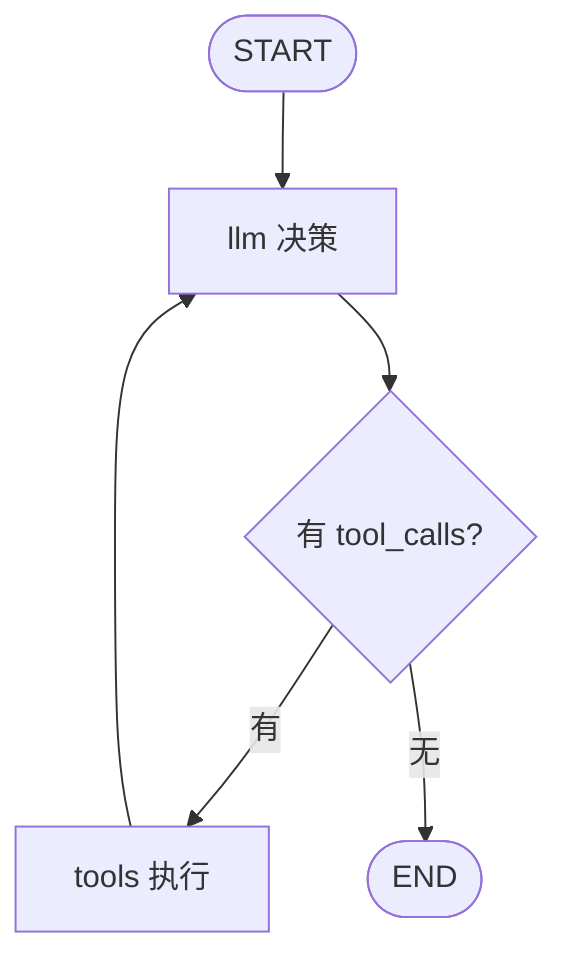
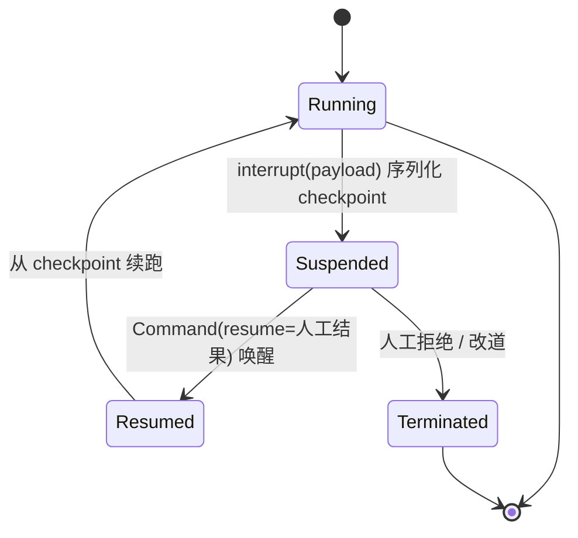
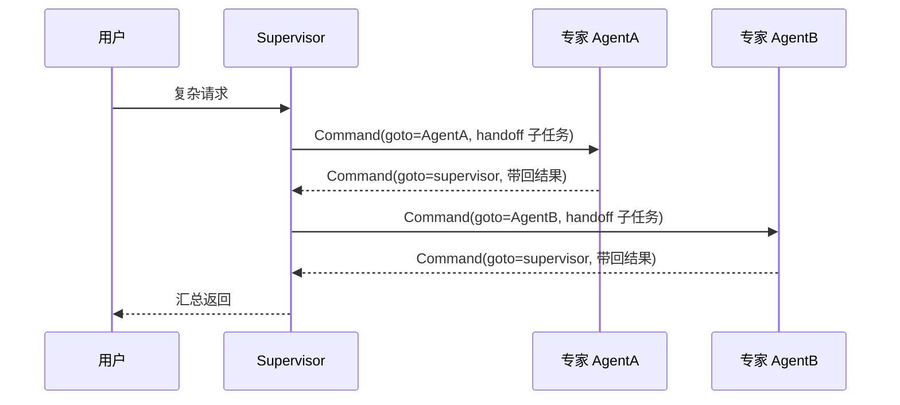
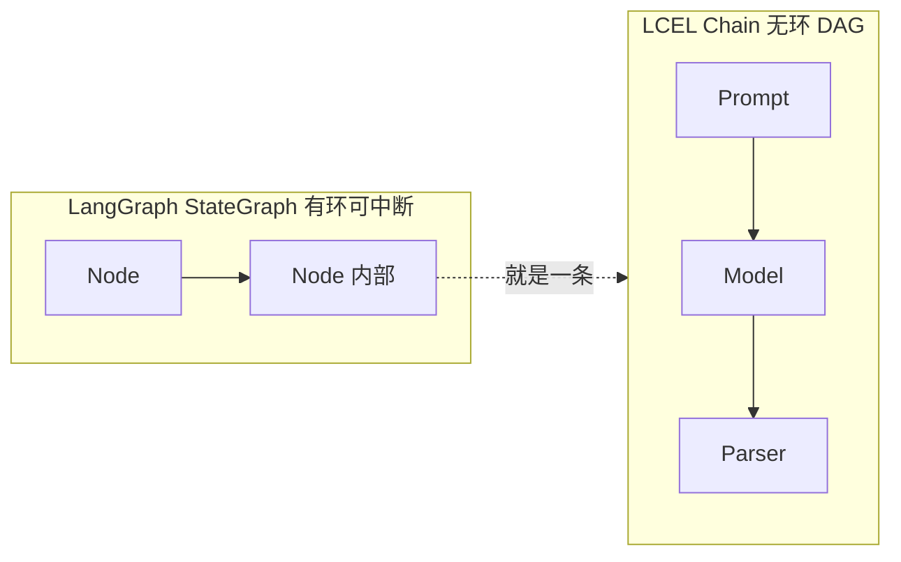

# LangGraph 状态图 Agent 实战

> 把 Agent 建模成「状态 + 节点 + 边」的有向图,用 checkpointer 拿到持久化 / 中断恢复 / 时间旅行——这三件事是区别于普通 Chain 的全部价值,Chain(DAG 无环)做不到循环、断点、后悔药。

## 为什么需要 LangGraph:从 Chain 到 Graph

LCEL 把 prompt / 模型 / parser 串成一条**有向无环图(DAG)**:一次调用从头流到尾,没有环、没有状态、没有中断。单次问答、单次抽取够用。但真实 Agent 是**循环**:LLM 决策 → 调工具 → 把结果喂回去 → 再决策,直到任务完成。这个 ReAct 循环本质是环,DAG 表达不了。

LangGraph 把这件事建模成 **StateGraph**:一个共享全局状态在节点间流转,节点做事、边决定下一步去哪,**允许成环**。环正是多轮工具调用、反思重试、多 Agent 往返所需要的。

| 维度        | LCEL Chain(DAG)       | LangGraph(StateGraph)            |
| ----------- | --------------------- | -------------------------------- |
| 拓扑        | 无环,流一遍结束       | 有环,可循环                      |
| 状态        | 无,每次调用独立       | 全局 State 跨节点共享、累积      |
| 控制流      | 静态,写死在链里       | 动态,条件边/Command 运行时决定   |
| 中断/恢复   | ❌ 不支持             | ✅ checkpointer + interrupt      |
| 持久化/记忆 | ❌ 自己管             | ✅ thread_id 自动落盘            |
| 适用        | 单次调用、prompt→解析 | 有状态长流程、多轮工具、多 Agent |

一句话:**单次无状态用 LCEL,有环有状态用 LangGraph**;Node 内部往往就是一条 LCEL 链,两者是组合不是对立。边界详见「与 LangChain 的关系」一节,以及 [LangChain](./langchain)。

---

## 核心三要素:State / Node / Edge(StateGraph 建模)

整个框架就三个概念:

- **State**:一个 TypedDict(或 Pydantic),全局共享,所有节点读写它。是图的「记忆」。
- **Node**:普通函数,**收整个 state,返回部分 state**(partial update),返回的字段被合并进全局状态。节点就是一步工作。
- **Edge**:决定控制流。普通边固定跳转;条件边运行时根据状态决定下一个节点;`START`/`END` 是虚拟起止节点。

```python
from typing import Annotated, TypedDict
from langgraph.graph import StateGraph, START, END
from langgraph.graph.message import add_messages

# 1. State:全局共享状态,messages 用 reducer 追加(见下节)
class AgentState(TypedDict):
    messages: Annotated[list, add_messages]  # 追加而非覆盖
    steps: int                                # 默认覆盖

# 2. Node:收 state,返回部分 state(只写要更新的字段)
def llm_node(state: AgentState) -> dict:
    resp = model.invoke(state["messages"])
    return {"messages": [resp], "steps": state["steps"] + 1}  # 部分更新

# 3. 建模 + 连边
builder = StateGraph(AgentState)
builder.add_node("llm", llm_node)
builder.add_edge(START, "llm")      # 入口
builder.add_edge("llm", END)        # 固定边
graph = builder.compile()           # 编译成可运行图
```

关键认知:**节点只返回增量,不返回整个 state**。返回什么字段就更新什么字段,其余保持原值——这是「部分更新」语义,也是 reducer 能精确控制合并行为的前提。

---

## Reducer:状态如何合并(add_messages 与自定义 reducer)

节点返回 partial state 后,框架要把它合并进全局 state。**合并规则由 reducer 决定**:

- 字段**没写 reducer** → 默认**覆盖**,新值直接替换旧值。
- 字段写了 `Annotated[list, add_messages]` → **追加**,新消息拼到历史后面。

新手最常踩的坑就是:messages 忘写 reducer,每个节点返回后历史被覆盖,只剩最后一条,Agent 失忆。

```python
from operator import add
from typing import Annotated, TypedDict
from langgraph.graph.message import add_messages

class State(TypedDict):
    # ✅ 追加:历史消息越滚越多
    messages: Annotated[list, add_messages]
    # ✅ 自定义 reducer:跨节点累加数字(并行分支求和常用)
    total: Annotated[int, add]
    # ❌ 没写 reducer:默认覆盖,后者盖前者
    current_tool: str
```

```python
# 自定义 reducer 就是一个 (old, new) -> merged 的纯函数
def merge_dicts(old: dict, new: dict) -> dict:
    return {**old, **new}  # 浅合并,按 key 覆盖

class State(TypedDict):
    findings: Annotated[dict, merge_dicts]  # 并行分支各写一部分 key
```

| 需求              | 写法                            | 合并行为            |
| ----------------- | ------------------------------- | ------------------- |
| 对话历史 / 消息流 | `Annotated[list, add_messages]` | 追加,支持按 id 更新 |
| 数值累加          | `Annotated[int, operator.add]`  | 求和                |
| 并行分支各写一份  | `Annotated[dict, merge_dicts]`  | 按 key 合并         |
| 最新值覆盖        | 不写 reducer                    | 直接替换            |

经验:**凡是要「累积」的字段(消息、日志、中间产物),都必须显式声明 reducer**;一次性标志位、当前指针用默认覆盖即可。

---

## 条件边与路由:让图分叉(Command vs conditional_edges)

固定边只能写死跳转。运行时「该不该调工具 / 该去哪」要靠**动态路由**,两种写法:

**写法一:`add_conditional_edges` + 路由函数**——路由函数**纯读状态**返回下一个节点名,不修改状态。关注点分离:节点负责更新,路由负责决策。

```python
from langgraph.graph import END

def should_call_tool(state: AgentState) -> str:
    last = state["messages"][-1]
    # 纯读:只看最后一条 AI 消息有没有 tool_calls,不改状态
    return "tools" if last.tool_calls else END

builder.add_conditional_edges("llm", should_call_tool, {
    "tools": "tools",   # 映射:返回值 -> 实际节点名
    END: END,
})
```

**写法二:节点内返回 `Command`**——一次完成「更新状态 + 跳转」,适合边算边跳、多 Agent handoff。

```python
from langgraph.types import Command

def researcher(state: AgentState) -> Command:
    result = do_research(state)
    # update 与 goto 一体:更新状态的同时决定去哪
    return Command(
        update={"messages": [result]},   # 更新状态
        goto="supervisor",                # 跳回主管
    )
```

| 场景                                  | 选哪个                                      |
| ------------------------------------- | ------------------------------------------- |
| 纯分叉,只依据状态选路                 | `add_conditional_edges`(更清晰、可静态分析) |
| 边更新边跳转,跳转目标依赖刚算出的结果 | `Command`(update+goto 原子完成)             |
| 多 Agent handoff                      | `Command`(子 Agent 干完 goto 回 supervisor) |

---

## 第一个完整 Agent:Tool 调用循环(最小可运行图)

本图核心结论:一个最小 Tool-Calling Agent 就是一个**环**——`llm` 决策,有工具调用就去 `tools` 执行,执行完回 `llm` 再决策,直到没有工具调用走 `END`。



```python
from typing import Annotated, TypedDict
from langgraph.graph import StateGraph, START, END
from langgraph.graph.message import add_messages
from langgraph.prebuilt import ToolNode          # 预建件:执行 tool_calls 的节点

class AgentState(TypedDict):
    messages: Annotated[list, add_messages]

tools = [search, calculator]
model_with_tools = model.bind_tools(tools)

def llm(state: AgentState) -> dict:
    return {"messages": [model_with_tools.invoke(state["messages"])]}

def route(state: AgentState) -> str:
    return "tools" if state["messages"][-1].tool_calls else END

b = StateGraph(AgentState)
b.add_node("llm", llm)
b.add_node("tools", ToolNode(tools))   # 自动把 tool 结果包成 ToolMessage 追加
b.add_edge(START, "llm")
b.add_conditional_edges("llm", route, {"tools": "tools", END: END})
b.add_edge("tools", "llm")             # 关键:执行完回 llm,构成环
graph = b.compile()

# 更省事:预建件 create_react_agent 等价于上面整张图
from langgraph.prebuilt import create_react_agent
agent = create_react_agent(model, tools)  # 模板代码都省了
```

`create_react_agent` 把这套循环封好,开箱即用;需要定制状态、加审批、改路由时仍回到手写图。

---

## Checkpointer 持久化:thread_id 与断点恢复

**Checkpointer 是 LangGraph 的灵魂**。`compile(checkpointer=...)` 之后,每个 super-step(一轮节点执行)结束自动把 state 落盘成一个 checkpoint。配合 `thread_id`,同一线程多次 invoke 自动续上——会话记忆、崩溃恢复、interrupt、time travel 全建立在它之上。**没有 checkpointer,后面三节(HITL/流式之外/时间旅行)全部失效。**

```python
from langgraph.checkpoint.memory import InMemorySaver
from langgraph.checkpoint.sqlite import SqliteSaver
from langgraph.checkpoint.postgres import PostgresSaver

# 本地调试:进程内存,重启即丢,只能玩
graph = builder.compile(checkpointer=InMemorySaver())

# 生产:Sqlite(单机)/ Postgres(多实例)
checkpointer = PostgresSaver.from_conn_string(DB_URL)
checkpointer.setup()                          # 首次建表
graph = builder.compile(checkpointer=checkpointer)

# thread_id 放 config:同一线程的多次调用共享状态
config = {"configurable": {"thread_id": "user-42-session-7"}}
graph.invoke({"messages": [("user", "帮我查订单 A1023")]}, config)
# 进程重启后,用同一 thread_id 接着聊,历史自动恢复
graph.invoke({"messages": [("user", "刚才那个单能改地址吗")]}, config)
```

| Saver           | 适用          | 持久性           |
| --------------- | ------------- | ---------------- |
| `InMemorySaver` | 本地调试/单测 | ❌ 进程内,重启丢 |
| `SqliteSaver`   | 单机/边缘部署 | ✅ 文件          |
| `PostgresSaver` | 生产多实例    | ✅ 共享库        |

经验:**thread_id 是会话的唯一钥匙**,按「用户 × 会话」生成,放进 `configurable`;checkpointer 的自动落盘语义和 Durable Execution 一脉相承,对比见 [Workflow](./workflow)。

---

## Interrupt 与 Human-in-the-Loop:审批/编辑/人工接管

敏感操作(下单、转账、删数据)前要让 Agent 暂停、等人审批再继续。用 **`interrupt()`**,而不是手动 break——它会序列化当前状态为 checkpoint 并挂起,外部用 `Command(resume=...)` 唤醒。

```python
from langgraph.types import interrupt, Command

def approve_node(state: AgentState) -> dict:
    # ⚠️ interrupt 之前的代码在恢复后会重跑 → 这里只做无副作用的计算
    payload = {"action": state["pending_action"], "amount": state["amount"]}
    # 挂起:序列化 checkpoint,把 payload 抛给外部等人工决定
    decision = interrupt(payload)               # resume 值从这里返回
    if decision["approved"]:
        return {"messages": [execute(state["pending_action"])]}
    return {"messages": [("ai", "用户拒绝了该操作")]}

# 调用方:拿到 __interrupt__ 说明图挂起了
result = graph.invoke({"messages": [("user", "转账 5000 给张三")]}, config)
if "__interrupt__" in result:
    print("等待审批:", result["__interrupt__"][0].value)
    # 人工审批后唤醒:resume 值就是 interrupt() 的返回值
    graph.invoke(Command(resume={"approved": True}), config)
```

本图核心结论:interrupt 把「运行中」序列化成可持久化的挂起态,人工注入 resume 值后从 checkpoint 唤醒续跑或终止。



**最关键的陷阱**:resume 后**整个节点从头重跑**,interrupt() 之前的代码会执行第二遍。所以 interrupt 之前若有写库、发请求等副作用,会重复执行。

```python
# ❌ 副作用在 interrupt 之前 → 恢复后写库两遍
def bad(state):
    db.insert(order)          # 重跑时重复插入!
    interrupt({"order": order})

# ✅ interrupt 前只做无副作用计算,副作用放 interrupt 之后
def good(state):
    preview = build_preview(state)   # 纯计算,幂等
    decision = interrupt(preview)    # 挂起
    if decision["approved"]:
        db.insert(order)             # 副作用在唤醒后才执行,只跑一次
```

---

## 流式输出:stream_mode 与逐 token/事件流

`graph.stream()` 替代 `invoke()`,按 `stream_mode` 分三档吐数据:

| stream_mode | 吐什么                             | 适用              |
| ----------- | ---------------------------------- | ----------------- |
| `values`    | 每个 super-step 后的**完整 state** | 调试,看全量状态   |
| `updates`   | 只吐**增量**(哪个节点改了哪些字段) | 前端渲染进度,常用 |
| `messages`  | **逐 token** 的 LLM 输出           | 打字机效果        |

```python
# updates:前端最常用,只拿增量,轻
for chunk in graph.stream(inputs, config, stream_mode="updates"):
    # chunk = {node_name: {更新的字段}}
    for node, update in chunk.items():
        print(f"[{node}]", update)

# messages:逐 token,做打字机
for msg, metadata in graph.stream(inputs, config, stream_mode="messages"):
    if msg.content:
        print(msg.content, end="", flush=True)
```

陷阱:图默认在最外层吐数据,**子图/嵌套节点里的 token 看不到**。要么用 `messages` 模式,要么开 `subgraphs=True`:

```python
# 嵌套图也要逐 token:开 subgraphs,chunk 前会带命名空间前缀
for ns, msg, meta in graph.stream(inputs, config, stream_mode="messages", subgraphs=True):
    ...
```

---

## Time Travel:回到任意 checkpoint 重放与分叉

挂了 checkpointer,整个执行历史就是一串可回溯的 checkpoint。`get_state_history` 列出来,用历史的 `checkpoint_id` 重新 invoke,就能**从过去某个点分叉**——后悔药、what-if 分析、调试回放都靠它。

```python
# 列出该线程的全部 checkpoint(新的在前)
history = list(graph.get_state_history(config))
for snap in history:
    print(snap.config["configurable"]["checkpoint_id"], snap.next, len(snap.values["messages"]))

# 找到想回到的那一步,用它的 config(含 checkpoint_id)重新 invoke
past = history[3].config
# 从过去分叉:传入新输入,会从该 checkpoint 接着走,写一条新分支
graph.invoke({"messages": [("user", "换个方案重来")]}, past)

# 也可以先改状态再续跑:update_state 到某个 checkpoint,再 invoke(None)
graph.update_state(past, {"amount": 3000})
graph.invoke(None, past)   # None = 从该 checkpoint 当前状态续跑
```

前提还是 checkpointer:没挂 saver,`get_state_history` 返回空。

---

## 子图与多 Agent:Supervisor / Handoff / 嵌套图

单 Agent 工具太多、职责太杂时,拆成**多 Agent**:一个 Supervisor 调度,多个专家子 Agent 各管一摊,用 `Command` 做 handoff。

本图核心结论:Supervisor 用 Command 把任务 handoff 给专家,专家干完用 Command 回 Supervisor,最终由 Supervisor 汇总返回。



```python
from langgraph.types import Command

# Supervisor:读状态决定派给谁,或汇总收尾
def supervisor(state: AgentState) -> Command:
    nxt = decide_next(state)          # LLM 或规则决定下一个专家 / FINISH
    return Command(goto=nxt)

# 专家 Agent:干完用 Command 回 supervisor
def research_agent(state: AgentState) -> Command:
    findings = run_research(state)
    return Command(
        update={"messages": [("ai", findings)]},
        goto="supervisor",            # handoff 回主管
    )

b = StateGraph(AgentState)
b.add_node("supervisor", supervisor)
b.add_node("research", research_agent)
b.add_node("code", code_agent)
b.add_edge(START, "supervisor")
# 每个专家返回 supervisor,supervisor 再路由 → 星型拓扑,可环
graph = b.compile()
```

**子图**把一块可复用的图封装成一个节点嵌进父图,屏蔽内部细节;`create_react_agent` 本身就是现成的子 Agent 单元。多 Agent 的编排模式(监督者/流水线/群聊)落地方式见 [Agent Patterns](./agent-patterns)。

---

## 与 LangChain 的关系:LCEL vs Graph,何时用哪个

本图核心结论:LCEL 是**无环 DAG**管单次调用,LangGraph 是**有环 StateGraph**管有状态长流程,LangGraph 的 Node 内部通常就是一条 LCEL 链——组合而非替代。



| 关注点                    | 用 LCEL       | 用 LangGraph    |
| ------------------------- | ------------- | --------------- |
| 单次 prompt → 模型 → 解析 | ✅ 一把梭     | 杀鸡用牛刀      |
| 无状态 RAG 单轮检索生成   | ✅            | 不必            |
| 多轮工具调用(ReAct)       | ❌ 表达不了环 | ✅              |
| 需要中断/审批/恢复        | ❌            | ✅              |
| 需要会话记忆/持久化       | 自己管        | ✅ checkpointer |
| 多 Agent 协作             | ❌            | ✅              |

经验:**先把 Node 内的单次调用用 LCEL 写好,再用 LangGraph 把这些 Node 编成图**。LCEL 组合与 Tool 绑定细节见 [LangChain](./langchain)。

---

## 生产实践:LangSmith 观测/部署/常见反模式

**观测**:LangGraph 原生打通 LangSmith,每个 super-step、每次 checkpoint、每条边跳转都是一条 trace。设环境变量即开:

```bash
export LANGSMITH_TRACING=true
export LANGSMITH_API_KEY=ls__xxx
export LANGSMITH_PROJECT=my-agent
```

图天然带可观测性——但**粒度取决于你怎么切节点**:一个巨型节点在 trace 里就是一个黑盒。评估指标、回归数据集见 [Evaluation](./evaluation)。

**部署**:长流程要异步跑 + checkpoint 续传;中断等待人工的图用任务队列承载,别同步阻塞;`PostgresSaver` 支撑多实例共享 thread 状态。

**常见反模式 ❌/✅**:

| 场景             | ❌ 错误                                             | ✅ 正确                                                  |
| ---------------- | --------------------------------------------------- | -------------------------------------------------------- |
| messages 字段    | 忘写 `add_messages`,历史被覆盖失忆                  | `Annotated[list, add_messages]` 追加                     |
| interrupt 副作用 | interrupt 前写库/发请求,恢复后执行两遍              | interrupt 前只做无副作用计算,副作用放唤醒后              |
| HITL/time travel | 无 checkpointer 却想用,interrupt 报错、history 为空 | 生产挂 `SqliteSaver`/`PostgresSaver`,thread_id 放 config |
| 节点粒度         | 大流程塞进一个巨型节点,失败整体重跑、trace 黑盒     | 按「一次原子决策 / 一次工具调用」切分节点                |
| 累积字段         | 全靠默认覆盖,中间产物互相盖掉                       | 要累积就显式声明 reducer                                 |
| 流式             | 嵌套图里想看 token 却只开 values                    | 用 `messages` 或 `subgraphs=True`                        |

```python
# ❌ 巨型节点:失去断点粒度和可观测性,中间挂了只能从头重跑
def do_everything(state):
    plan(); call_tool_a(); call_tool_b(); call_tool_c(); write_report()

# ✅ 拆成原子节点:每步一个 checkpoint,断点恢复精确到步,trace 逐步可见
b.add_node("plan", plan); b.add_node("tool_a", ta)
b.add_node("tool_b", tb); b.add_node("tool_c", tc); b.add_node("report", report)
```

一句话收尾:**图的颗粒度就是你能恢复、能观测、能调试的颗粒度**——切得越原子,checkpointer 给你的后悔药越细。
