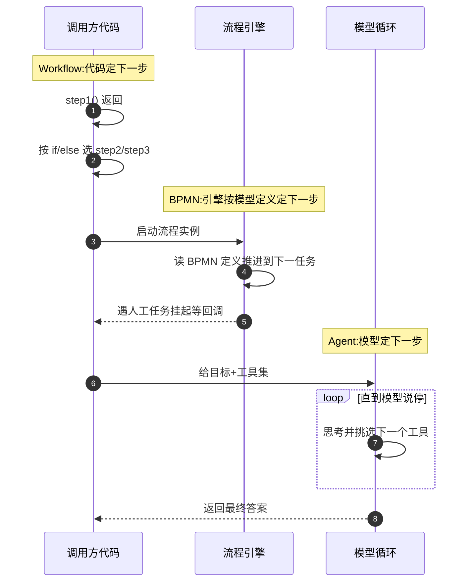
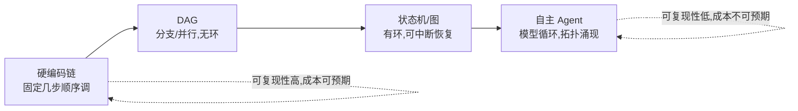
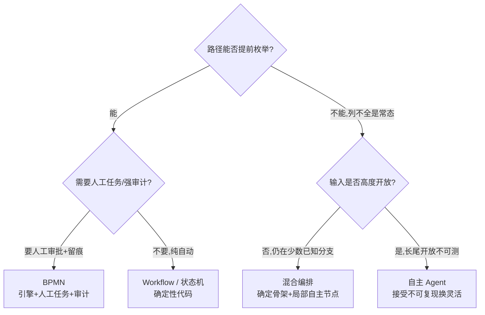
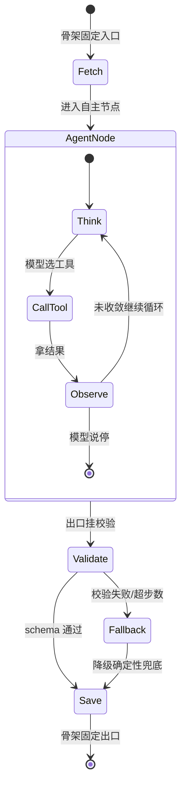

# Orchestration 编排全景与边界

> 编排的唯一真正分界是**控制流归属**：代码定下一步 = workflow，模型在循环里定下一步 = agent。其余（框架名、用了几个工具、有没有 LLM）全是灰度，别拿灰度当分界。

## 编排的本质：控制流由谁决定

所有"编排"问题最终都收敛到一个问题：**下一步执行什么，由谁在运行时决定**。不是"用没用 LangChain"、不是"调没调工具"、更不是"看起来智不智能"——是控制权在谁手里。

- 控制流写在代码里（`if/else`、DAG 定义、状态机迁移表）→ **workflow**，路径可提前枚举、可静态审查、可回放。
- 控制流由流程引擎按模型定义驱动（BPMN 引擎、Temporal）→ 仍是 **workflow**，只是定义从代码搬到了模型文件，决定权仍在人写的定义里。
- 控制流由模型在一个循环里现想（思考→选工具→观察→再思考）→ **agent**，路径运行时涌现，无法提前枚举。

三种范式"谁决定下一步"的时序差异一目了然：



> 核心结论：前两种下一步在**定义阶段**就锁死，第三种下一步在**运行时**才出现。这是后面所有对比与选型的分水岭。

---

## Workflow / BPMN / Agent 三者对比速览

三者常被混为一谈，是因为它们都能"串多步、调 LLM"。差别在控制流归属之外的第二、三维度：**谁建模、谁执行、是否含人工任务**。

| 维度              | Workflow             | BPMN                         | Agent                                       |
| ----------------- | -------------------- | ---------------------------- | ------------------------------------------- |
| 下一步由谁定      | 调用方代码           | 流程引擎（按 BPMN 定义）     | 模型在循环里现想                            |
| 流程定义形态      | 代码 / 配置文件      | BPMN 2.0 标准 XML + 图形符号 | 无固定定义，只有目标 + 工具集               |
| 路径可提前枚举    | ✅ 可以              | ✅ 可以                      | ❌ 不能（运行时涌现）                       |
| 含人工任务 / 审批 | 要自己拼             | ✅ 原生支持（UserTask）      | 要外挂 HITL 断点                            |
| 审计 / 留痕       | 自己记日志           | ✅ 引擎级审计（实例历史）    | 靠 Trace 补，天然弱                         |
| 崩溃恢复          | 需 Durable Execution | ✅ 引擎持久化                | 需 Checkpointer 类机制                      |
| 可复现性          | 高                   | 高                           | 低                                          |
| 典型载体          | Temporal / 自写代码  | Camunda / Flowable           | ReAct 循环 / [Agent 模式](./agent-patterns) |

**Workflow ≠ BPMN**：BPMN 是带**标准符号 + 执行引擎 + 人工任务 + 审计**的业务流程建模规范，重但完备。AI 语境下 BPMN 的合理定位是——**LLM 只是一条长业务流里的一个任务节点**（如审批流里嵌一个"让 LLM 起草回复"的 ServiceTask），而不是拿 BPMN 去画 LLM 的推理链。详见 [BPMN](./bpmn)。

---

## 编排范式光谱：硬编码链 → DAG → 状态机 → 自主 Agent

四级范式不是四个筐，而是**一条从纯确定到纯自主的连续光谱**。自主性每升一级，可测试性、可复现性、成本可预期性就降一档——这是单向兑换，换出去就收不回来。



> 核心结论：横轴左端可复现性最高、右端自主性最强；往右走一格，是用"可复现/可测试/成本可控"换"应对开放输入的灵活性"。

| 范式        | 控制流          | 有无环     | 路径可枚举 | 适合                   |
| ----------- | --------------- | ---------- | ---------- | ---------------------- |
| 硬编码链    | 代码顺序写死    | 无         | ✅         | 固定 2~5 步、无分支    |
| DAG         | 代码定义边      | **无环**   | ✅         | 有分支/并行、无回退    |
| 状态机 / 图 | 迁移表 / 图定义 | **有环**   | ✅         | 需回退/重试/中断恢复   |
| 自主 Agent  | 模型循环        | 环由模型造 | ❌         | 输入开放、路径无法预知 |

**DAG 与状态机的本质区别就一条：有无环**。DAG 无环 → 无法表达"回到上一步重试"，节点只能向前；状态机 / 图允许环 → 能回退、能循环、能在某态挂起等外部事件再恢复。凡是流程里有"驳回重填""失败重试直到成功""人工改完再回来"，就该上状态机而不是 DAG。

**Agent 的拓扑是运行时涌现的**：它走几步、调哪些工具、绕不绕路，跑之前不知道。**"路径无法提前枚举"是启用 Agent 的前提条件，不是它的优点**——只有当你的输入开放到根本列不全路径时，才需要付出这个代价。

---

## 决策准则：何时用确定性流程，何时交给 Agent

Anthropic 的核心建议一句话：**能用 workflow 就不用 Agent**。Agent 是为"路径真的无法提前枚举"准备的，不是默认选项。

判定走三问，全答完再决定放权多少：

1. **路径能否提前枚举？** 能 → workflow；不能、且列不全是常态 → 才考虑 agent。
2. **出错代价 / 审计要求多高？** 越高越要留在确定性侧（workflow/BPMN），把自主收敛到最小。
3. **输入开放程度多大？** 封闭可枚举（固定表单、已知分类）→ workflow；开放自然语言、长尾不可测 → 才可能要 agent。



> 核心结论：能枚举路径就别上 Agent；要人工/审计就上 BPMN；只有"输入开放 + 路径列不全 + 出错代价可承受"三者同时成立，才用纯自主 Agent。多数真实需求落在混合编排。

---

## 四级范式的最小代码骨架

代码以 TypeScript 为主，每级只留能体现"控制流在哪"的最小骨架。

### 1. 硬编码链 —— 控制流在调用顺序里

```ts
// 下一步=下一行,无任何分支。路径一眼可枚举。
async function chain(input: string): Promise<string> {
  const summary = await llm.summarize(input); // step1
  const translated = await llm.translate(summary); // step2
  return llm.polish(translated); // step3
}
// 适用:固定几步、无分支无回退。出问题了从上往下单步调试即可。
```

### 2. DAG —— 控制流在边定义里,无环

```ts
// 节点向前不回头;分支/并行靠有向边。无法表达"回到上一步重试"。
type DagNode = { id: string; run: (ctx: Ctx) => Promise<void>; deps: string[] };

const dag: DagNode[] = [
  { id: 'fetch', run: fetchData, deps: [] },
  { id: 'cleanA', run: cleanA, deps: ['fetch'] }, // 并行分支
  { id: 'cleanB', run: cleanB, deps: ['fetch'] }, // 并行分支
  { id: 'merge', run: mergeResult, deps: ['cleanA', 'cleanB'] }, // 汇合
];
// 执行=拓扑排序后按依赖调度。想"merge 失败回 fetch 重来"?DAG 做不到,得上状态机。
```

### 3. 状态机 —— 控制流在迁移表里,有环可回退

```ts
// 显式状态+事件驱动迁移;允许环,可在某态挂起等外部事件。
type State = 'draft' | 'review' | 'approved' | 'rejected';
const transitions: Record<State, Partial<Record<string, State>>> = {
  draft: { submit: 'review' },
  review: { approve: 'approved', reject: 'rejected' },
  rejected: { edit: 'draft' }, // 环:驳回后回到 draft 重填
  approved: {}, // 终态
};
function transition(cur: State, event: string): State {
  const next = transitions[cur][event];
  if (!next) throw new Error(`非法迁移: ${cur} --${event}-->`); // 边界必须拦
  return next;
}
// 适用:驳回重填/失败重试/人工改完再回来——凡"有环"都该用它,别拿 DAG 硬扛。
```

### 4. 自主 Agent —— 控制流在模型循环里

```ts
// 下一步由模型每轮现想;循环直到模型主动 stop。拓扑运行时涌现。
async function agent(goal: string, tools: Tool[]): Promise<string> {
  const messages: Msg[] = [{ role: 'user', content: goal }];
  for (let i = 0; i < MAX_STEPS; i++) {
    // 必须设上限,防失控烧钱
    const res = await llm.withTools(tools).call(messages);
    if (res.stopReason === 'end_turn') return res.text; // 模型自己说停
    const out = await runTool(res.toolCall); // 模型选的工具
    messages.push(res.assistantMsg, { role: 'tool', content: out });
  }
  throw new Error('超步数上限未收敛'); // 不允许无限循环
}
// 适用:输入开放、路径无法提前枚举。代价:不可复现、难调试、成本不可预期。
```

---

## 进阶：确定性骨架内嵌自主节点（混合编排）

工程主流不是二选一，而是**混合编排**：确定性骨架保住主干（可复现、可审计、成本可控），把不确定性收敛到**少数几个自主节点**里。骨架定"必经哪些阶段"，自主节点只在阶段内部灵活。

但**骨架确定 ≠ 安全**——自主节点的输出有方差，会污染下游确定性阶段。必须在自主节点**出口**挂 schema 校验 + 降级，把方差拦在节点边界内。



> 核心结论：主干 Fetch→AgentNode→Validate→Save 是确定的可枚举路径；自主只发生在 AgentNode 内部（思考→调工具→观察的循环）；Validate 在出口拦方差，失败走 Fallback 降级，绝不让脏数据流进下游。

```ts
import { z } from 'zod';

// 自主节点的输出契约:不达标就地拦住,不污染下游
const DraftSchema = z.object({
  title: z.string().min(1),
  body: z.string().min(50),
  confidence: z.number().min(0).max(1),
});
type Draft = z.infer<typeof DraftSchema>;

async function agentNodeWithGuard(input: string): Promise<Draft> {
  try {
    const raw = await agent(input, tools); // 自主循环,输出方差大
    return DraftSchema.parse(JSON.parse(raw)); // 出口 schema 校验
  } catch {
    // 降级:自主失败回退到确定性兜底,保证主干可复现
    return deterministicDraft(input);
  }
}
```

---

## 常见陷阱

| ❌ 错误                                                                      | ✅ 正确                                                                                      |
| ---------------------------------------------------------------------------- | -------------------------------------------------------------------------------------------- |
| 默认上 Agent 干本可用三步 chain 干掉的任务，换来不可复现 + 难调试 + 成本翻倍 | 先问路径能否枚举：能就用 chain/DAG/状态机，把 Agent 留给真列不全路径的开放输入               |
| 用 DAG 硬扛有环流程，靠复制节点 + 堆条件边模拟循环，越补越乱                 | 流程里有回退/重试/驳回重填就上状态机或图——有无环是 DAG 与状态机的分界线                      |
| 混淆 BPMN 与 LLM workflow 互相套娃：拿 BPMN 画推理链，或拿 LLM 链模拟审批    | BPMN 留给"LLM 只是长业务流里一个节点"的场景；纯 LLM 多步推理用代码 workflow，别套 BPMN       |
| 以为混合编排骨架确定就安全，放任自主节点输出直接进下游                       | 自主节点出口必须加 schema 校验 + 降级兜底，把方差拦在节点边界内（见上 `agentNodeWithGuard`） |
| Agent 循环不设步数上限，失控时烧 token 不停                                  | 所有自主循环必须有 `MAX_STEPS` 硬上限，超限抛错或降级                                        |
| 按框架名站队（"用了 LangGraph 就是 Agent"），不看控制流实际在哪              | 判界只看控制流归属：代码/引擎定下一步=workflow，模型循环定下一步=agent，与用哪个框架无关     |

---

## 范式选型一页速查

| 信号                                            | 选这个                                 |
| ----------------------------------------------- | -------------------------------------- |
| 固定 2~5 步、无分支                             | 硬编码链                               |
| 有分支/并行、无回退、路径可枚举                 | DAG                                    |
| 需回退/重试/人工改完再回来（有环）              | 状态机 / 图                            |
| 长业务流、要人工审批 + 强审计、LLM 只是其中一环 | BPMN                                   |
| 主干可枚举、少数环节输入开放                    | 混合编排（骨架 + 自主节点 + 出口校验） |
| 输入高度开放、路径列不全、出错代价可承受        | 自主 Agent（+ 步数上限 + 护栏）        |

> 六种方案的多维度打分表与可直接照抄的选型结论，见 [编排方案选型](./comparison)。Workflow 的持久化与状态机落地见 [Workflow](./workflow)，自主节点的循环与护栏模式见 [Agent 模式](./agent-patterns)，BPMN 元素与引擎见 [BPMN](./bpmn)。
