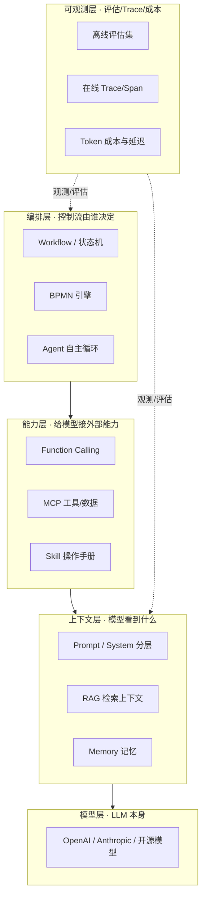

# AI 编排全景

> 一页建立坐标系：LLM 应用分哪几层、核心术语指什么、本板块每页解决哪一层的问题。

## 分层架构

一个生产级 LLM 应用，可以拆成五层。本板块的每一页都落在其中一层上：

> 说明：编排层调用能力层、能力层喂给上下文层、上下文层驱动模型层；可观测层横切所有层做评估与监控。

| 层        | 解决什么                 | 对应本板块页面                                                                                                                                                    |
| --------- | ------------------------ | ----------------------------------------------------------------------------------------------------------------------------------------------------------------- |
| 上下文层  | 模型看到什么、怎么拼     | [Prompt 工程](./prompt-engineering) · [RAG](./rag) · [记忆](./agent-memory)                                                                                       |
| 能力层    | 模型能调什么外部能力     | [Function Calling](./function-calling) · [MCP/A2A/AG-UI](./protocols) · [Skill](./skill)                                                                          |
| 编排层    | 控制流由谁定、状态怎么存 | [Orchestration](./orchestration) · [Workflow](./workflow) · [BPMN](./bpmn) · [LangChain](./langchain) · [LangGraph](./langgraph) · [Agent 模式](./agent-patterns) |
| 可观测层  | 怎么知道它对不对、贵不贵 | [评估与可观测](./evaluation)                                                                                                                                      |
| 横切·安全 | 防注入、权限、不可信输入 | [安全与注入防护](./llm-security)                                                                                                                                  |

---

## 核心术语速查

| 术语              | 一句话                                                    | 深入                                              |
| ----------------- | --------------------------------------------------------- | ------------------------------------------------- | ------------------------ |
| Agent             | 模型在循环里自主决定下一步（调工具/继续/终止）的执行单元  | [Agent 模式](./agent-patterns)                    |
| Workflow          | 控制流由代码预先定义的确定性多步编排                      | [Workflow](./workflow)                            |
| BPMN              | 带标准图形符号与执行引擎的业务流程建模（含人工任务/审计） | [BPMN](./bpmn)                                    |
| Function Calling  | 模型输出结构化"调用意图"，由宿主代码执行并回灌            | [Function Calling](./function-calling)            |
| Tool / 工具       | 模型可调用的一段确定性函数（查库/调 API/读写系统）        | [Function Calling](./function-calling)            |
| MCP               | Model Context Protocol，给模型接工具/数据的标准 C/S 协议  | [协议三件套](./protocols)                         |
| A2A               | Agent-to-Agent，让两个独立 Agent 互相发现并委派任务       | [协议三件套](./protocols)                         |
| AG-UI             | 把 Agent 中间状态流式推给前端的交互协议                   | [协议三件套](./protocols)                         |
| Skill             | 教模型"怎么做一类事"的可复用知识包（SKILL.md）            | [Skill](./skill)                                  |
| RAG               | 检索增强生成：先检索相关文档再让模型基于它回答            | [RAG](./rag)                                      |
| HITL              | Human-in-the-Loop，人在关键环节介入的断点机制             | [Workflow](./workflow) · [LangGraph](./langgraph) |
| Guardrails        | 输入/工具/输出三层确定性护栏，拦截越界与危险操作          | [Agent 模式](./agent-patterns)                    |
| Durable Execution | 持久化执行：崩溃后靠事件重放恢复，而非从头重跑            | [Workflow](./workflow)                            |
| Checkpointer      | LangGraph 的状态持久化机制，支撑断点恢复与时间旅行        | [LangGraph](./langgraph)                          |
| LCEL              | LangChain 表达式语言，用 `                                | ` 把组件拼成链                                    | [LangChain](./langchain) |
| LLM-as-Judge      | 用另一个模型当评委给输出打分（需防偏差）                  | [评估](./evaluation)                              |
| Prompt Injection  | 通过输入污染诱导模型越权/泄密的攻击                       | [安全](./llm-security)                            |

---

## 怎么读这个板块

- **想快速选型**：直接看 [编排方案选型决策表](./comparison)，再按结论回读对应页面。
- **想建立体系**：按 [学习路径](./)（基础 → 编排 → 工具协议 → 框架 → 深化）逐页读。
- **只想查一个点**：用上方术语表定位到具体页。

> ⚠️ 贯穿全板块的一条主线：**先分清"流程由代码定"还是"流程由模型定"**。这是所有编排选型的分水岭，会在 [Orchestration](./orchestration) 展开。
