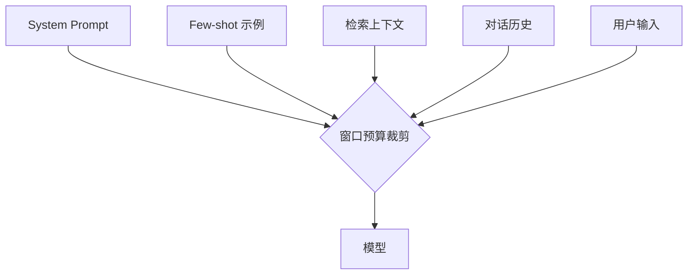

# Prompt 与上下文工程

> 所有编排、框架、Agent 的底层输入都是 prompt 与上下文——模型本身没变,效果差异九成来自这份输入写得对不对、管得好不好。

## System Prompt 分层与角色设定

System prompt 不是一段散文,而是**分层结构**:角色/目标 → 约束 → 输出契约 → 示例。越稳定的层越靠前,因为模型对前缀有 KV-cache 复用,稳定前缀既便宜又快;易变内容(本轮数据、动态指令)放后面,避免污染缓存。

核心原则:**顺序即优先级,前缀即缓存**。

```ts
// 分层组装:稳定在前、易变在后
function buildSystemPrompt(ctx: RuntimeContext): string {
  return [
    // L1 角色与目标(最稳定,几乎不变)
    `你是订单履约领域的资深工程师助手,目标是把用户的自然语言诉求转成结构化的履约动作。`,
    // L2 约束(行为边界,稳定)
    `约束:
- 只处理订单履约相关问题,越界请求明确拒绝
- 不臆造订单号、库存数;缺信息就追问,不猜
- 金额、数量必须原样引用,不得四舍五入`,
    // L3 输出契约(稳定,见「结构化输出契约」)
    `输出必须是合法 JSON,字段见随附 schema,不要输出任何 JSON 以外的文字。`,
    // L4 易变上下文(本轮才确定,放最后)
    `当前环境:${ctx.env};调用方:${ctx.caller}`,
  ].join('\n\n');
}
```

| 层  | 内容                  | 稳定性 | 位置         |
| --- | --------------------- | ------ | ------------ |
| L1  | 角色 / 目标           | 最高   | 最前(吃缓存) |
| L2  | 约束 / 边界           | 高     | 前           |
| L3  | 输出契约              | 高     | 中           |
| L4  | 动态上下文 / 本轮变量 | 低     | 最后         |

---

## Few-shot 示例选取

Few-shot 的价值不在数量,在**覆盖边界**。只给 happy path 示例,模型遇到边界 case 照样翻车;3-5 个精心挑选的示例足够,超过之后边际收益骤降还浪费窗口。

选取原则:

- **覆盖边界 case 而非只有 happy path**:空值、歧义、越界、格式变体各来一个
- **示例质量 > 数量**:一个错误示例的破坏力大于十个正确示例的收益
- **示例格式必须和输出契约严格一致**:示例里偷的懒,模型会原样学走

```ts
// 意图分类的 few-shot:happy path + 边界 case
const FEW_SHOT = [
  // happy path
  { input: '帮我把订单 A1023 改成明天送达', output: { intent: 'RESCHEDULE', order_id: 'A1023', date: 'TOMORROW' } },
  // 边界:缺关键信息 → 触发追问而非臆造
  { input: '这个订单能不能快点', output: { intent: 'CLARIFY', question: '请提供订单号' } },
  // 边界:越界请求 → 拒绝
  { input: '顺便帮我订个外卖', output: { intent: 'OUT_OF_SCOPE' } },
  // 边界:多意图 → 取主意图,其余进 notes
  {
    input: 'A1023 改地址到科技园,另外问一下运费',
    output: { intent: 'CHANGE_ADDRESS', order_id: 'A1023', notes: 'user also asked shipping fee' },
  },
];
```

---

## 上下文窗口预算与裁剪策略

窗口是**预算**,不是无限仓库。system + few-shot + 检索上下文 + 对话历史 + 用户输入,五部分要在发送前显式分配额度并裁剪,否则要么撑爆窗口报错,要么静默截断丢关键信息。

本图核心结论:所有上下文源汇入一个**预算裁剪器**,超预算按优先级裁剪后再进模型。



```ts
// 按预算自顶向下裁剪,优先级:用户输入 > 输出契约 > 检索 > 历史 > few-shot
interface Budget {
  system: number;
  fewShot: number;
  rag: number;
  history: number;
  input: number;
}

function assemble(parts: ContextParts, totalTokens: number, budget: Budget): Message[] {
  const fixed = countTokens(parts.system) + countTokens(parts.input);
  let remaining = totalTokens - fixed;

  // 1. 检索上下文优先给(本轮相关性最高)
  const rag = truncateToTokens(parts.rag, Math.min(budget.rag, remaining));
  remaining -= countTokens(rag);

  // 2. 历史从最新往旧装,装不下就丢最旧的(别丢头尾,见 context rot)
  const history = fitHistoryFromRecent(parts.history, Math.min(budget.history, remaining));
  remaining -= countTokens(history);

  // 3. few-shot 最后,额度不够就减示例数,绝不截断单个示例(半截示例是有毒的)
  const fewShot = pickFewShotWithin(parts.fewShot, remaining);

  return buildMessages(parts.system, fewShot, rag, history, parts.input);
}
```

裁剪顺序的取舍:**先砍历史最旧轮次,再砍 few-shot 个数,最后才压检索**——用户当前输入和输出契约永远不动。

---

## 结构化输出契约(JSON mode / schema)

不要指望模型"自觉"按格式输出自由文本再用正则/parser 兜底——那是拿运行时稳定性赌概率。**优先用模型原生 JSON mode / structured output**,把 schema 交给模型侧约束解码,格式错误在生成阶段就被消掉,而不是在解析阶段才暴露。

```ts
// Anthropic / OpenAI structured output:schema 即契约
const OrderActionSchema = {
  type: 'object',
  properties: {
    intent: { type: 'string', enum: ['RESCHEDULE', 'CHANGE_ADDRESS', 'CLARIFY', 'OUT_OF_SCOPE'] },
    order_id: { type: ['string', 'null'] },
    notes: { type: 'string' },
  },
  required: ['intent', 'order_id', 'notes'],
  additionalProperties: false, // 关键:禁止模型自由发挥加字段
} as const;

const res = await client.messages.create({
  model: 'claude-opus-4-8',
  // 用原生 structured output / tool-use 约束输出,而非自由文本 + parser
  response_format: { type: 'json_schema', schema: OrderActionSchema },
  messages,
});
// 返回即合法 JSON,直接 JSON.parse,无需正则提取、无需容错
```

| 方案                                | 格式保证            | 适用       |
| ----------------------------------- | ------------------- | ---------- |
| 自由文本 + 正则/parser              | ❌ 无,靠运气        | 一次性脚本 |
| JSON mode(仅保证合法 JSON)          | ⚠️ 合法但不保证字段 | 宽松场景   |
| structured output / tool-use schema | ✅ 字段级约束       | 生产默认   |

这套契约和 Tool Schema 是同一枚硬币的两面,详见 [Function Calling](./function-calling)。

---

## Prompt 版本管理与回归

Prompt 是代码,不是配置文案。改一行措辞可能让某类 case 准确率掉 20%,没有回归就是裸奔。

- **纳入版本管理**:prompt 模板进 git,每次变更带 commit,可 diff、可回滚
- **变更跑回归**:改 prompt 后在固定评估集上重跑,对比指标再合入
- **模板与变量分离**:用占位符注入变量,模板本体稳定可评测

```ts
// prompts/reschedule.ts —— prompt 即模块,进版本管理
export const VERSION = '1.4.0'; // 语义化版本,变更必升
export function render(vars: { env: string; caller: string }): string {
  return `...(模板本体稳定,变量从 vars 注入)...`;
}
```

```bash
# 改 prompt 后必跑回归,指标掉了就不合入
pnpm eval --prompt reschedule@1.4.0 --against reschedule@1.3.0 --dataset golden/order-intent.jsonl
```

回归指标与评估集怎么建,见 [Evaluation](./evaluation)。评估集要和 few-shot 示例**去重**——拿训练示例当考题,分数虚高没意义。

---

## 上下文腐烂(context rot)与中间遗忘

长上下文不等于有效上下文。模型对**开头和结尾**的内容关注度最高,**中间部分易被忽略**(lost in the middle)。塞进去的文档越多,每篇被真正用到的注意力越少,这叫 context rot——窗口没爆,效果先烂了。

应对策略:

- **关键信息放开头或结尾**:核心指令放 system(开头),本轮最关键的事实复述到用户输入(结尾)
- **别把检索结果一股脑平铺**:先做相关性排序和压缩,只放 top-k 且去冗余,检索组装见 [RAG](./rag)
- **长文档先提炼再注入**:整篇塞入不如先抽要点
- **主动验证**:对长上下文任务,让模型先复述它"看到的关键约束",不一致说明已腐烂

```ts
// 关键约束在结尾复述一次,对抗中间遗忘
const userTurn = `
${retrievedContext}

——
重申本轮硬约束:金额不得修改;只处理订单 ${orderId};输出必须是前述 JSON schema。
用户诉求:${userInput}`;
```

---

## 常见陷阱 ❌/✅

| 场景               | ❌ 错误                           | ✅ 正确                                     |
| ------------------ | --------------------------------- | ------------------------------------------- |
| System prompt 内容 | 把易变指令、大段参考全塞进 system | 稳定分层放 system,易变数据放用户轮          |
| 缓存利用           | 每次改 system 前缀,缓存全失效     | 稳定前缀靠前,吃 KV-cache,降本提速           |
| 格式输出           | 指望模型自觉,自由文本 + 正则兜底  | 原生 JSON mode / structured output + schema |
| Few-shot           | 堆 20 个 happy path 示例          | 3-5 个覆盖边界 case,质量优先                |
| 对话历史           | 不裁剪,长会话撑爆窗口或静默截断   | 预算化裁剪,丢最旧轮次,保头尾                |
| 长上下文           | 检索结果一股脑平铺进中间          | 排序压缩放头尾,关键约束结尾复述             |
| Prompt 变更        | 改完直接上线,出问题靠用户反馈     | 版本管理 + 评估集回归后再合入               |

```ts
// ❌ 反例:易变数据污染 system,缓存失效还稀释核心指令
const bad = `你是助手。当前时间 ${Date.now()},本轮库存 ${JSON.stringify(bigInventory)},${coreRules}`;

// ✅ 正例:稳定规则进 system 前缀,易变数据进用户轮
const system = coreRules; // 稳定,吃缓存
const user = `库存快照:${summary(inventory)}\n诉求:${input}`; // 易变,放后面
```

历史裁剪与长期记忆的落盘策略(摘要、向量召回),见 [Agent Memory](./agent-memory)。
