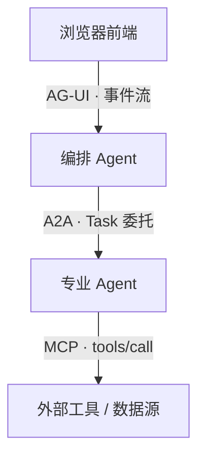
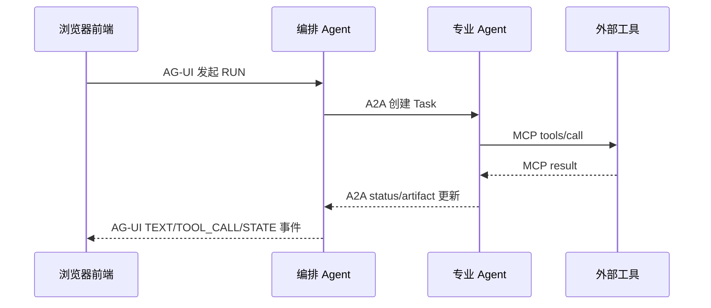

# Agent 协议三件套 MCP / A2A / AG-UI

> MCP 给模型接工具、A2A 让 Agent 互相委托、AG-UI 把 Agent 状态推给前端——三者解决不同层的问题,正交互补,真实系统是叠加用而非三选一。

## 三件套不是竞品:分层定位与各管一段

最大的认知错误是把三者当竞品去"选型"。它们各管一段边界,谁也不替代谁:

- **MCP(Model Context Protocol)**:管 **模型 ↔ 工具/数据**。把"给 LLM 接外部能力"收敛成标准 C/S,替代一坨胶水代码。
- **A2A(Agent-to-Agent)**:管 **Agent ↔ Agent**。让两个独立 Agent(不同厂商/框架/团队)互相发现并委派任务。
- **AG-UI(Agent-User Interaction)**:管 **Agent ↔ 前端**。把 Agent 的中间状态实时结构化地推给浏览器。

本图核心结论:前端在顶,向下逐层委托;三个协议分别封住 Agent 的三个边界,完整系统常三层同用。



| 协议  | 边界              | 类比                              | 速查口径             |
| ----- | ----------------- | --------------------------------- | -------------------- |
| MCP   | 模型 ↔ 工具/数据 | LLM 界的 USB-C                    | 接工具/数据 → MCP    |
| A2A   | Agent ↔ Agent    | Agent 间的"服务间 RPC + 任务队列" | 接别的 Agent → A2A   |
| AG-UI | Agent ↔ 前端     | Agent 后端的"WebSocket 推送协议"  | 接浏览器前端 → AG-UI |

---

## MCP:给模型接工具与数据的标准接口

没有 MCP 时,每接一个外部能力都要手写:拼 prompt 描述工具、解析模型输出、执行、回灌结果。MCP 把这套收敛成标准 C/S:

- **Host**:跑模型的应用(Claude Desktop / 你的 Agent),顶层容器。
- **Client**:Host 内每个 Server 一条连接,维护会话与能力协商。
- **Server**:暴露能力的进程/服务,提供 Tools / Resources / Prompts 三件套。

它和 [Function Calling](./function-calling) 的关系:**FC 是模型侧的"调用意图"格式,MCP 是传输侧的"工具从哪来"标准**。两者叠加——模型产出 FC 调用意图,宿主把它翻译成 MCP `tools/call` 发给 Server。FC 不解决工具发现与执行,MCP 不解决模型怎么决定调谁。

```ts
// MCP Server 端:用官方 SDK 暴露一个工具(TS 版)
import { McpServer } from '@modelcontextprotocol/sdk/server/mcp.js';
import { StdioServerTransport } from '@modelcontextprotocol/sdk/server/stdio.js';
import { z } from 'zod';

const server = new McpServer({ name: 'orders', version: '1.0.0' });

// 工具=模型可调用的一段确定性函数;schema 即模型看到的"函数签名"
server.registerTool(
  'get_order',
  {
    title: '查询订单',
    description: '按订单号查询订单状态与金额',
    inputSchema: { orderId: z.string().describe('订单号') }, // zod 自动生成 JSON Schema
  },
  async ({ orderId }) => {
    const order = await db.order.findUnique({ where: { id: orderId } });
    return { content: [{ type: 'text', text: JSON.stringify(order) }] };
  },
);

await server.connect(new StdioServerTransport()); // 本地 stdio:子进程零网络
```

> ⚠️ MCP 的工具/资源输出对模型是**不可信输入**,可能夹带注入指令,必须在宿主侧做防护。见 [安全与注入防护](./llm-security)。

---

## MCP 能力模型:Tools / Resources / Prompts / Sampling

Server 暴露的不只是 Tools。只用 Tools 是最常见的浪费:

| 原语          | 由谁触发         | 是什么                    | 典型用途                         |
| ------------- | ---------------- | ------------------------- | -------------------------------- |
| **Tools**     | 模型(LLM 决定调) | 可执行的函数,有副作用     | 查库、调 API、写文件(主角)       |
| **Resources** | 应用/用户        | 只读数据,URI 寻址         | 喂上下文:文件、日志、库表 schema |
| **Prompts**   | 用户/应用        | 参数化的提示模板          | 复用团队沉淀的 prompt,一处维护   |
| **Sampling**  | Server(反向)     | Server 请 Host 帮忙调 LLM | Server 内部需要"问一下模型"时    |

```ts
// Resources:以 URI 暴露只读数据,应用按需拉取进上下文,不用手写"喂上下文"逻辑
server.registerResource(
  'order-schema',
  'schema://orders', // URI 寻址
  { title: '订单表结构', mimeType: 'application/json' },
  async (uri) => ({ contents: [{ uri: uri.href, text: JSON.stringify(orderTableDdl) }] }),
);

// Prompts:参数化模板,一处维护多处复用,避免 prompt 散落各调用方
server.registerPrompt('review-sql', { argsSchema: { sql: z.string() } }, ({ sql }) => ({
  messages: [{ role: 'user', content: { type: 'text', text: `Review this SQL:\n${sql}` } }],
}));
```

- **Tools** 是绝对主角:模型自主决定调不调,把"函数"交给模型。
- **Resources / Prompts** 解决的是"别自己造轮子":Resources 管只读上下文注入,Prompts 管提示模板复用——这两项手写一遍纯属重复劳动。
- **Sampling** 是反方向调用:让 Server 也能借 Host 的模型能力(用得少,知道有这回事即可)。

---

## MCP 报文与传输:JSON-RPC over stdio / Streamable HTTP

报文是 **JSON-RPC 2.0**,连接建立时先 `initialize` 握手协商双方能力,之后才是业务调用:

```json
// Client → Server:握手,声明协议版本与自身能力
{ "jsonrpc": "2.0", "id": 1, "method": "initialize",
  "params": { "protocolVersion": "2025-06-18", "capabilities": {}, "clientInfo": { "name": "my-host", "version": "1.0" } } }

// Client → Server:调用工具
{ "jsonrpc": "2.0", "id": 2, "method": "tools/call",
  "params": { "name": "get_order", "arguments": { "orderId": "A10086" } } }

// Server → Client:返回结果
{ "jsonrpc": "2.0", "id": 2, "result": { "content": [{ "type": "text", "text": "{\"status\":\"paid\"}" }] } }
```

两种传输,按部署形态选:

| 传输                | 部署形态   | 特点                                                                        |
| ------------------- | ---------- | --------------------------------------------------------------------------- |
| **stdio**           | 本地子进程 | Server 作为 Host 子进程,走 stdin/stdout,**零网络、零鉴权开销**,适合本地工具 |
| **Streamable HTTP** | 远程服务   | **单端点** POST + 按需升级为流式;**已取代旧的 HTTP+SSE 双端点方案**         |

```ts
// 远程 Client:连 Streamable HTTP 单端点(新 SDK 写法)
import { StreamableHTTPClientTransport } from '@modelcontextprotocol/sdk/client/streamableHttp.js';

const transport = new StreamableHTTPClientTransport(new URL('https://mcp.example.com/mcp'));
await client.connect(transport); // 单端点;旧的 '/sse' + '/messages' 双端点已废弃
```

> ❌ 还在用 HTTP+SSE 双端点接远程 MCP:新 SDK 已移除该传输,升级即报错。
> ✅ 远程一律走 **Streamable HTTP 单端点**;并在 `initialize` 锁定 `protocolVersion`,升级前先对 changelog。

---

## A2A:Agent 之间的任务委托协议

MCP 解决"Agent 调工具",A2A 解决"Agent 调 Agent"。当一个编排 Agent 要把活委派给另一个**独立部署、不同厂商/框架**的专业 Agent 时,需要标准的发现与协作协议——这就是 A2A。

它和 MCP / function-calling 的本质区别:**A2A 的任务是长时、有状态、多往返的**,不是一次同步函数调用。用"同步阻塞等返回值"的思路接 A2A,长任务和流式进度必然栽跟头。

- **Client Agent(发起方)**:发现远端 Agent、创建 Task、接收更新。
- **Remote Agent(执行方)**:执行 Task、流式回传状态与产出。
- 协作围绕 **Task** 展开:有生命周期、可长时运行、可多次交互,远超"一次调用一次返回"。

---

## A2A 能力模型:Agent Card / Task / Message / Artifact

| 概念           | 是什么                                                        | 速查                        |
| -------------- | ------------------------------------------------------------- | --------------------------- |
| **Agent Card** | 发布在 `/.well-known/agent.json` 的名片:能力/skills/端点/鉴权 | **发现**机制,先读名片再委派 |
| **Task**       | 协作核心单元,有状态、可长时、可多往返                         | 一次委托 = 一个 Task        |
| **Message**    | Task 内的对话轮次(role + parts)                               | Agent 间来回沟通            |
| **Artifact**   | Task 的产出物(文件/数据/结构化结果)                           | 最终交付的"结果文件"        |

```json
// Agent Card(挂在 .well-known/agent.json):声明"我会什么、怎么连我"
{
  "name": "invoice-agent",
  "url": "https://agents.example.com/invoice",
  "capabilities": { "streaming": true, "pushNotifications": true },
  "skills": [{ "id": "reconcile", "name": "对账", "description": "核对发票与订单" }]
}
```

```ts
// 发起方:创建 Task 并订阅流式更新(异步、长时、多状态)
// 伪代码,体现"订阅 Task 状态"而非"同步等返回"
const task = await a2a.tasks.send({
  message: { role: 'user', parts: [{ kind: 'text', text: '核对 7 月发票' }] },
});

for await (const event of a2a.tasks.subscribe(task.id)) {
  // event: TaskStatusUpdateEvent | TaskArtifactUpdateEvent
  if (event.kind === 'status-update') render(event.status.state); // working / input-required / completed / failed
  if (event.kind === 'artifact-update') saveArtifact(event.artifact); // 承载产出的 Artifact
}
```

Task 状态机(常见流转):`submitted → working → (input-required ↔ working) → completed / failed / canceled`。`input-required` 是关键:远端 Agent 可中途反向找发起方要补充信息——这是 function-calling 没有的**多往返**能力。

---

## AG-UI:Agent 到前端的流式交互协议

前两层管后端,AG-UI 管**最后一段:把 Agent 的中间状态实时、结构化地推给浏览器**。

关键设计取舍:**AG-UI 不约定业务逻辑,只约定事件流**。它规定 Agent 后端通过 SSE / WebSocket 发出一串标准事件,前端按事件类型增量渲染——不绑定你的 Agent 用什么框架、什么模型。由 CopilotKit 主推。

没有 AG-UI 时,前端要么自己轮询、要么裸读原始流自己拼状态,既脆弱又把工具细节暴露给浏览器。

---

## AG-UI 事件模型:生命周期/文本/工具调用/状态同步

事件分四类,前端据此驱动 UI:

| 类别         | 代表事件                                     | 驱动什么 UI                     |
| ------------ | -------------------------------------------- | ------------------------------- |
| **生命周期** | `RUN_STARTED` / `RUN_FINISHED` / `RUN_ERROR` | loading 态、错误提示、整体开关  |
| **文本增量** | `TEXT_MESSAGE_START/CONTENT/END`             | 流式打字机效果的聊天气泡        |
| **工具调用** | `TOOL_CALL_START/ARGS/END`                   | "正在调用 xxx 工具"的可视化     |
| **状态同步** | `STATE_SNAPSHOT` / `STATE_DELTA`             | 共享状态(如表单/看板)前后端对齐 |

```ts
// 前端:消费 AG-UI 事件流(SSE),按事件类型增量渲染
const source = new EventSource(`/agui/run/${runId}`);

source.onmessage = (e) => {
  const ev = JSON.parse(e.data) as { type: string; [k: string]: unknown };
  switch (ev.type) {
    case 'TEXT_MESSAGE_CONTENT':
      appendToken(ev.delta as string); // 文本增量:打字机
      break;
    case 'TOOL_CALL_START':
      showToolBadge(ev.toolCallName as string); // 工具调用:显示"正在调用 xxx"
      break;
    case 'STATE_DELTA':
      applyJsonPatch(sharedState, ev.delta); // 状态同步:JSON Patch 增量对齐
      break;
    case 'RUN_FINISHED':
      setLoading(false);
      break;
  }
};
```

> ✅ 状态同步用 `STATE_DELTA`(JSON Patch 增量)而非每次全量 `STATE_SNAPSHOT`,大对象下省带宽、避免闪烁。

---

## 三协议组合架构:一个请求穿过 AG-UI → A2A → MCP

真实系统里三层叠加,难点在**事件映射**:每一层要把下层的事件翻译成本层的事件,再逐级回传到前端。

本图核心结论:一条用户请求自上而下委托三层,结果自下而上逐层翻译回前端;每层只做"调用下层 + 翻译事件"。



事件映射对照(组合的核心工作量在这里):

| 下层事件                   | 翻译成本层                     | 说明           |
| -------------------------- | ------------------------------ | -------------- |
| MCP `tools/call` 开始/结束 | AG-UI `TOOL_CALL_START/END`    | 工具调用可视化 |
| A2A Task 状态 `working`    | AG-UI 生命周期/进度事件        | 长任务进度透传 |
| A2A `artifact-update`      | AG-UI `STATE_DELTA` 或文本消息 | 产出物回显     |
| MCP result 文本            | AG-UI `TEXT_MESSAGE_CONTENT`   | 逐 token 透出  |

```ts
// 编排 Agent 内:把 A2A Task 事件 → AG-UI 事件,推给前端
for await (const ev of a2a.tasks.subscribe(taskId)) {
  if (ev.kind === 'status-update') {
    agui.emit({ type: 'TEXT_MESSAGE_CONTENT', delta: `远端状态:${ev.status.state}\n` });
  } else if (ev.kind === 'artifact-update') {
    agui.emit({ type: 'STATE_DELTA', delta: [{ op: 'add', path: '/artifact', value: ev.artifact }] });
  }
}
```

> 这套"把下层事件翻译成 AG-UI 事件"的胶水,正是 [Agent 模式](./agent-patterns) 里多 Agent 编排落地时最易被低估的工作量。

---

## 选型决策表:什么场景用哪个协议

记住速查口径即可,绝大多数场景一句话定位:

| 场景                                | 用哪个                                       | 为什么                               |
| ----------------------------------- | -------------------------------------------- | ------------------------------------ |
| 给模型接工具/数据库/API             | **MCP**                                      | 标准化的工具/数据 C/S,免胶水         |
| 模型自己决定调哪个函数              | [Function Calling](./function-calling) + MCP | FC 出意图,MCP 管发现与执行           |
| 委托给另一个独立 Agent(跨团队/厂商) | **A2A**                                      | Agent Card 发现 + Task 长时协作      |
| 长时任务、需多往返/中途要输入       | **A2A**(Task 状态机)                         | function-calling 无 `input-required` |
| 把 Agent 进度/工具调用推给浏览器    | **AG-UI**                                    | 结构化事件流,前端增量渲染            |
| 教模型"怎么做一类事"(非接能力)      | [Skill](./skill)                             | Skill 是知识包,不是通信协议          |
| 完整产品(前端+编排+多 Agent+工具)   | **三者叠加**                                 | 各管一段,正交互补                    |

---

## 常见陷阱

**❌ 把三者当竞品去"选型"**
这是最大的认知错误。三者封住 Agent 的不同边界,真实系统是叠加而非三选一。
✅ 先按"模型↔工具 / Agent↔Agent / Agent↔前端"定位层,再各选各的协议。

**❌ 只用 MCP Tools,忽略 Resources / Prompts,又手写一套喂上下文/复用 prompt 的逻辑**
等于装了标准接口却只用一个口,其余自己造轮子。
✅ 只读上下文走 **Resources**,提示模板复用走 **Prompts**,别在调用方重复实现。

**❌ 远程 MCP 还在用过时的 HTTP+SSE 双端点;协议版本没锁定,升级就断连**
旧传输已被新 SDK 移除,协议一年一换。
✅ 远程走 **Streamable HTTP 单端点**;`initialize` 锁定 `protocolVersion`,升级前必看 changelog。

**❌ 把 A2A 当"Agent 版 function-calling",用同步阻塞思路接**
A2A Task 长时、有状态、多往返,同步等返回会在长任务/流式进度栽跟头。
✅ 用**订阅 Task 事件**的异步模型,处理好 `input-required` 多往返。

**❌ 前端直连 MCP/A2A,不用 AG-UI**
把工具细节、Task 状态机暴露给浏览器,还让前端自己拼流式状态,既泄密又脆弱。
✅ 前端只面对 **AG-UI 事件流**;后端在编排层做 A2A/MCP → AG-UI 的事件映射。

> ⚠️ 三协议都很年轻、变动快:**A2A 已并入 Linux Foundation、MCP 传输一年一换、AG-UI 由 CopilotKit 主推**。落地时锁定版本、盯住官方 changelog,别把宝押在某个具体传输/字段名上。
