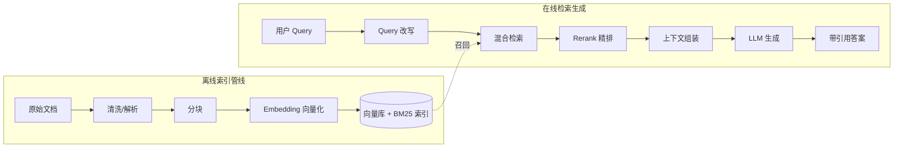
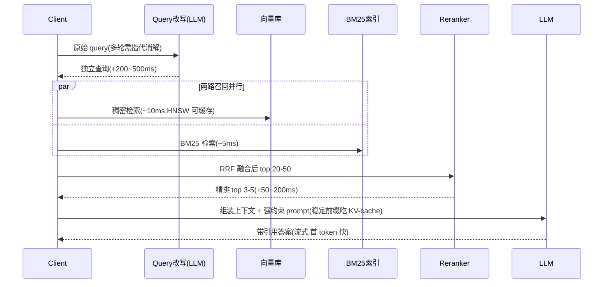
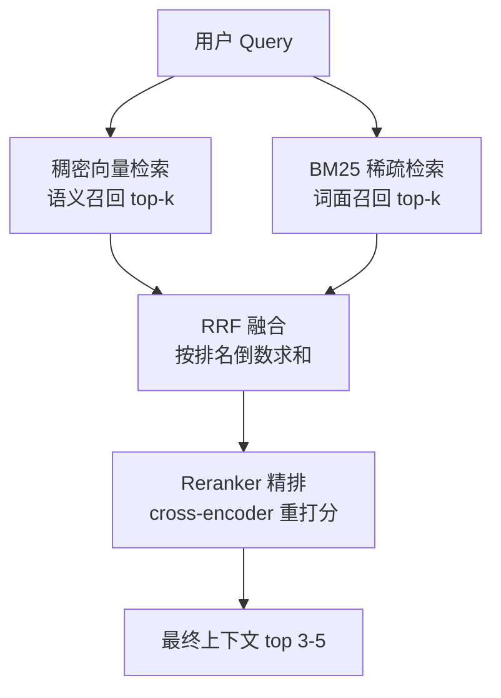
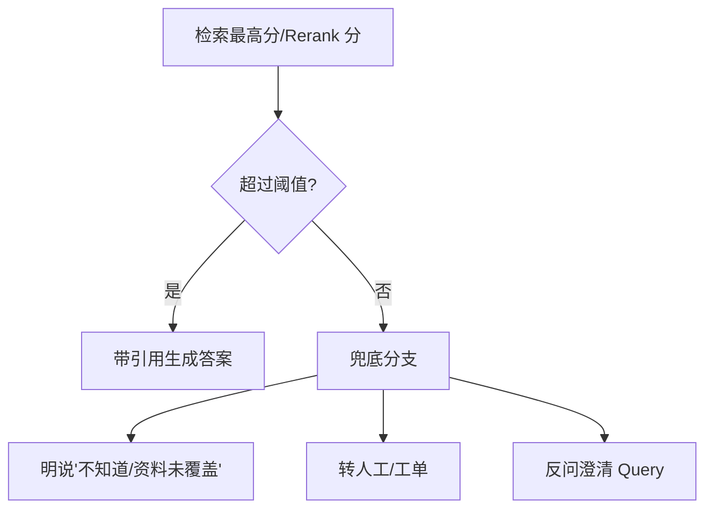

# RAG 检索增强生成

> RAG 的效果九成不在 LLM,而在检索这条链:分块是第一杠杆,混合检索 + Rerank 是性价比最高的两步,忠实度红线靠 prompt 强约束 + 相似度阈值兜底守住。检索不到硬答 = 幻觉;没建评估集的调参都是盲调。本页是全链路工程备忘,不是入门科普。

## RAG 是什么与适用边界

RAG = 检索(Retrieval)+ 增强(Augmented)+ 生成(Generation):先从外部知识库召回相关片段,塞进 prompt 作上下文,再让 LLM **只依据这些上下文**作答。本质是把"模型参数里的记忆"换成"可更新的外部索引"。

| 维度     | 微调 Fine-tune         | RAG                        |
| -------- | ---------------------- | -------------------------- |
| 知识形态 | 烤进权重,改起来要重训  | 外置索引,改文档即生效      |
| 时效性   | 差(训练截止)           | 强(索引可实时重建)         |
| 可追溯   | 无引用                 | 可逐句标出处               |
| 适合     | 改变风格/格式/领域语感 | 注入事实/私域知识/长尾问答 |
| 幻觉控制 | 不解决                 | 强约束 + 兜底可显著压制    |

适用边界:

- ✅ **该上**:私域知识问答、文档客服、合规条款引用、内部 Wiki/代码库问答——知识要新、要可引用、频繁变。
- ❌ **别上**:纯创作/闲聊(无知识可检索反而添乱)、强多跳推理且知识高度关联(考虑 [GraphRAG](#进阶-graphrag-与结构化知识))、对延迟极敏感的实时场景(每多一路检索多一份延迟)。

> 经验判断:**知识是"事实"就走 RAG,是"能力/风格"才走微调**。两者可叠加,但先用 RAG 把事实层解决,微调只补 RAG 补不了的语感。

---

## 整体架构:离线索引 + 在线检索生成

RAG 天然分两条管线。**离线**把文档煮成可检索的索引(慢、可重跑);**在线**在毫秒级内完成检索 + 生成(快、有缓存)。两者唯一的契约是:**索引侧和查询侧必须用同一个 embedding 模型、同一套预处理**,否则检索静默翻车。

核心结论:离线管线决定"能检索到什么",在线管线决定"答得好不好",中间的 embedding 一致性是两条管线的命门。



在线侧一次请求的时序与延迟预算如下。核心结论:**改写和 HyDE 这类"先问一次 LLM"的步骤是主要延迟源,检索本身很快;system 前缀和向量检索都可缓存**。



---

## 索引构建:分块策略

**分块是 RAG 的第一杠杆**,比换模型、调 prompt 都更影响上限。核心矛盾:块太小丢上下文(指代、表格头丢了),块太大稀释相关性(关键句被噪声淹没、浪费窗口)。

| 策略           | 做法                        | 适用              | 坑                      |
| -------------- | --------------------------- | ----------------- | ----------------------- |
| 定长(按 token) | 每 N token 一刀             | 纯文本基线        | 拦腰断句、切断表格/代码 |
| 递归分隔符     | 按 `\n\n`→`\n`→句号逐级退避 | 通用文档首选      | 仍可能断在结构中间      |
| 结构分块       | 按标题/代码块/表格边界切    | Markdown/技术文档 | 需先解析出结构          |
| 语义分块       | embedding 相似度骤降处切    | 主题切换明显      | 贵,多一次 embedding     |

工程要点:

- **按 token 不按字符**:不同语言字符↔token 换算差异大,按字符切出来的块喂给模型时对不上窗口预算。用目标模型的 tokenizer 数。
- **重叠 10-15%**:相邻块保留重叠,避免答案正好落在切块边界被切没。重叠太多(>30%)则索引膨胀、召回重复。
- **块大小 256-512 token 起步**:经验甜区。短问答偏 256,长文档综述偏 512;再配上"小子块检索 + 父块回填"(检索小块定位、返回所属大块给 LLM)兼顾精度与上下文。
- **结构化内容整体成块**:表格不要拦腰切断——整个表成一个块,或先转成 Markdown 表再切;代码块同理,按函数/类边界切。

```ts
import { RecursiveCharacterTextSplitter } from '@langchain/textsplitters';
import { encodingForModel } from 'js-tiktoken';

const enc = encodingForModel('gpt-4o-mini');

// 按 token 而非字符切;递归分隔符退避;重叠 ~12%
const splitter = RecursiveCharacterTextSplitter.fromLanguage('markdown', {
  chunkSize: 400, // 单位:token(自定义 lengthFunction 后)
  chunkOverlap: 48, // 400 * 12%,保上下文连续
  lengthFunction: (text) => enc.encode(text).length, // 关键:按 token 数
});

const chunks = await splitter.splitText(markdownSource);
// 每个 chunk 带上 source/标题路径等 metadata,供引用标注与过滤
```

> ❌ 直接 `text.slice(0, 2000)` 按字符定长切 → 表格、代码、句子全被切碎。
> ✅ 按结构边界 + token 计量 + 适度重叠;结构化内容单独处理。

---

## 索引构建:Embedding 模型选型

Embedding 把文本映射成向量,语义相近则向量相近。选型记住一句话:**索引侧与查询侧必须同模型、同版本、同预处理(归一化/截断),否则检索静默变差且无任何报错**——这是 RAG 最高频的隐形翻车源。

| 场景        | 推荐                                | 说明                                              |
| ----------- | ----------------------------------- | ------------------------------------------------- |
| 中文为主    | `bge-m3` / `bge-large-zh`           | bge-m3 同时输出稠密+稀疏+多向量,多语言,中文检索强 |
| 英文/多语言 | `bge-m3` / `text-embedding-3-large` | 后者托管省心,前者可自部署                         |
| 私有部署    | bge 系列 / `gte` / `e5`             | 可自托管,数据不出内网                             |
| 代码检索    | 代码专用 embedding                  | 自然语言模型对代码语义建模弱                      |

关键约束:

- **维度即契约**:换模型往往维度也变(768→1024),旧索引向量维度对不上,必须**全量重建索引**,不能混用。
- **归一化一致**:cosine 相似度要求向量归一化方式两侧一致;有的模型内置归一化,有的要自己做,不一致会导致分数分布漂移。
- **query/passage 前缀**:部分模型(如 e5)要求查询加 `"query: "`、文档加 `"passage: "` 前缀,两侧前缀用错也是静默翻车。
- **别信公共榜单分数**:MTEB 排名 ≠ 你领域语料的表现。领域术语多的场景必须用自己的评估集实测(见 [评估](#评估-检索质量指标))。

---

## 索引构建:向量库与存储

向量库负责存向量 + 近似最近邻(ANN)检索。选型按规模与运维成本,而不是追新。

| 方案                             | 定位              | 何时用                       |
| -------------------------------- | ----------------- | ---------------------------- |
| `pgvector`(PG 扩展)              | 复用现有 Postgres | 中小规模、不想多运维一个组件 |
| `Qdrant` / `Milvus` / `Weaviate` | 专用向量库        | 大规模、高 QPS、要丰富过滤   |
| `LanceDB` / `Chroma`             | 嵌入式            | 本地/原型、随进程跑          |
| `OpenSearch` / `Elasticsearch`   | 向量+BM25 一体    | 已有 ES,想做混合检索一套搞定 |

工程要点:

- **metadata 过滤与向量一样重要**:按 `source`、`doc_type`、`tenant_id`、`更新时间` 预过滤再 ANN,既能多租户隔离又能控召回范围。
- **HNSW 是默认索引**:图索引召回/延迟平衡最好;注意 `ef_search`/`m` 等参数是召回率与延迟的旋钮。
- **保留原文**:向量库只存向量 + payload,原文块通常另存(对象存储/KV),用 `chunk_id` 关联,便于回填大块与渲染引用。
- **重建索引可重放**:离线索引管线要幂等、可整体重跑——换 embedding、调分块都要重建,把"重放"当成常态而非事故。

---

## 检索:稠密检索与 BM25

两条检索路线互补,缺一不可。

|      | 稠密检索(向量)                                            | 稀疏检索(BM25)                              |
| ---- | --------------------------------------------------------- | ------------------------------------------- |
| 原理 | embedding 语义相似                                        | 词频/逆文档频率的词面匹配                   |
| 擅长 | 同义改写、语义泛化("怎么退款"≈"退货流程")                 | 专有名词、型号、编号、错误码、缩写、精确 ID |
| 盲区 | **精确词面**:型号 `XJ-9000`、错误码 `E-4032` 向量里分不清 | 语义:词不同但意思同的查不到                 |
| 索引 | 向量库                                                    | 倒排索引(Lucene/ES)                         |

核心结论:**纯向量检索对专有名词/编号/型号/精确 ID 天然差**——这类 token 在 embedding 空间里挤成一团,语义距离拉不开。线上系统大量"查不到"的 badcase,根源都是缺了 BM25 那一半的词面匹配。

```python
# BM25(稀疏):词面精确匹配的兜底,专有名词/编号靠它
from rank_bm25 import BM25Okapi

tokenized_corpus = [doc.lower().split() for doc in chunks]
bm25 = BM25Okapi(tokenized_corpus)

def bm25_search(query: str, k: int = 20) -> list[int]:
    scores = bm25.get_scores(query.lower().split())
    # 取分数最高的 k 个下标
    return sorted(range(len(scores)), key=lambda i: -scores[i])[:k]
```

---

## 检索:混合检索与 RRF 融合

**混合检索 = 稠密(语义)+ BM25(词面)各召回一路,再融合**。融合算法首选 **RRF(Reciprocal Rank Fusion,倒数排名融合)**:只用各路排名倒数求和,**不需要对两路分数做归一化**——向量分数(0~1)和 BM25 分数(0~几十)量纲完全不同,加权求和极易被一路压制,RRF 天然免疫,比加权求和稳得多。

核心结论:两路各取 top-k 召回,RRF 按排名融合,再过 Reranker 精排出最终上下文。



```python
def rrf_fuse(dense_ids: list[str], sparse_ids: list[str], k: int = 60) -> list[str]:
    """RRF:score(d) = Σ 1/(k + rank(d));k=60 是常用平滑常数,抹平头部排名差异。"""
    score: dict[str, float] = {}
    for rank, doc_id in enumerate(dense_ids):
        score[doc_id] = score.get(doc_id, 0) + 1 / (k + rank + 1)
    for rank, doc_id in enumerate(sparse_ids):
        score[doc_id] = score.get(doc_id, 0) + 1 / (k + rank + 1)
    # 按 RRF 分降序,取融合后的 top
    return [d for d, _ in sorted(score.items(), key=lambda x: -x[1])]
```

> ❌ 向量分数 + BM25 分数直接加权求和 → 量纲不同,几乎等于只用了一路。
> ✅ RRF 用排名不用分数,免归一化,两路都能公平贡献。

---

## 检索:重排序 Rerank

**召回(top-k 大、快、糙)与精排(top-k 小、慢、准)分离**。混合检索召回 20-50 个候选,再用 **cross-encoder Reranker** 把 query 和每个候选**拼在一起**过模型精排,留 top 3-5 给生成。Rerank 是全链路**性价比最高的一步**——bi-encoder 检索时 query/文档分别编码、只看向量点积,信息损失大;cross-encoder 让两者深度交互,相关判断准一个量级。

|      | bi-encoder(检索/召回) | cross-encoder(Rerank) |
| ---- | --------------------- | --------------------- |
| 输入 | query、文档分别编码   | query + 文档拼一起    |
| 速度 | 快(向量可预算)        | 慢(逐对算)            |
| 精度 | 糙                    | 准                    |
| 用量 | 召回 top 20-50        | 精排 top 3-5          |

```python
from sentence_transformers import CrossEncoder

# bge-reranker-v2-m3:中文友好,开源可自部署
reranker = CrossEncoder('BAAI/bge-reranker-v2-m3')

def rerank(query: str, candidates: list[str], top_n: int = 5) -> list[str]:
    pairs = [[query, doc] for doc in candidates]
    scores = reranker.predict(pairs)   # query-文档 逐对打分
    ranked = sorted(zip(candidates, scores), key=lambda x: -x[1])
    return [doc for doc, _ in ranked[:top_n]]
```

> 经验:**召回 20-50 → Rerank 留 3-5**。召回太少(<10)Rerank 没料子排;召回太多(>100)Rerank 又慢又贵,边际收益骤减。Reranker 的分数还可直接当相关性阈值用(见 [拒答与兜底](#生成-拒答与兜底策略))。

---

## 生成:上下文组装与引用标注

**忠实度是红线**。生成端的核心是把"仅依据上下文回答"写成硬约束,并要求逐句标注引用——没有约束,模型会把检索不到的硬答成幻觉。

组装要点:检索块按相关性排序填入,标注编号 `[1][2]`,带上 source/标题 metadata;上下文放 prompt 前部(配合稳定 system 前缀吃 KV-cache,详见 [Prompt 工程](./prompt-engineering))。

```ts
interface RetrievedChunk {
  id: string;
  text: string;
  source: string; // 文档名/URL,供引用渲染
  score: number; // Rerank 后的相关性分
}

function buildRagPrompt(query: string, chunks: RetrievedChunk[]): string {
  // 给每块编号,组装上下文
  const context = chunks.map((c, i) => `[${i + 1}] (来源: ${c.source})\n${c.text}`).join('\n\n');

  return `你是严谨的技术问答助手。仅依据下面提供的上下文回答,禁止使用上下文之外的知识。
要求:
1. 回答中每句关键结论后用 [编号] 标注引用来源;
2. 上下文没有的信息,直接说"根据现有资料无法确定",不要编造;
3. 不确定就说不确定。

上下文:
${context}

问题:${query}`;
}
```

> ❌ 把检索块原样塞进 prompt,不加"仅依据上下文"约束 → 模型自由发挥,幻觉源头。
> ✅ 编号 + 来源 + 强约束 + 逐句引用;引用编号要能回溯到原始文档供前端渲染链接。

---

## 生成:拒答与兜底策略

检索不到相关内容时,**必须拒答而不是硬答**。这是压制幻觉的最后一道闸:用相关性分数设阈值,低于阈值走兜底,而不是把不相关的块硬喂给模型让它编。

核心结论:检索/Rerank 最高分过不过阈值,决定走"带引用生成"还是走"兜底"。



```ts
const RELEVANCE_THRESHOLD = 0.35; // Rerank 分数阈值,按评估集标定,别拍脑袋

async function answer(query: string): Promise<string> {
  const chunks = await hybridRetrieveThenRerank(query); // 混合检索 + 精排
  const top = chunks[0];

  // 相关性不足 -> 兜底,绝不硬答
  if (!top || top.score < RELEVANCE_THRESHOLD) {
    return '根据现有资料无法确定这个问题。可以换个问法,或我帮你转人工跟进。';
  }
  return generateWithCitations(query, chunks); // 带引用生成
}
```

> ❌ 无阈值、无兜底,相关性再低也强行生成 → 只能编造,幻觉就是这么来的。
> ✅ 设相似度/Rerank 阈值,低于走"不知道 / 转人工 / 追问澄清";阈值用评估集标定并随数据回归。

---

## 评估:检索质量指标

RAG 调参必须先有评估集,否则都是盲调。评估分两层自动化:**检索层**和**生成层**分开测。检索层需要标注 **query → 相关文档** 的对应关系(几十到几百条即可起步)。

| 指标       | 含义                           | 关注点                           |
| ---------- | ------------------------------ | -------------------------------- |
| `Recall@k` | 相关文档有多少进了 top-k       | 召回够不够全(混合检索的主要指标) |
| `MRR`      | 第一个相关结果排第几的倒数均值 | 头部命中快不快                   |
| `nDCG@k`   | 考虑相关程度分级的排序质量     | 排序合理性(相关度有分级时用)     |
| `Hit Rate` | top-k 是否至少命中一个相关     | 粗放的召回兜底指标               |

```python
def recall_at_k(retrieved_ids: list[str], relevant_ids: set[str], k: int) -> float:
    """top-k 命中的相关文档数 / 该 query 全部相关文档数。"""
    hit = len(set(retrieved_ids[:k]) & relevant_ids)
    return hit / len(relevant_ids) if relevant_ids else 0.0

def mrr(retrieved_ids: list[str], relevant_ids: set[str]) -> float:
    """第一个相关结果排名的倒数;一个都没命中记 0。"""
    for rank, doc_id in enumerate(retrieved_ids):
        if doc_id in relevant_ids:
            return 1 / (rank + 1)
    return 0.0
```

> 检索层不达标(Recall@k 低),生成层做得再好也救不回来——**先修检索,再调生成**。这批指标是判断"加 BM25、换 Rerank、调块大小"是否真有效的唯一依据。检索质量指标与 LLM-as-Judge 的统一评估框架见 [评估与可观测](./evaluation)。

---

## 评估:答案忠实度与 RAGAS

生成层评估答案是"忠于上下文"还是"在编"。核心指标 + **RAGAS**(RAG Assessment)框架可自动化跑,无需人工标注标准答案(它用 LLM 当裁判)。

| 指标                | 测什么                       | 不达标说明               |
| ------------------- | ---------------------------- | ------------------------ |
| `faithfulness`      | 答案每句能否被检索上下文支撑 | 幻觉/编造,忠实度红线破了 |
| `answer relevancy`  | 答案是否切题                 | 答非所问                 |
| `context precision` | 召回块里相关的占比           | 召回噪声多,Rerank 不够   |
| `context recall`    | 回答问题所需的上下文是否召全 | 检索漏了,回到检索层修    |

```python
from ragas import evaluate
from ragas.metrics import faithfulness, answer_relevancy, context_precision
from datasets import Dataset

# samples:question / answer / contexts(retrieved)/ ground_truth(可选)
ds = Dataset.from_list(eval_samples)
result = evaluate(ds, metrics=[faithfulness, answer_relevancy, context_precision])
print(result)  # 每个指标一个 0-1 分,跑离线回归对比每次改动
```

> faithfulness 低 = 模型在编,先收紧 prompt 约束和兜底;context recall 低 = 检索没召全,回去修检索。**没建评估集就调参 = 盲调**。RAGAS 的 LLM-as-Judge 原理、裁判偏差与自建评估集见 [评估与可观测](./evaluation)。

---

## 进阶:Query 改写与多路召回

**用户问得烂是常态**:多轮对话里指代不清("那它多少钱")、口语化、缺主语。Query 改写把烂查询改造成适合检索的形式,是低成本高收益的一步,但**都加延迟**。

| 技巧        | 做法                              | 解决               | 成本            |
| ----------- | --------------------------------- | ------------------ | --------------- |
| 指代消解    | 结合对话历史把追问补全成独立查询  | "它/那个"指代不明  | 一次 LLM 调用   |
| Multi-Query | 一题改写成多个变体,多路召回后去重 | 单一问法召回片面   | 多次检索 + 合并 |
| Step-back   | 抽象成更上位的问题再检索          | 太具体的查询查不到 | 一次改写        |

```ts
// 指代消解:把多轮追问补全成独立查询再进检索
async function contextualize(history: Msg[], question: string): Promise<string> {
  if (history.length === 0) return question; // 首轮无需改写
  return llm.invoke(
    `根据对话历史,把最新的追问改写成一个无需上下文也能独立检索的完整问题。只输出改写后的问题。\n\n历史:${fmt(history)}\n追问:${question}`,
  );
}
```

> ❌ 把多轮原始 query(带"它/那个")直接丢去向量库 → 指代不明,检索跑飞。
> ✅ 先做指代消解补全成独立查询;要更高召回再上 Multi-Query 多路召回。

---

## 进阶:HyDE 假设性文档检索

**HyDE(Hypothetical Document Embeddings)**:不让 query 直接去检索,而是先让 LLM 生成一段"假设性答案/文档",再用这段假设文档的向量去检索真实文档。动机:query 和答案在 embedding 空间里距离远(问句 vs 陈述句),而"假设答案"和"真实答案"同为陈述、距离近,检索更准。

```python
def hyde_retrieve(question: str, k: int = 20) -> list[str]:
    # 1. 让 LLM 写一段可能错但"长得像答案"的假设文档
    hypo = llm.invoke(f"写一段关于以下问题的假设性回答(不必正确,像是文档里的话):\n{question}")
    # 2. 用假设文档的向量去检索(而非 question 的向量)
    return vectorstore.similarity_search(hypo, k=k)
```

权衡:多一次 LLM 调用,**延迟和成本都上去**;假设文档若跑偏反而带偏检索。适合 query 短/模糊、答案与问句表述差异大的场景,别当默认项。

---

## 进阶:GraphRAG 与结构化知识

普通向量 RAG 的天花板:**跨文档多跳推理**和**全局总结类问题**("整个库主要讲了什么""A 和 B 通过什么关联")天然弱——向量检索只能找"和 query 像的块",拼不出跨越多个文档的推理链,也做不了全局聚合。

**GraphRAG** 把知识抽成实体 + 关系建成知识图谱,检索时沿图谱做多跳遍历 + 社区摘要,补齐向量 RAG 的盲区。

|                   | 向量 RAG | GraphRAG                     |
| ----------------- | -------- | ---------------------------- |
| 单点事实问答      | ✅ 强    | 可以但浪费                   |
| 多跳推理(A→B→C)   | ❌ 弱    | ✅ 沿图谱遍历                |
| 全局总结/主题归纳 | ❌ 弱    | ✅ 社区摘要                  |
| 构建成本          | 低       | **高**(抽实体/建图/社区检测) |

> ❌ 什么场景都上 GraphRAG → 构建成本高(实体抽取、图谱构建、社区摘要都要算力),简单问答纯属杀鸡用牛刀。
> ✅ 确有跨文档多跳、全局总结需求才上;普通问答用混合检索 + Rerank 已够。

---

## 常见坑速查

| 坑                                       | 现象                                    | 正解                                               |
| ---------------------------------------- | --------------------------------------- | -------------------------------------------------- |
| 索引/查询用不同 embedding 模型/版本/维度 | 检索静默变差,无报错                     | 两侧同模型同版本同预处理;换模型**全量重建索引**    |
| 只做稠密向量检索上线                     | 型号/错误码/专有名词/缩写大量召回失败   | 必须混合检索,补 BM25 词面那一半,RRF 融合           |
| 召回十几个块原样塞 prompt 还没 Rerank    | 顶爆窗口、稀释关键信息,检索到了但答不对 | 召回 20-50 → Rerank 精排留 3-5 再进 prompt         |
| 没有拒答/兜底                            | 相关性低仍强行生成,只能编造             | 设相似度阈值,低于走"不知道/转人工/追问"            |
| PDF/表格/代码按纯文本定长切              | 表格拦腰切断、代码切碎                  | 结构化内容按结构边界分块,表格整体成块或转 Markdown |
| 拿公共评测分数当自家效果                 | 榜单高但领域语料翻车                    | 领域术语多必须自建评估集实测,榜单排名≠领域表现     |
| 先调生成后修检索                         | faithfulness 低狂改 prompt 无效         | 检索层 Recall@k 不达标,生成再好也救不回;先修检索   |

> 通用检索组件(Retriever、`as_retriever()`、向量库集成)的落地代码见 [LangChain](./langchain);记忆与 RAG 的边界(什么放对话记忆、什么放检索库)见 [Agent 记忆](./agent-memory)。
