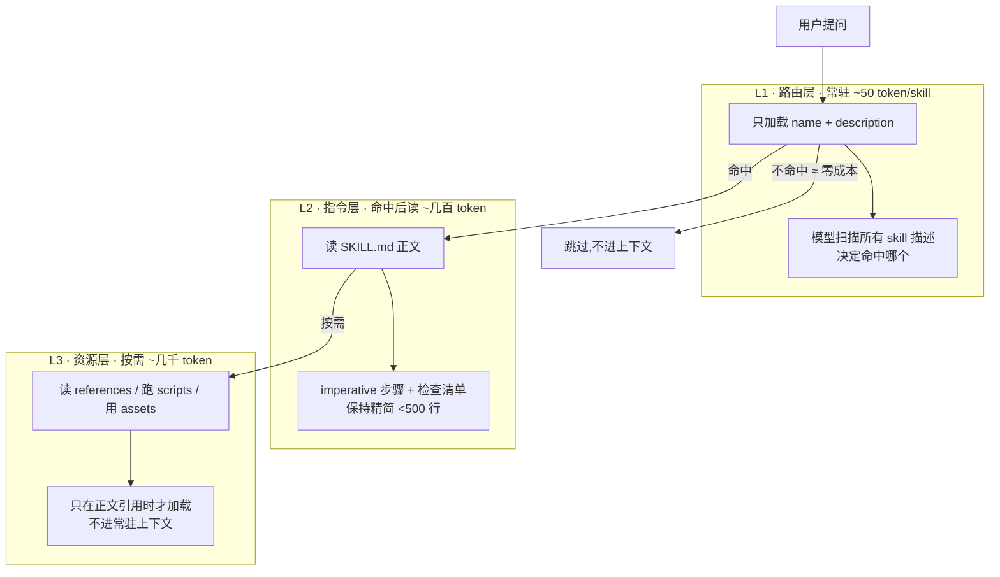
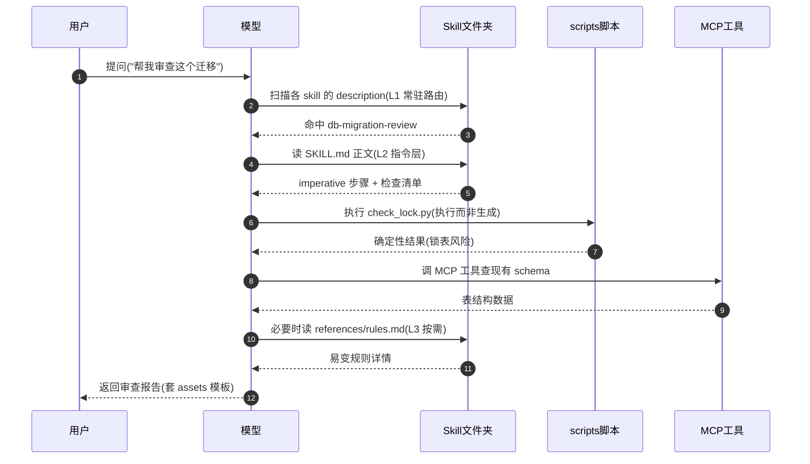
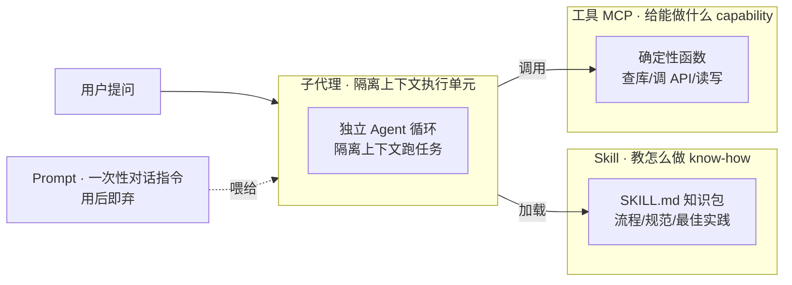

# Skill Agent 技能

> Skill 教模型"怎么做"，MCP 给模型"能做什么"。一个带 frontmatter 的 `SKILL.md` 文件夹，靠渐进式披露按需注入上下文——不命中≈零成本，命中才逐级展开。它的工程价值在于把隐性最佳实践显性化、可复用、可版本化。

## Skill 是什么：不是 prompt，也不是工具

Skill 的本质是**一个文件夹 + 一个 `SKILL.md` 入口**。它不是一次性对话指令，也不是模型可调用的确定性函数，而是**一份可复用、可版本化、带触发条件的"操作手册"（know-how 知识包）**。

三句话定位：

- **装的是"怎么做一类事"**：流程、规范、最佳实践、易踩的坑——而不是新能力。
- **靠描述被检索命中**：模型扫描各 Skill 的 `description`，匹配上才展开读正文。
- **按需加载**：不命中时只常驻几十 token 的元数据，几乎零成本。

和团队里"老员工脑子里的套路"对照最直观：重复踩坑形成的经验，固化成 Skill 后**一键复用、人人可用、可进 git 评审**，不再依赖口耳相传。

```
my-skill/
├── SKILL.md          # 入口:frontmatter(name/description) + 正文指令
├── scripts/          # 可执行脚本:让模型"执行"而非"现写"
├── references/       # 按需加载的参考文档(相对链接引用)
└── assets/           # 模板/样板:复制进产物,不读进上下文
```

> 判断要不要做成 Skill 的第一性问题：**它教的是"怎么完成一类任务"（Skill），还是给了模型一个"新能力/数据源/动作"（[MCP](./protocols)）？** 详见下文分工边界。

---

## SKILL.md 结构与 frontmatter 字段

`SKILL.md` = YAML frontmatter + Markdown 正文。frontmatter 至少含 `name` / `description` 两个字段，其余按需扩展。

```yaml
---
name: db-migration-review # 唯一标识,kebab-case,与文件夹名一致
description: > # 触发器,可发现性的唯一抓手(见下)
  审查数据库迁移脚本的安全性与可回滚性。当用户要求 review 迁移、
  检查 DDL 变更、评估 schema 变更风险、加字段/改索引/删列时使用。
  关键词:migration、DDL、schema change、alter table、回滚、expand-contract。
when-to-use: 审查或编写数据库迁移时 # 部分运行时支持的显式触发条件
allowed-tools: [Read, Bash, Grep] # 该 Skill 允许调用的工具白名单
version: 1.2.0 # 版本号,配合 git 做演进管理
---
# 数据库迁移审查

正文指令:imperative 步骤 + 检查清单 + 相对链接指向 references/scripts。
```

| 字段            | 类型     | 必填 | 说明                                                     |
| --------------- | -------- | ---- | -------------------------------------------------------- |
| `name`          | string   | 是   | 唯一标识，kebab-case，建议与文件夹名一致                 |
| `description`   | string   | 是   | **触发器**：写清 when-to-use 关键词，模型靠它检索命中    |
| `when-to-use`   | string   | 否   | 显式触发条件（部分运行时用，等价于把触发场景再强调一遍） |
| `allowed-tools` | string[] | 否   | 工具白名单，收敛该 Skill 可调用的能力面                  |
| `version`       | string   | 否   | 版本号，配合 git 做变更追溯                              |

**`description` 是整个 Skill 唯一影响可发现性的抓手**。模型在 L1 阶段只看得见 `name + description`，靠它决定要不要展开。写成"介绍"就永远不会命中——这是头号陷阱（见下文）。

❌ 写成介绍（模型检索不到）：

```yaml
description: 这是一个关于数据库迁移的 Skill,包含了迁移相关的知识和最佳实践。
```

✅ 写成触发器（穷尽 when-to-use 关键词）：

```yaml
description: >
  审查数据库迁移脚本的安全性与可回滚性。当用户要求 review 迁移、评估 schema
  变更风险、加字段/改索引/删列、排查迁移失败时使用。覆盖 expand-contract、
  大表加列锁表、索引并发创建、回滚方案。
```

> 写法口诀：**不说"这是什么"，只说"什么时候用它"**。把用户可能说的每一句触发话术都塞进 `description`。

---

## 渐进式披露：三级上下文加载模型

Skill 的核心机制是**渐进式披露（Progressive Disclosure）**：上下文分三级加载，**不命中≈零成本**，命中才逐级展开。设计目标是把"常驻路由成本"压到最低。

本图核心结论：**L1 只常驻几十 token 的 name+description 做路由，命中后才读正文，大块内容按需才进上下文**。



| 级别    | 加载什么                           | token 量级  | 何时加载             |
| ------- | ---------------------------------- | ----------- | -------------------- |
| L1 路由 | `name + description`               | ~50 / skill | 常驻，每次提问都扫描 |
| L2 指令 | `SKILL.md` 正文                    | ~几百       | 命中后读             |
| L3 资源 | `references/` `scripts/` `assets/` | ~几千       | 正文引用到才读/执行  |

工程含义：

- **几十个 Skill 共存也不会爆上下文**——因为 L1 只花 `50 × N` token 做路由。
- **`SKILL.md` 正文必须精简（<500 行）**：它是命中后必读的指令层，塞得越多越稀释指令、越贵。
- **大块参考拆到 `references/*.md`**，正文里用相对链接指路，模型按需才展开——把"可能用到"和"一定用到"分开。

一次 Skill 命中的运行时序如下。核心结论：**L1 扫描常驻发生，L2/L3 只在命中后才被拉进上下文，scripts 与 MCP 是"执行"而非"生成"**。



> 注意第 5、6 步：`scripts` 与 [MCP](./protocols) 工具是模型**调用并读结果**，确定性由代码/协议保证——这正是"确定性操作抽 scripts"的时序体现。

---

## Skill / Prompt / 工具 / 子代理 四方对比

这四个概念常被混用。一句话区分：**Prompt 是一次性指令，Skill 是可复用知识包，工具是确定性函数，子代理是隔离上下文的执行单元**。

本图核心结论：**Skill 提供 know-how，工具（[MCP](./protocols)）提供 capability，子代理提供隔离执行环境，Prompt 是一次性的——子代理 + 专属 Skill 是常见搭配**。



| 维度     | Prompt                              | Skill                  | 工具（MCP）                | 子代理                         |
| -------- | ----------------------------------- | ---------------------- | -------------------------- | ------------------------------ |
| 本质     | 一次性对话指令                      | 可复用知识包           | 确定性函数                 | 隔离执行单元                   |
| 装什么   | 当下任务的指令                      | know-how：流程/规范    | capability：能力/数据/动作 | 一个完整任务                   |
| 触发方式 | 每次手写                            | `description` 检索命中 | 模型按 schema 调用         | 主 Agent 委派                  |
| 上下文   | 占主对话窗口                        | 渐进式按需注入         | 调用时传入参数             | 独立隔离窗口                   |
| 可版本化 | ❌ 散落在对话里                     | ✅ 进 git              | ✅ 代码即版本              | ✅ 配置即版本                  |
| 复用性   | 低，复制粘贴                        | 高，跨项目搬运         | 高，标准协议               | 高，组合调用                   |
| 深入     | [Prompt 工程](./prompt-engineering) | 本页                   | [协议三件套](./protocols)  | [Agent 模式](./agent-patterns) |

**最常见的搭配是"子代理 + 专属 Skill"**：给某类任务开一个隔离上下文的子代理，让它加载自己的 Skill（专属操作手册），既保证主对话不被污染，又让子代理有确定的做事章法。详见 [Agent 模式](./agent-patterns)。

---

## 设计可复用 Skill 的工程原则

把"能跑的 Skill"做成"可复用的 Skill"，靠五条原则：

| 原则                     | 做法                       | 反例                                |
| ------------------------ | -------------------------- | ----------------------------------- |
| 单一职责                 | 一个 Skill 只教一类任务    | 一个 Skill 又管迁移又管缓存又管日志 |
| `description` 写路由钩子 | 穷尽触发场景与关键词       | 写成"这是关于 X 的介绍"             |
| 指令写 imperative 步骤   | 第一步做什么、第二步做什么 | 大段背景知识、原理科普              |
| 确定性操作抽 `scripts/`  | 让模型执行而非生成         | 让模型现写格式化/校验代码           |
| 易变内容抽 `references/` | 正文只放稳定指令           | 把易变清单硬编码进正文              |

正文指令的写法对照（imperative 步骤 vs 科普）：

❌ 科普式（模型读完还是不知道第一步干嘛）：

```markdown
数据库迁移是一个重要的主题。Expand-contract 是一种经典模式,
它通过先扩展再收缩来避免锁表。在实际生产中我们需要注意很多方面……
```

✅ 指令式（可直接照做的步骤）：

```markdown
审查迁移脚本时,按以下顺序执行:

1. 先跑 `scripts/check_lock.py <migration.sql>`,确认是否有锁表风险。
2. 检查是否遵循 expand-contract:加列用 expand,删列分两步走。
3. 索引必须 `CONCURRENTLY` 创建;大表禁止直接 `ADD COLUMN NOT NULL`。
4. 确认回滚方案:每个迁移必须配 `down` 脚本,见 references/rollback.md。
5. 产出审查报告,模板见 assets/review-template.md。
```

> 工程价值收口：这五条本质是同一件事——**把隐性最佳实践显性化**。重复踩坑形成的套路固化成 Skill，下次（以及团队其他人）一键复用，还能进 git 评审演进。

---

## Skill 与 MCP 工具的分工边界

Skill 和 MCP 最容易边界不清、重复造轮子。判定标准一句话：**教"怎么完成一类任务"用 Skill，给"新能力/数据源/动作"用 [MCP](./protocols)。Skill 是 know-how，MCP 是 capability**。

| 维度       | Skill                      | MCP 工具                  |
| ---------- | -------------------------- | ------------------------- |
| 提供什么   | know-how：怎么做           | capability：能做什么      |
| 回答的问题 | "这一步该怎么走"           | "我能调什么去拿到/改变它" |
| 形态       | `SKILL.md` 知识包          | C/S 协议暴露的工具/资源   |
| 例子       | 迁移审查流程、发布检查清单 | 查库、调 API、读写文件    |
| 上下文成本 | 渐进式按需注入             | 调用时传参/回结果         |

决策速查：

- **要教模型一个流程、一套规范、一组最佳实践** → Skill。
- **要给模型一个新能力、一个数据源、一个可执行动作** → MCP 工具。
- **两者配合**：Skill 教"何时调、按什么顺序调、调完怎么判断"，MCP 提供"实际能调的东西"。

❌ 边界混淆、重复造轮子：

```markdown
# SKILL.md 里教模型手写 SQL/HTTP 去查已有 MCP 工具能查的库

当需要查用户订单时,手写如下 SQL:
SELECT \* FROM orders WHERE user_id = ? AND status = 'PAID' ...
注意表名是 orders,字段是 user_id ……(硬编码 schema,易过时)
```

✅ 各司其职：MCP 给查库能力，Skill 只教"查完怎么判断、边界怎么处理"：

```markdown
查订单走已有的 query-orders MCP 工具(见 [MCP](./protocols)),不要手写 SQL。
本 Skill 只负责:查到后按状态机判断是否可退款(见 references/refund-rules.md),
以及金额 > 阈值时的审批分支。
```

> 一句话记忆：**Skill 教模型"用手里已有的工具把事做对"，MCP 负责"手里有哪些工具"。** 已有能力别再用 Skill 重新教一遍。

---

## 目录组织与配套资源（scripts/references/assets）

标准目录约定，**引用一律用相对路径**，保证整个文件夹可搬运、可复用：

```
refund-skill/
├── SKILL.md                      # 入口:frontmatter + imperative 指令
├── scripts/
│   ├── calc_refund.py            # 确定性计算:模型执行,不现写
│   └── check_lock.py
├── references/
│   ├── refund-rules.md           # 退款规则(易变,按需加载)
│   └── rollback.md
└── assets/
    └── review-template.md        # 报告模板:复制进产物,不读进上下文
```

三类配套资源的分工：

| 目录          | 放什么             | 模型怎么用                   | 加载成本           |
| ------------- | ------------------ | ---------------------------- | ------------------ |
| `scripts/`    | 确定性可执行脚本   | **执行**而非生成，结果稳定   | 按需执行，不占正文 |
| `references/` | 按需加载的参考文档 | 正文引用到才读（L3）         | 按需读进上下文     |
| `assets/`     | 模板/样板/骨架     | **复制进产物**，不读进上下文 | 几乎不占上下文     |

**为什么确定性操作要抽 `scripts/`**：格式化、校验、固定算法这类操作，让模型现写既不稳定又慢，还会有边界遗漏。抽成脚本后模型只需"执行并读结果"，确定性由代码保证。

```python
# scripts/calc_refund.py —— 模型执行,而非让它现写这套计算
import sys, json
from decimal import Decimal

def calc_refund(amount: str, days: int, used_ratio: float) -> dict:
    """按退款规则计算:固定算法,确定性,不该交给模型生成。"""
    amt = Decimal(amount)
    if days > 30:                       # 超 30 天不可退
        return {"refundable": False, "reason": "over_30_days"}
    refund = amt * Decimal(str(1 - used_ratio))
    return {"refundable": True, "amount": str(refund.quantize(Decimal("0.01")))}

if __name__ == "__main__":
    # CLI:模型 `python calc_refund.py 99.00 12 0.3` 拿确定性结果
    amount, days, used = sys.argv[1], int(sys.argv[2]), float(sys.argv[3])
    print(json.dumps(calc_refund(amount, days, used), ensure_ascii=False))
```

`SKILL.md` 里用相对链接指路（可搬运的关键）：

```markdown
1. 跑 `scripts/calc_refund.py <amount> <days> <used_ratio>` 拿退款金额。
2. 状态判断规则见 [references/refund-rules.md](references/refund-rules.md)。
3. 报告套用 [assets/review-template.md](assets/review-template.md) 模板。
```

> ❌ 用绝对路径 / 写死机器路径 → 换台机器、换个项目就失效。
> ✅ 一律相对路径 → 整个文件夹即拷即用，跨项目复用。

---

## 常见陷阱

四个高频踩坑点，❌/✅ 对照：

**1. `description` 写成"介绍"而非"触发器"，模型永不命中。**

❌ 不写 when-to-use，检索不到：

```yaml
description: 本 Skill 涵盖代码审查相关内容,提供审查能力支持。
```

✅ 写清触发场景与关键词，把用户话术穷举进去：

```yaml
description: >
  审查前端代码改动。当用户要求 code review、检查 PR、review diff、
  排查 React/Vue 组件问题、评估改动风险时使用。覆盖 hooks 依赖、
  状态批处理、key 用法、XSS 转义。
```

**2. `SKILL.md` 写成大杂烩，正文塞几千行一次性灌进上下文。**

❌ 正文塞进所有参考，命中即爆 token、稀释指令：

```markdown
# 审查 Skill(正文 3000 行)

……这里贴了完整的退款规则、全部历史 case、所有 schema 定义……
```

✅ 正文只留稳定指令（<500 行），大块参考拆 `references/` 按需加载：

```markdown
# 审查 Skill(正文 80 行)

1. 跑 scripts/check_lock.py 2. 规则见 references/rules.md(按需读)
```

**3. 让模型现写确定性操作，结果不稳定还慢。**

❌ 让模型每次现写格式化/校验逻辑：

```markdown
请根据退款规则手写一段代码计算退款金额……(每次结果可能不同,易错)
```

✅ 抽成 `scripts/*.py` 让模型执行：

```markdown
跑 `scripts/calc_refund.py <amount> <days> <used>` 拿确定性结果。
```

**4. 混淆 Skill 与 MCP 边界，重复造轮子。**

❌ 已有查库/调 API 能力，又用 Skill 教模型手写 SQL/HTTP：

```markdown
查订单手写 SQL:SELECT \* FROM orders WHERE ...(硬编码 schema,易过时)
```

✅ 能力交给 [MCP](./protocols)，Skill 只教流程与判断：

```markdown
查订单走 query-orders MCP 工具;本 Skill 只教查完按状态机判断是否可退。
```

---

## 相关页面

- [Function Calling 工具调用机制与实战](./function-calling) — 工具作为确定性函数的调用闭环
- [Agent 协议三件套 MCP / A2A / AG-UI](./protocols) — Skill 的能力供给侧（capability）
- [Prompt 与上下文工程](./prompt-engineering) — Skill 是一次性 prompt 的可复用升级
- [Agent 设计模式](./agent-patterns) — 子代理 + 专属 Skill 的搭配落地
