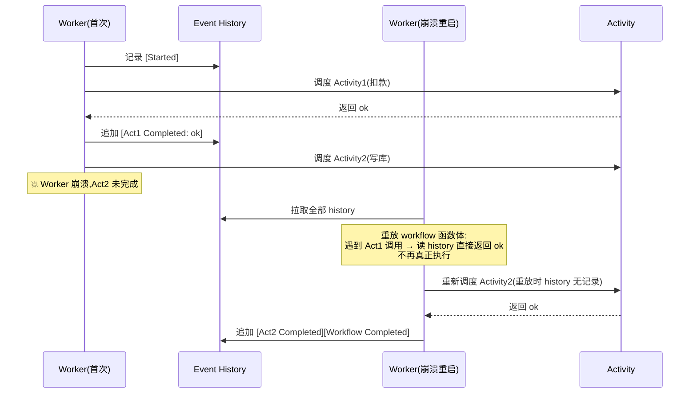
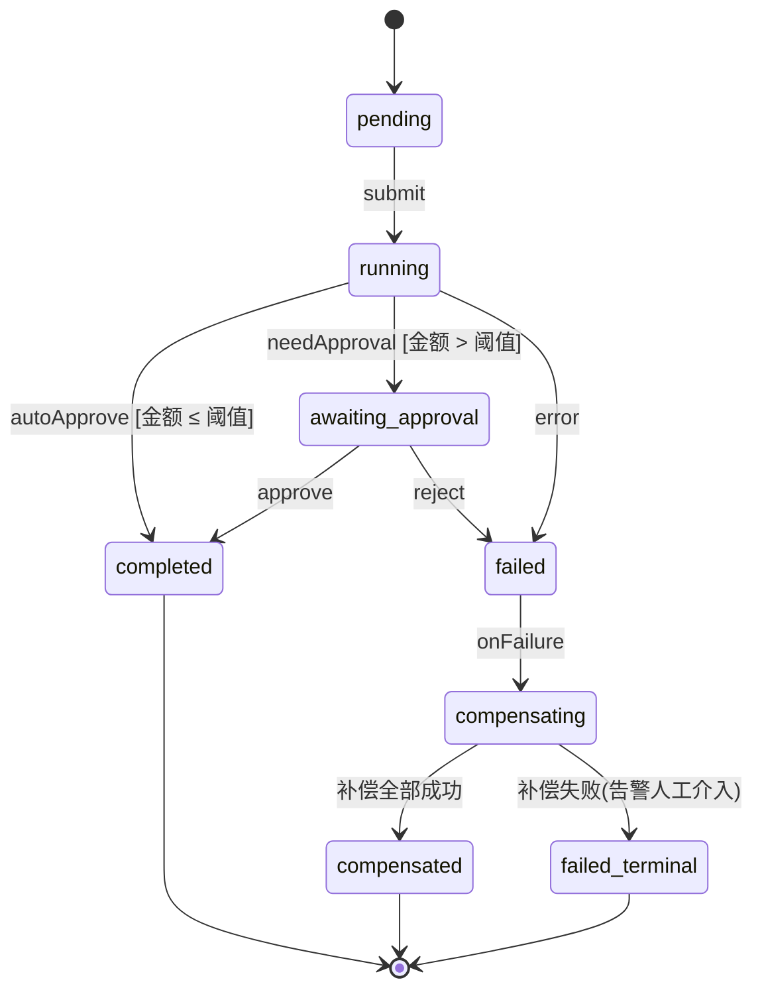
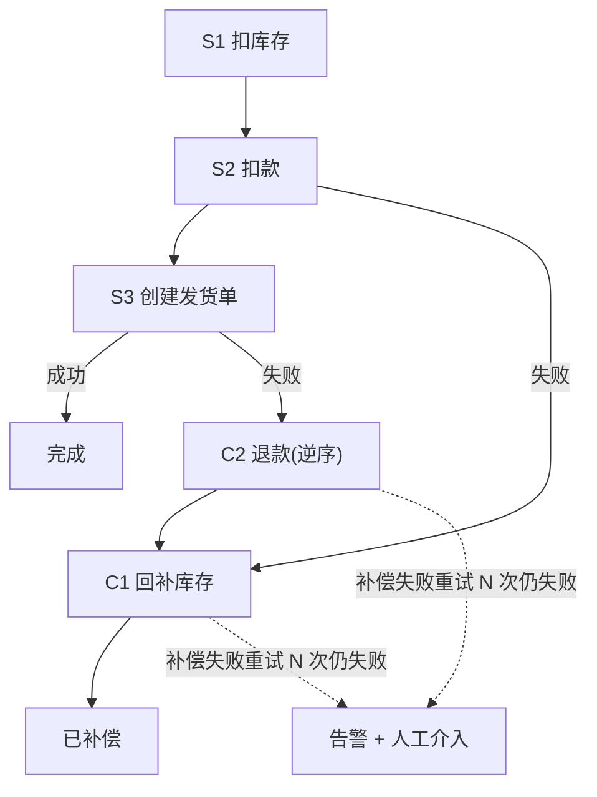
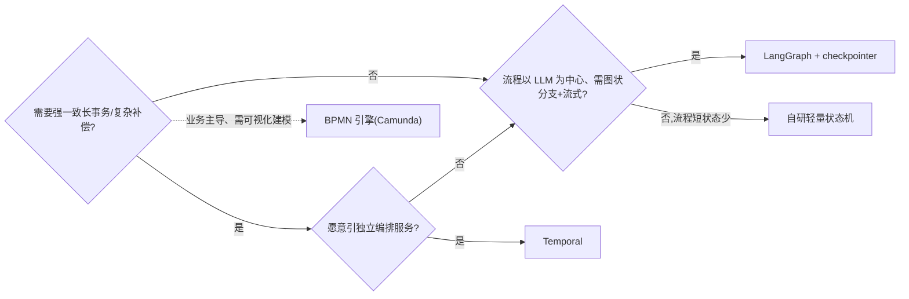

# Workflow 持久化执行与状态机

> 把多步 LLM/工具调用当成一个**可崩溃、可恢复、可补偿的长事务**来编排——状态不活在进程内存里,活在事件历史里;失败不是从头重跑,而是从断点重放续跑。这跟"把一堆 Promise await 串起来"是两回事。

## 为什么需要 Workflow 编排(直接 await 链为什么会崩)

一个典型的 Agent 流程:理解意图 → 检索 → 调工具 → 调 LLM 汇总 → 写库 → 通知。写成顺序 await 看着很美,放到生产就出事:

| 问题                       | 直接 await 链的表现     | 后果                              |
| -------------------------- | ----------------------- | --------------------------------- |
| 进程崩溃/重启              | 内存里的进度全丢        | 中途状态不可知,只能整个重跑       |
| 第 3 步已扣款、第 4 步失败 | 没有进度记录            | 重跑 = 重复扣款;不重跑 = 半完成态 |
| LLM 偶发超时/限流          | 一个 try/catch 包住全链 | 重试粒度太粗,要么全重试要么放弃   |
| 需要人工审批               | 只能用 sleep + 轮询 DB  | 无法精确从断点续跑、无法留痕      |
| 跑了 2 小时的长任务        | 连接/令牌/部署中断      | 前功尽弃                          |

核心矛盾:**业务流程的寿命 >> 进程寿命**。await 链把流程状态绑死在单个进程的调用栈里,进程一死状态就没了。Workflow 编排要做的就是把这个隐式调用栈**外化成显式、可持久化、可恢复的状态**。这也是 [Orchestration](./orchestration) 要解决的根本问题——编排层与执行层分离,状态独立于任何一次执行。

❌ 把"重试"当成解决方案——重试救不了崩溃,只会让已成功的副作用重复执行。

---

## Durable Execution:事件溯源与重放恢复

Durable Execution 的核心是**事件溯源(Event Sourcing)**:不存"当前状态快照",而是把每一步的**输入/输出作为不可变事件追加到 event history**;崩溃后靠**重放(replay)history 重建内存状态**,而不是从头重跑业务逻辑。

关键结论:**重放 = 重新执行 workflow 函数体,但已完成的 Activity 不重跑——直接读 history 里记录的结果返回**。只有还没记录的步骤才会真正调度执行。



**确定性约束是重放的前提**。重放要求 workflow 函数体是纯函数:同样的 history 重放必须得到同样的控制流。因此函数体内**禁止**直接调用任何非确定性来源:

❌ 在 workflow 函数体里直接写——重放时值变了,控制流分叉,history 对不上:

```ts
// ❌ 这些都会破坏重放确定性
const now = new Date();            // 重放时时间不同
const id = Math.random();          // 重放时随机数不同
const res = await fetch(url);      // 网络/DB 是非确定的
if (Date.now() > deadline) { ... } // 分支依赖墙钟,重放走另一条路
```

✅ 把非确定性全部包进 **Activity**(执行副作用,结果落 history);workflow 体内只用框架提供的确定性 API:

```ts
// ✅ workflow 体内:只编排,不碰副作用
import * as wf from '@temporalio/workflow';

const { charge, saveOrder } = wf.proxyActivities<Activities>({
  startToCloseTimeout: '1m',
});

export async function orderWorkflow(input: OrderInput): Promise<void> {
  // 时间/随机数也要用框架的确定性版本
  const id = wf.uuid4(); // 确定性随机:首次生成后存入 history
  await wf.sleep('30s'); // 确定性定时器,重放不重等
  await charge(input, id); // 副作用走 Activity,结果落 history
  await saveOrder(input, id);
}
```

改已上线 workflow 代码时,新旧 history 并存会导致重放分叉——必须靠 **versioning / patch** 标记分支,让旧 history 走旧逻辑、新执行走新逻辑,而不是直接改函数体。

✅ `wf.patched('add-notify-step')` 显式声明版本分支,旧 history 重放时跳过新增代码路径。

> LangGraph 的 checkpointer 与 Durable Execution 是同一思想的不同实现——都是把执行进度外化持久化、支持断点续跑,差异在状态模型与持久化粒度,详见 [LangGraph](./langgraph)。

---

## 状态机建模:状态/事件/转移/守卫

流程越长、分支越多,越不能用线性脚本里的 if/else 散弹来表达。**显式状态机**把流程建模为四要素:

| 要素       | 含义                   | 订单审批示例                                  |
| ---------- | ---------------------- | --------------------------------------------- |
| State      | 系统某一时刻的稳定态   | `pending` / `running` / `awaiting_approval`   |
| Event      | 触发转移的外部刺激     | `submit` / `approve` / `reject` / `timeout`   |
| Transition | 状态 + 事件 → 下一状态 | `awaiting_approval` + `approve` → `completed` |
| Guard      | 转移生效的前置条件     | 金额 > 阈值才需审批                           |

核心结论:**合法转移收敛在一张表里,非法转移直接拒绝**——而不是散落各处的条件判断。



✅ 用一张转移表穷举所有 `当前状态 × 事件 → 下一状态`,执行器只做查表 + 守卫校验;新增状态只改表,不动执行逻辑。

❌ 在业务代码里嵌套 `if (status === 'a' && evt === 'b')` 判断——状态多了之后没人能看清全集,极易漏掉非法转移(比如已完成的订单又被 approve 一次)。

---

## Activity 与副作用边界:幂等与去重

**Activity 是副作用的唯一出口**,也是重试/重放的作用单位。铁律:**幂等是 Activity 的硬要求,不是可选项**。因为:

- 重试会让同一 Activity 执行多次;
- 重放后未确认的 Activity 会被重新调度;
- 框架大多只保证 **at-least-once** 语义,不是 exactly-once。

既然无法保证只执行一次,就必须让"执行多次"等价于"执行一次"——靠 **idempotency key** 去重。key 通常由 `workflowRunId + activityName + 业务键` 派生,确保同一个逻辑步骤无论重试多少次,key 都相同。

✅ 下游用 idempotency key 做去重,重复请求命中已存记录直接返回首次结果:

```ts
// ✅ Activity:带幂等键的扣款
async function charge(input: OrderInput, idemKey: string): Promise<Receipt> {
  const existing = await db.receipts.findByIdemKey(idemKey);
  if (existing) return existing; // 命中去重:重试不重复扣款

  const receipt = await paymentApi.charge({
    amount: input.amount,
    idempotencyKey: idemKey, // 传给下游,支付网关层也去重
  });
  await db.receipts.insert({ ...receipt, idemKey });
  return receipt;
}
```

❌ 假设 Activity 只执行一次,下游不带 idempotency key——一次网络超时触发的重试就是一笔重复扣款。

设计副作用边界时遵循:

| 原则                | 说明                                                          |
| ------------------- | ------------------------------------------------------------- |
| workflow 体零副作用 | 所有 IO / 随机 / 时间都进 Activity                            |
| Activity 单一副作用 | 一个 Activity 只干一件事,便于幂等与补偿                       |
| 先写意图再执行      | 关键副作用先落一条 `pending` 记录,再执行,崩溃后可知"执行到哪" |
| 幂等键可推导        | 由稳定输入派生,不用每次随机生成                               |

---

## 重试策略与超时:心跳/截止/退避

重试要分两层,混用会出僵尸任务或无效重试:

| 层          | 管什么                  | 手段                         |
| ----------- | ----------------------- | ---------------------------- |
| Activity 级 | 瞬时故障(限流/网络抖动) | 指数退避 + 最大次数,自动重试 |
| Workflow 级 | 僵尸任务(卡死/失联)     | 整体超时 + 心跳检测          |

✅ Activity 级重试:瞬时错误重试,永久性错误(如参数非法)不重试直接失败:

```ts
// ✅ 指数退避,且区分可重试/不可重试错误
const { charge } = wf.proxyActivities<Activities>({
  startToCloseTimeout: '1m', // 单次执行最长耗时
  heartbeatTimeout: '10s', // 10s 收不到心跳判死
  retry: {
    initialInterval: '1s', // 首次重试间隔
    backoffCoefficient: 2, // 退避系数:1s→2s→4s→...
    maximumInterval: '30s', // 间隔上限
    maximumAttempts: 5, // 总次数上限,0 = 无限
    nonRetryableErrorTypes: ['InvalidArgument'], // 这类错直接失败
  },
});
```

**三种超时的区别(高频混淆点)**:

| 超时              | 含义                                     | 典型用途           |
| ----------------- | ---------------------------------------- | ------------------ |
| start-to-close    | 单次 Activity 执行从开始到结束的上限     | 防单次调用卡死     |
| heartbeat         | Activity 需周期性上报心跳,超时未报即判死 | 检测长任务进程假死 |
| schedule-to-close | 含所有重试在内的总时长上限               | 给整个步骤兜底     |

❌ 把 heartbeat 超时当 start-to-close 用——长任务单次执行就是很慢,该调大 start-to-close;心跳是另外一回事,是让 Activity **主动汇报"我还活着、进度到 X"**,失联才判死。

✅ 长任务 Activity 内部周期 `heartbeat(progress)`,既防误判,崩溃重试时还能从上次进度续跑。

---

## 补偿与 Saga:长事务的逆向回滚

跨多个服务/资源的长事务**没法用数据库 ACID 回滚**(已经扣的款、已经发的消息,不能 `ROLLBACK`)。Saga 模式把长事务拆成一串本地事务,**每步登记一个逆向补偿动作**;某步失败时,按**逆序**执行已完成步骤的补偿,把系统"退回去"。

核心结论:**补偿不是 try/catch**。catch 是同步就地处理;Saga 是登记-触发-逆向执行的独立流程,补偿本身也要**幂等 + 可重试**,补偿失败要告警而不是静默吞掉。



✅ 每个正向步骤成对登记补偿,失败逆序回放,补偿带重试与兜底告警:

```ts
// ✅ 补偿栈:每成功一步压入对应补偿
const compensations: Array<() => Promise<void>> = [];

try {
  await reserveStock(order);
  compensations.push(() => releaseStock(order)); // 逆序会执行到

  await charge(order, idemKey);
  compensations.push(() => refund(order, idemKey)); // 退款也要幂等

  await createShipment(order);
  compensations.push(() => cancelShipment(order));
} catch (err) {
  // 逆序执行补偿;每个补偿独立重试,失败上报告警
  for (const compensate of compensations.reverse()) {
    await retryWithBackoff(compensate, { attempts: 5 }).catch((e) => alertOps('compensation failed', e)); // 不静默吞
  }
  throw err; // 补偿完仍要把 workflow 标记为失败
}
```

❌ 补偿写成一次性尽力调用、不重试、失败也不告警——补偿一旦失败就被静默吞掉,系统留下**半完成态**(款扣了没退、货发了单没建),还无人知晓。

---

## 人机回环 HITL:中断/挂起/信号恢复

很多 workflow 需要在某一步**停下来等人**(审批、人工标注、合规确认),人操作完再续跑。正确做法是**挂起(suspend)+ 信号(signal)恢复**,而不是 sleep + 轮询:

- workflow 执行到审批点,对外暴露 **signal / query** 接口后挂起(不占 worker 资源,状态已持久化);
- 人在外部系统操作,调用 **signal** 把决定送回;
- workflow 收到 signal 从**断点精确续跑**,整个等待/决定都留在 history 里可审计。

✅ 挂起等信号,带超时兜底:

```ts
// ✅ workflow 体内:等审批 signal,超时自动拒绝
import * as wf from '@temporalio/workflow';

export const approveSignal = wf.defineSignal<[Decision]>('approve');
export const statusQuery = wf.defineQuery<string>('status');

export async function approvalWorkflow(order: Order): Promise<string> {
  let decision: Decision | undefined;
  wf.setHandler(approveSignal, (d) => {
    decision = d;
  });
  wf.setHandler(statusQuery, () => (decision ? 'decided' : 'waiting'));

  // 挂起等待,最长 24h;超时视为拒绝(确定性 timer)
  const approved = await wf.condition(() => decision !== undefined, '24h');
  if (!approved || !decision!.approved) return 'rejected';

  await fulfillOrder(order); // 从断点续跑
  return 'completed';
}
```

❌ 用 `sleep(60) + 轮询 DB` 模拟 HITL——既不精确(轮询间隔)、不留痕(审批动作不在 history)、占着 worker 空转,崩溃后还恢复不到等待点。

> 人机回环是 [Agent Patterns](./agent-patterns) 里 human-in-the-loop 模式在持久化执行层的落地。

---

## 框架实战:Temporal 速查(TS)

Temporal 是 Durable Execution 的标杆实现,核心概念速查:

| 概念           | 作用                               | 备注             |
| -------------- | ---------------------------------- | ---------------- |
| Workflow       | 编排函数,确定、可重放              | 体内零副作用     |
| Activity       | 副作用单元,可重试                  | 必须幂等         |
| Worker         | 轮询任务队列执行 Workflow/Activity | 可水平扩展、可崩 |
| Task Queue     | Workflow 与 Worker 之间的队列      | 路由 + 负载均衡  |
| Signal / Query | 外部写进 / 读取运行中 workflow     | HITL 基础        |
| Event History  | 全部事件日志,重放依据              | 强一致持久化     |

最小骨架:

```ts
// workflows.ts —— 编排(确定性)
import * as wf from '@temporalio/workflow';
import type * as activities from './activities';

const { charge, saveOrder } = wf.proxyActivities<typeof activities>({
  startToCloseTimeout: '1m',
  retry: { maximumAttempts: 5 },
});

export async function orderWorkflow(order: Order): Promise<string> {
  const idemKey = `${wf.workflowInfo().runId}:charge`; // 稳定幂等键
  await charge(order, idemKey);
  await saveOrder(order);
  return 'done';
}
```

```ts
// worker.ts —— 启动 Worker
import { Worker } from '@temporalio/worker';
import * as activities from './activities';

const worker = await Worker.create({
  workflowsPath: require.resolve('./workflows'),
  activities,
  taskQueue: 'orders',
});
await worker.run(); // Worker 崩了重启即可,workflow 自动重放续跑
```

```ts
// client.ts —— 启动 & 发信号
import { Client } from '@temporalio/client';

const client = new Client();
const handle = await client.workflow.start(orderWorkflow, {
  taskQueue: 'orders',
  workflowId: `order-${order.id}`, // 业务键作 ID,天然去重防重复启动
  args: [order],
});
await handle.signal(approveSignal, { approved: true }); // HITL 送回决定
```

---

## 自研轻量状态机(Python/TS 最小实现)

流程短、状态少、不想引 Temporal 这类服务时,一个"转移表 + 持久化当前态 + 幂等执行"的最小状态机往往就够。核心是三件事:**转移合法由表决定、当前状态落库、每步副作用幂等**。

```python
# ✅ Python 最小状态机:转移表驱动 + 状态落库
from enum import Enum
from typing import Callable

class S(str, Enum):
    PENDING = "pending"; RUNNING = "running"
    WAIT = "awaiting_approval"; DONE = "completed"; FAILED = "failed"

# 转移表:(当前态, 事件) -> 下一态,非法转移查不到即拒绝
TRANSITIONS: dict[tuple[S, str], S] = {
    (S.PENDING, "submit"): S.RUNNING,
    (S.RUNNING, "need_approval"): S.WAIT,
    (S.RUNNING, "auto_approve"): S.DONE,
    (S.WAIT, "approve"): S.DONE,
    (S.WAIT, "reject"): S.FAILED,
}

def fire(run_id: str, event: str) -> S:
    cur = load_state(run_id)                      # 从 DB 读当前态(持久化)
    nxt = TRANSITIONS.get((cur, event))
    if nxt is None:
        raise IllegalTransition(f"{cur} + {event}")  # 非法转移显式拒绝
    save_state(run_id, nxt)                       # 先落库再执行副作用
    return nxt
```

```ts
// ✅ TS 版:守卫 + 每步幂等副作用
type Guard = (ctx: Ctx) => boolean;

interface Transition<E> {
  from: S;
  event: E;
  to: S;
  guard?: Guard; // 转移前置条件
  effect?: (ctx: Ctx) => Promise<void>; // 副作用,必须幂等
}

async function transition<E>(ctx: Ctx, t: Transition<E>): Promise<S> {
  if (ctx.state !== t.from) throw new Error('illegal transition');
  if (t.guard && !t.guard(ctx)) return ctx.state; // 守卫不过,停在原态
  await saveState(ctx.runId, t.to); // 先持久化
  await t.effect?.(ctx); // 副作用幂等,可安全重试
  return t.to;
}
```

自研的边界很清楚:**状态 < ~10 个、无复杂补偿、单服务内**够用;一旦要跨服务长事务、精确重放、复杂补偿,就该上框架而不是继续堆自研。

---

## LangGraph 的 workflow 模式与 checkpointer

当流程**以 LLM 为中心、需要图状分支 + 流式输出 + 断点续跑**时,LangGraph 比通用 Durable Execution 框架更顺手。它把流程建成**状态图(StateGraph)**,节点是处理函数,边是转移(可条件),配合 **checkpointer** 在每个 super-step 边界持久化状态。

```python
# ✅ LangGraph:状态图 + checkpointer 实现断点续跑 + HITL
from langgraph.graph import StateGraph, START, END
from langgraph.checkpoint.memory import MemorySaver

builder = StateGraph(AgentState)
builder.add_node("retrieve", retrieve)      # 节点 = 一步处理
builder.add_node("grade", grade_docs)
builder.add_node("human_review", human_review)
builder.add_edge(START, "retrieve")
builder.add_conditional_edges(              # 条件边 = 守卫
    "grade", route_by_score,
    {"good": END, "need_human": "human_review"},
)
builder.add_edge("human_review", END)

# checkpointer:每个 super-step 持久化;interrupt_before 实现 HITL 挂起
memory = MemorySaver()
graph = builder.compile(checkpointer=memory, interrupt_before=["human_review"])

config = {"configurable": {"thread_id": "run-42"}}  # thread 即一次运行
graph.invoke(input, config)                  # 跑到 human_review 前挂起
graph.invoke(None, config)                   # 人操作后从断点续跑
```

与 Temporal 的对照:

| 维度       | Temporal              | LangGraph checkpointer |
| ---------- | --------------------- | ---------------------- |
| 持久化粒度 | 事件级(event history) | super-step 状态快照    |
| 中心抽象   | 确定性 workflow 函数  | LLM 状态图             |
| HITL       | signal/query          | interrupt + 恢复       |
| 流式       | 需额外机制            | 原生 token 流式        |
| 适用       | 通用长事务/补偿       | LLM 中心图状流程       |

二者选型与互链详见 [LangGraph](./langgraph) 与框架对比页 [Comparison](./comparison)。

---

## Workflow vs BPMN:工程取舍决策

BPMN 是给业务分析师画的**标准化流程图语言**(网关、泳道、消息事件一应俱全),靠 BPMN 引擎(Camunda 等)执行;代码态 Workflow 是工程师写的**确定性函数/状态图**。取舍看受众与复杂度:

| 维度         | 代码态 Workflow(Temporal/自研/LangGraph) | BPMN 引擎                |
| ------------ | ---------------------------------------- | ------------------------ |
| 受众         | 工程师,逻辑在代码里可测试可 diff         | 业务/流程分析师,图形化   |
| 变更         | 改代码 + versioning,走 CI                | 改图 redeploy,业务可自助 |
| LLM/流式     | 一等支持(LangGraph)                      | 需自封装节点,别扭        |
| 强一致长事务 | Temporal 原生                            | Camunda 也支持           |
| 复杂度上限   | 复杂补偿/重放友好                        | 极复杂审批流可视化更好   |



工程判断:**事务一致性强 + 复杂补偿 → Temporal;LLM 中心 + 流式 + 图分支 → LangGraph;流程短状态少不想引服务 → 自研;业务方要自己拖流程图 → BPMN**。BPMN 细节见 [BPMN](./bpmn),通用框架横向对比见 [Comparison](./comparison)。

---

## 常见陷阱与反模式

| ❌ 反模式                                              | 后果                                            | ✅ 正确做法                                                              |
| ------------------------------------------------------ | ----------------------------------------------- | ------------------------------------------------------------------------ |
| workflow 体内 `new Date()` / `Math.random()` / `fetch` | 重放时值变,控制流分叉,history 对不上            | 非确定性全包进 Activity;时间/随机用框架确定性 API(`wf.uuid4`/`wf.sleep`) |
| 直接改已上线 workflow 函数体                           | 新旧 history 重放分叉                           | 用 versioning/patch 标记分支,新旧逻辑并存                                |
| 假设 Activity 只执行一次,下游无幂等键                  | 重试/重放 → 重复扣款                            | Activity 必带 idempotency key,下游去重                                   |
| 把 heartbeat 超时当 start-to-close                     | 长任务被误判死 / 假死检测不到                   | 长执行调大 start-to-close;心跳让 Activity 主动汇报进度                   |
| 补偿一次性尽力调用、不重试、失败静默吞                 | 补偿失败留半完成态,无人知晓                     | 补偿幂等 + 重试 N 次 + 失败告警人工介入                                  |
| 补偿当 try/catch 写                                    | 无法逆向、乱序、漏补偿                          | 每步登记补偿栈,失败逆序回放                                              |
| HITL 用 sleep + 轮询 DB                                | 不精确、不留痕、空耗 worker、崩溃恢复不到等待点 | 挂起 + signal/query,决定入 history 可审计                                |
| 线性脚本里 if/else 散弹表达流程                        | 状态全集不可见,漏非法转移                       | 显式状态机:转移表 + 守卫,非法转移显式拒绝                                |
| 用"重试"救崩溃                                         | 已成功副作用被重复执行                          | Durable Execution:进度外化,断点重放续跑                                  |
| 状态少也硬上 Temporal                                  | 引入运维成本,杀鸡用牛刀                         | 状态 < ~10 个、单服务、无复杂补偿时自研轻量状态机                        |
